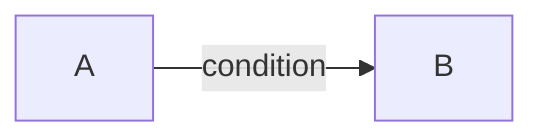

# Mermaid Syntax

Rules for writing valid Mermaid diagrams in this project's markdown docs.

## Line Breaks in Node Labels

Use `<br>` — never `\n`.

```mermaid
%% CORRECT
graph LR
  A["Stage 1<br>Auth"] --> B["Stage 2<br>Catalog"]

%% WRONG — \n does not render as a line break
graph LR
  A["Stage 0\nAuth"] --> B["Stage 1\nCatalog"]
```

## Node Label Safety

- Wrap labels containing special characters in double quotes: `A["label text"]`
- Avoid parentheses inside node labels (parser-sensitive): prefer `createSession userId` over `createSession(userId)`
- Keep labels short and ASCII-friendly where possible

## Edge Labels

Wrap edge labels in pipes: `A -->|label text| B`



## Quick Checklist

| Pattern             | Correct            | Wrong            |
| ------------------- | ------------------ | ---------------- |
| Line break in label | `"Line1<br>Line2"` | `"Line1\nLine2"` |
| Special char label  | `A["my (label)"]`  | `A[my (label)]`  |
| Edge label          | `-->\|text\|`      | `-->text`        |
