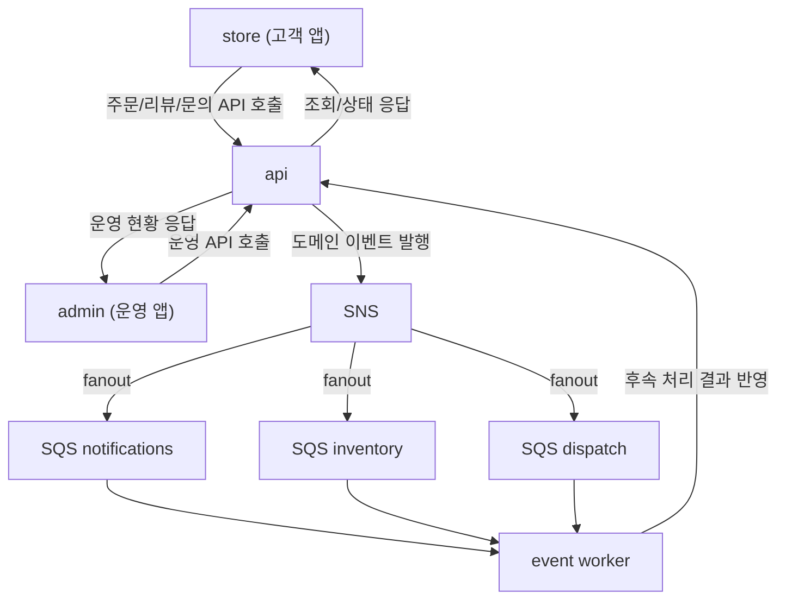
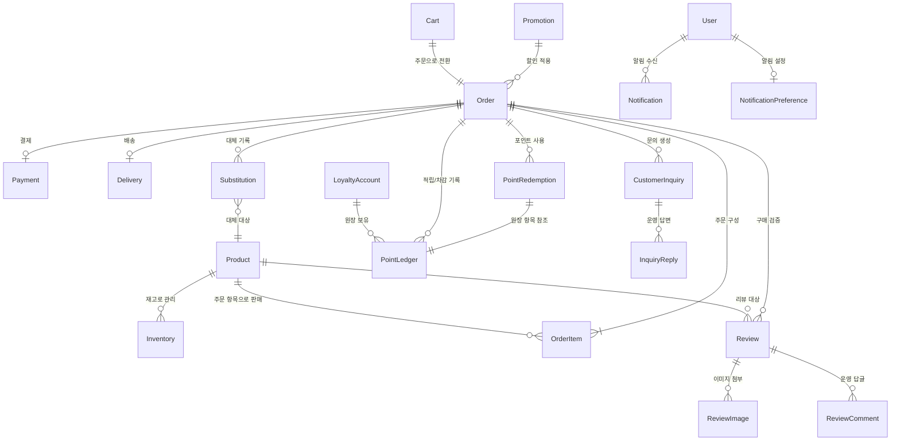
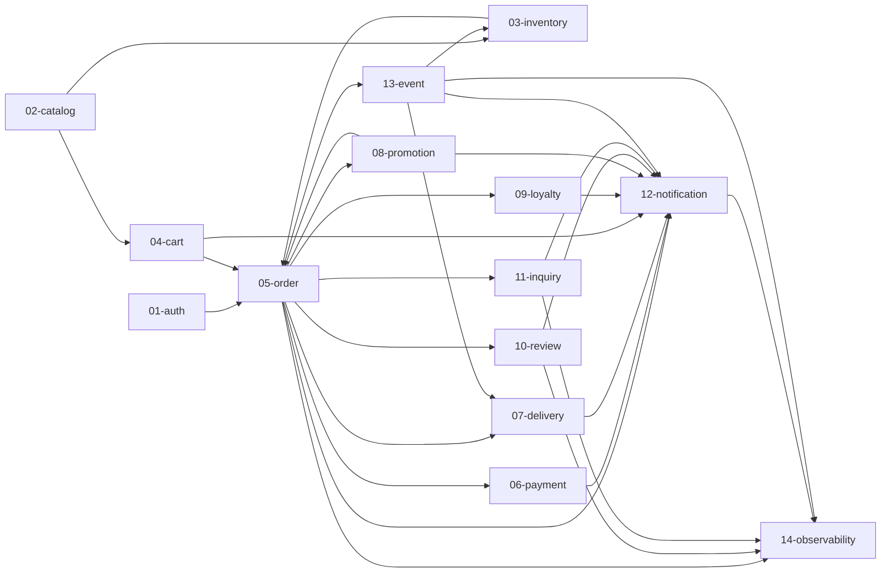
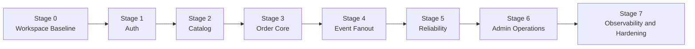

# 00. Overview

## 1. 제품 개요 (비전·문제·타겟)

- 제품명: `Urban Essential Quick Commerce`
- 제품 형태: 도심 1~2인 가구 대상 즉시배송 커머스
- 앱 구성:
  - `store`: 고객용 앱
  - `admin`: 운영용 앱
  - `api`: 인증/주문/리뷰/문의/운영 API
  - `event workers`: 주문 후속처리(알림/재고/배차)

### 시스템 컨텍스트

기존 즉시배송 서비스의 반복 문제:

- 품절/대체 안내가 늦어 주문 경험 악화
- 운영자가 장애와 적체를 늦게 인지
- 이벤트 중복/실패 시 수동 복구에 시간 과다 소요
- 상품 후기/문의 응답 이력이 분산되어 구매 판단과 고객 신뢰 형성이 어려움

본 제품은 "주문 성공률"과 "복구 속도"를 핵심 성과로 둔다.

### 고객(Primary)

- 페르소나: 퇴근 후 30분 내 생필품이 필요한 1~2인 가구
- 목표: 빠른 주문, 정확한 도착예측, 품절시 대체 선택

### 운영자(Internal)

- 페르소나: 주문/재고/배차를 실시간 관리하는 운영팀
- 목표: SLA 위반 최소화, 실패 이벤트 빠른 복구, 재고 정확도 유지

## 2. 범위 (MVP 포함/제외)

### 포함

- 인증: 이메일 + Google OAuth + Kakao OAuth
- 카탈로그: 40~60 SKU, 카테고리 6개
- 주문: 장바구니, 주문 생성/조회, 주문 상태 확인
- 고객 참여: 상품 리뷰 작성/수정, 리뷰 댓글(고객-운영 상호작용)
- 고객 지원: 고객 문의 생성/조회, 운영자 답변/상태 변경
- 운영: 주문 상태 전이, 저재고 모니터링, redrive
- 이벤트: SNS-SQS fanout, idempotency, DLQ

### 제외(초기)

- 냉장/냉동 신선식품
- 주류/의약품
- 다중 창고 최적 라우팅
- 실시간 지도 추적
- 실시간 채팅 상담

## 3. 성공 지표 (KPI 7개)

| 지표               | 목표        | 측정 방식                          |
| ------------------ | ----------- | ---------------------------------- |
| 주문 성공률        | 98% 이상    | 주문 시도 대비 완료                |
| 중복 처리 오류     | 0건         | 동일 eventId 재처리 점검           |
| DLQ 복구 성공률    | 95% 이상    | DLQ -> redrive 성공 비율           |
| 운영 복구 시간     | 10분 이내   | 장애 감지 -> 재처리 완료           |
| p95 주문 조회 지연 | 500ms 이하  | API 지표                           |
| 리뷰 작성 전환율   | 25% 이상    | 배송완료 주문 대비 리뷰 작성 비율  |
| 문의 1차 응답 시간 | 24시간 이내 | 문의 생성 시각 대비 첫 운영자 응답 |

## 4. 도메인 모델 (엔터티 목록)

핵심 엔터티:

- `Product`
- `Inventory`
- `Cart`
- `Order`
- `OrderItem`
- `Payment`
- `Delivery`
- `Promotion`
- `Substitution`
- `LoyaltyAccount`
- `PointPolicy`
- `PointLedger`
- `PointRedemption`
- `Review`
- `ReviewImage`
- `ReviewComment`
- `CustomerInquiry`
- `InquiryReply`
- `Notification`
- `NotificationPreference`

### 핵심 엔터티 관계(ER)

## 5. 비기능 요구사항

- 신뢰성: at-least-once 전제, idempotency 강제
- 보안: OAuth state/nonce, secure cookie, rate limit
- 관측: queue depth/처리율/실패율/지연 지표 수집
- 운영: rollback 기준/절차 명시, runbook 유지
- 고객 커뮤니케이션: 리뷰/문의 악성 콘텐츠 대응 및 운영 감사 로그 유지

### 비즈니스 수치 기본값

| 항목                    | 기본값                                 | 비고     |
| ----------------------- | -------------------------------------- | -------- |
| 안전재고 임계치         | 5개                                    | 재고     |
| 결제 타임아웃           | 30초                                   | 결제     |
| 최소 결제 금액          | 100원                                  | 결제     |
| 결제 재시도 제한        | 동일 주문 5회                          | 결제     |
| Idempotency key TTL     | 24시간                                 | 결제     |
| 결제-주문 대사 주기     | 10분                                   | 결제     |
| 결제 데이터 보존        | 5년                                    | 결제     |
| 포인트 적립률           | 결제금액의 1%                          | 포인트   |
| 최소 적립 주문 금액     | 5,000원                                | 포인트   |
| 최소 사용 포인트        | 1,000원                                | 포인트   |
| 포인트 유효기간         | 12개월(적립일 기준)                    | 포인트   |
| 대체상품 가격 허용 범위 | 원본 대비 120% 이내 자동, 초과 시 승인 | 주문     |
| 대체 승인 타임아웃      | 10분                                   | 주문     |
| 리뷰 본문 최대 길이     | 2,000자                                | 리뷰     |
| 리뷰 이미지 최대 장수   | 5장                                    | 리뷰     |
| 리뷰 이미지 최대 크기   | 5 MB (장당)                            | 리뷰     |
| 문의 제목 최대 길이     | 200자                                  | 문의     |
| 문의 본문 최대 길이     | 5,000자                                | 문의     |
| 답변 본문 최대 길이     | 10,000자                               | 문의     |
| 문의 재오픈 횟수 제한   | 최대 3회                               | 문의     |
| 문의 데이터 보관        | 3년 (이후 비식별화)                    | 문의     |
| 문의 SLA 주의 경과      | 12시간                                 | 문의     |
| 문의 SLA 알림 경과      | 20시간                                 | 문의     |
| 즉시배송 SLA            | 30분                                   | 배송     |
| 예약배송 SLA 허용 범위  | ±15분                                  | 배송     |
| 예약배송 슬롯 단위      | 1시간                                  | 배송     |
| 배차 자동 재시도        | 1회 실패 시 즉시 자동 재배차           | 배송     |
| 배차 운영자 개입 기준   | 2회 연속 실패                          | 배송     |
| SQS VisibilityTimeout   | 90초                                   | 이벤트   |
| SQS maxReceiveCount     | 3                                      | 이벤트   |
| Source 큐 retention     | 4일                                    | 이벤트   |
| DLQ retention           | 14일                                   | 이벤트   |
| 비밀번호 최소 길이      | 8자                                    | 인증     |
| 비밀번호 해싱           | bcrypt (cost factor 12)                | 인증     |
| 최소주문금액(프로모션)  | 15,000원                               | 프로모션 |
| 최대 할인 상한(정률)    | 주문금액의 50%, 최대 10,000원          | 프로모션 |
| 쿠폰 per_user_limit     | 기본 1회(쿠폰별 설정 가능)             | 프로모션 |
| 가격 단위               | KRW (원)                               | 공통     |
| 무게 단위               | g (그램)                               | 공통     |

## 6. 요구사항 우선순위 (P0/P1/P2)

- P0: 인증, 주문 생성/조회, 리뷰/댓글, 고객 문의, fanout, idempotency, DLQ/redrive
- P1: 프로모션/쿠폰, 예약배송 슬롯, 운영 대시보드 고도화
- P2: 개인화 추천, 다중 창고 최적화

### 14 도메인 관계 맵

## 7. 운영 원칙

- 각 단계는 `구현 목표 + 학습 목표 + 증빙(Evidence)`를 반드시 포함
- 단계 완료 조건(Exit Criteria) 미충족 시 다음 단계 진행 금지
- 단계 종료 시 관련 evidence 기록 필수

## 8. Stage 통합 로드맵 (0~7)

| Stage   | 핵심 도메인                 | 구현 초점                                                         | Gate 출처                                                |
| ------- | --------------------------- | ----------------------------------------------------------------- | -------------------------------------------------------- |
| Stage 0 | Workspace Baseline          | 모노레포 실행 루프, codegen/build/typecheck 안정화                | `00-overview.md`                                         |
| Stage 1 | Auth                        | 이메일/OAuth 로그인, 세션/보안 정책                               | `01-auth/01-overview.md`                                 |
| Stage 2 | Catalog                     | SKU seed, 상품 탐색/장바구니 연계, 품절 노출                      | `02-catalog/01-overview.md`                              |
| Stage 3 | Order Core + Promotion      | 주문 생성/조회, 상태 전이, 대체상품 흐름, 쿠폰/카테고리 할인 기본 | `05-order/01-overview.md`, `08-promotion/01-overview.md` |
| Stage 4 | Event Fanout                | `OrderCreated` 발행, SQS fanout 소비자 분리                       | `13-event/01-overview.md`                                |
| Stage 5 | Reliability                 | idempotency, DLQ/redrive 운영 루프                                | `13-event/01-overview.md`                                |
| Stage 6 | Admin Operations            | 운영자 상태 전이, 실패 이벤트 관리/redrive                        | `05-order/01-overview.md`                                |
| Stage 7 | Observability and Hardening | metrics/alerts/dashboard, drill/rollback                          | `14-observability/01-overview.md`                        |

### Stage 흐름 시각화

### Stage 0 상세 게이트 (Workspace Baseline)

### Entry Criteria

- 레포 clone 완료
- 필수 도구 설치(node/pnpm/docker)

### 구현 목표

- `store/admin/api` 실행 루프 확인
- codegen/build/typecheck 루프 안정화

### 학습 목표

- 모노레포 의존성 구조 이해
- code-first(route schema) 개발 흐름 이해

### Exit Criteria

- `pnpm typecheck` 통과
- `pnpm build` 통과
- 핵심 문서 경로 이해(README, 00, 07, PRD)

### Evidence

- 실행 명령 결과 요약
- 발견한 갭 리스트

## 9. 공통 Stage Gate 체크리스트

각 Stage 종료 시 공통 체크:

- [ ] 요구사항 구현 완료
- [ ] 보안 정책 위반 없음
- [ ] 테스트/검증 결과 기록
- [ ] 실패 케이스 재현/복구 확인
- [ ] 다음 단계 리스크 정리
