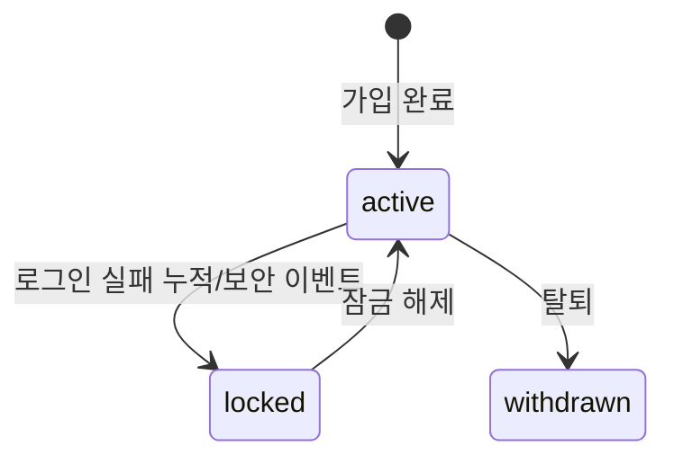

# Auth Domain Overview

## §1 인증 범위

- 이메일 로그인/로그아웃
- Google OAuth
- Kakao OAuth
- 이메일 회원가입
- 세션 유지/만료/재발급

## §2 회원가입 흐름

### 이메일 회원가입

1. 사용자가 이메일/비밀번호로 `회원가입` 요청
2. 서버가 이메일 중복 여부와 비밀번호 정책을 검증
3. 계정 생성 후 즉시 로그인 세션을 발급하고 store로 리디렉션

### OAuth 자동 회원가입

1. 사용자가 Google/Kakao OAuth 시작
2. callback에서 provider 식별자 기준 기존 계정 조회
3. 계정이 없으면 최소 프로필로 자동 회원가입 후 세션 발급
4. 계정이 있으면 기존 계정으로 세션 발급

> MVP 범위에서 이메일 인증 플로우는 제공하지 않는다.

## §3 인증 정책 상세

### 세션/토큰

- Access token 형식: JWT (서명 검증 + 짧은 수명)
- Refresh token 형식: opaque random token (서버 저장소 hash 검증)
- Access session TTL: 15분
- Refresh session TTL: 14일
- Refresh rotation: 매 재발급 시 refresh token 교체
- Reuse detection: 기존 refresh 재사용 탐지 시 세션 강제 폐기

### 비밀번호 정책

- 최소 길이: 8자
- 저장 방식: bcrypt
- bcrypt cost factor: 12

### 쿠키 정책

- `HttpOnly=true`
- `SameSite=Lax` (기본)
- `Secure=true` (prod 필수, local 개발환경은 예외 허용)
- 쿠키 이름 예시:
  - `qc_access`
  - `qc_refresh`

### OAuth 정책

- 지원 provider: `google`, `kakao`
- `state`/`nonce` 생성 후 Redis TTL(5분) 저장
- callback 성공 시 1회성 소비 후 즉시 삭제
- provider 응답 검증 실패 시 계정 생성 금지
- redirect allowlist 외 경로 금지(Open Redirect 방지)

## §4 계정/권한 정책

### 계정 상태

- `active`
- `locked` (브루트포스/보안 이벤트)
- `withdrawn` (탈퇴)

### 권한 역할

- `customer`: store 접근
- `operator`: admin 접근
- `admin`: 운영/정책 변경

### 권한 검증

- `admin` 화면/API는 `operator|admin`만 허용
- 고객 세션으로 admin API 호출 시 403

## §5 로그인/로그아웃 보안 정책

### 실패 정책

- 로그인 실패 5회 연속 시 15분 잠금
- 잠금 해제 후 실패 카운터 초기화
- OAuth provider 실패는 재시도 1회 후 실패 반환

### 감사 로그(Audit) - auth

필수 기록 이벤트:

- `login_success`
- `login_failed`
- `oauth_start`
- `oauth_callback_success`
- `oauth_callback_failed`
- `logout`
- `session_revoked`

로그 필드:

- `user_id`(없으면 null)
- `ip`
- `user_agent`
- `request_id`
- `provider`(oauth only)
- `result_code`

## §8 검증 기준 (완료 조건) - auth

- 이메일 로그인/로그아웃 시나리오 성공
- Google/Kakao OAuth 시작/콜백 성공
- state/nonce 변조 시 차단
- refresh reuse 탐지 시 세션 폐기
- admin 권한 없는 사용자 접근 차단

## Stage 1 게이트

### Exit Criteria

- 이메일 로그인/로그아웃 성공
- Google/Kakao callback 성공
- 변조 state 차단 테스트 통과
- 로그인 실패 잠금/rate limit 확인

### Evidence

- 인증 시퀀스 다이어그램
- 에러 코드 테스트 결과
