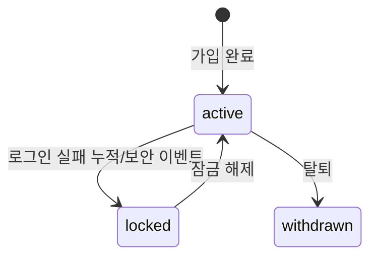

# Auth Domain Overview

## §1 인증 범위

- 이메일 로그인/로그아웃
- Google OAuth
- Kakao OAuth
- 이메일 회원가입
- 세션 유지/만료/재발급

### Auth Surface 분리 정책

> Vendure(`admin-api`/`shop-api`), Medusa v2(`/admin/*`/`/store/*`), Saleor(Staff/Customer 분리) 등
> 주요 커머스 플랫폼은 관리자 인증과 고객 인증을 **API surface 수준에서 분리**한다.
> 본 프로젝트도 동일한 원칙을 따른다.

인증 시스템은 두 개의 **auth surface**로 분리한다.

| Surface   | 대상 앱          | 허용 역할           | 로그인 방식                    |
| --------- | ---------------- | ------------------- | ------------------------------ |
| **store** | store (고객용)   | `customer`          | 이메일 + OAuth (Google, Kakao) |
| **admin** | admin (운영자용) | `operator`, `admin` | 이메일 전용                    |

분리 근거:

- **공격 면 격리**: 고객 인증이 침해되어도 관리자 접근에 영향 없음
- **보안 정책 차등화**: 관리자에게 더 짧은 세션, 더 엄격한 rate limit 적용
- **폭발 반경 축소**: 고객 brute-force 공격이 관리자 잠금을 유발하지 않음
- **감사 추적 분리**: surface별 감사 이벤트 독립 추적

공유하는 것:

- User 테이블 (role 필드로 구분)
- 비밀번호 해싱 인프라 (bcrypt)
- JWT 서명/검증 로직
- 세션 관리 로직 (TTL 값만 surface별 차등)

## §2 회원가입 흐름

### 고객 회원가입 (store surface)

#### 이메일 회원가입

1. 사용자가 이메일/비밀번호로 `회원가입` 요청
2. 서버가 이메일 중복 여부와 비밀번호 정책을 검증
3. 계정 생성(role=`customer`) 후 즉시 로그인 세션을 발급하고 store로 리디렉션

#### OAuth 자동 회원가입

1. 사용자가 Google/Kakao OAuth 시작
2. callback에서 provider 식별자 기준 기존 계정 조회
3. 계정이 없으면 최소 프로필로 자동 회원가입(role=`customer`) 후 세션 발급
4. 계정이 있으면 기존 계정으로 세션 발급

> MVP 범위에서 이메일 인증 플로우는 제공하지 않는다.

### 운영자 계정 생성 (admin surface)

> 관리자/운영자 계정은 자가 가입(self-signup)을 허용하지 않는다.
> 이는 Vendure, Medusa, Saleor 등 모든 주요 커머스 플랫폼의 공통 원칙이다.

1. 기존 `admin` 역할 사용자가 관리 화면에서 운영자 계정을 생성한다
2. 생성 시 역할(`operator` 또는 `admin`)을 지정한다
3. 초기 비밀번호 설정 링크를 이메일로 전송한다
4. 운영자는 비밀번호 설정 후 admin 로그인 가능

## §3 인증 정책 상세

### 세션/토큰

- Access token 형식: JWT (서명 검증 + 짧은 수명)
- Refresh token 형식: opaque random token (서버 저장소 hash 검증)
- Refresh rotation: 매 재발급 시 refresh token 교체
- Reuse detection: 기존 refresh 재사용 탐지 시 세션 강제 폐기

#### Surface별 세션 TTL

| 정책              | store surface | admin surface |
| ----------------- | ------------- | ------------- |
| Access token TTL  | 15분          | 10분          |
| Refresh token TTL | 14일          | 7일           |

> 관리자 세션을 더 짧게 설정하는 이유: 관리자 권한은 고객 데이터 수정, 주문 처리 등 민감한 작업을 수행하므로
> 토큰 탈취 시 피해 범위(blast radius)를 줄이기 위해 짧은 TTL을 적용한다.

### 비밀번호 정책

- 최소 길이: 8자
- 저장 방식: bcrypt
- bcrypt cost factor: 12

### 쿠키 정책

- `HttpOnly=true`
- `SameSite=Lax` (기본)
- `Secure=true` (prod 필수, local 개발환경은 예외 허용)

#### Surface별 쿠키 네임스페이스

| Surface | Access 쿠키       | Refresh 쿠키       |
| ------- | ----------------- | ------------------ |
| store   | `qc_access`       | `qc_refresh`       |
| admin   | `qc_admin_access` | `qc_admin_refresh` |

> 쿠키 이름을 surface별로 분리하여 한 surface의 세션이 다른 surface에 영향을 주지 않도록 한다.
> 동일 브라우저에서 store 고객 세션과 admin 운영자 세션이 독립적으로 공존할 수 있다.

### OAuth 정책 (store surface 전용)

- 지원 provider: `google`, `kakao`
- `state`/`nonce` 생성 후 Redis TTL(5분) 저장
- callback 성공 시 1회성 소비 후 즉시 삭제
- provider 응답 검증 실패 시 계정 생성 금지
- redirect allowlist 외 경로 금지(Open Redirect 방지)

> OAuth는 store surface에서만 사용한다. admin surface는 이메일 로그인만 허용한다.
> 운영자용 소셜 로그인은 통제되지 않는 외부 IdP에 관리자 접근을 위임하는 위험이 있어 제외한다.

## §4 계정/권한 정책

### 계정 상태

- `active`
- `locked` (브루트포스/보안 이벤트)
- `withdrawn` (탈퇴)

### 권한 역할

- `customer`: store 접근
- `operator`: admin 접근
- `admin`: 운영/정책 변경

### 권한 검증

- `admin` 화면/API는 `operator|admin`만 허용
- 고객 세션으로 admin API 호출 시 403

## §5 로그인/로그아웃 보안 정책

### 실패 정책

#### Store surface

- 로그인 실패 5회 연속 시 15분 잠금
- 잠금 해제 후 실패 카운터 초기화
- OAuth provider 실패는 재시도 1회 후 실패 반환

#### Admin surface

- 로그인 실패 3회 연속 시 30분 잠금
- 잠금 해제 후 실패 카운터 초기화

> 관리자 surface는 잠금 임계치를 더 낮게(3회), 잠금 시간을 더 길게(30분) 설정하여
> 관리자 계정에 대한 brute-force 공격의 실효성을 낮춘다.

### 감사 로그(Audit) - auth

필수 기록 이벤트:

- `login_success`
- `login_failed`
- `oauth_start`
- `oauth_callback_success`
- `oauth_callback_failed`
- `logout`
- `session_revoked`
- `admin_login_role_rejected` (admin surface에서 customer 역할 로그인 시도)

로그 필드:

- `user_id`(없으면 null)
- `auth_surface` (`store` | `admin`)
- `ip`
- `user_agent`
- `request_id`
- `provider`(oauth only)
- `result_code`

## §8 검증 기준 (완료 조건) - auth

### Store surface

- 이메일 로그인/로그아웃 시나리오 성공
- Google/Kakao OAuth 시작/콜백 성공
- state/nonce 변조 시 차단
- refresh reuse 탐지 시 세션 폐기

### Admin surface

- 이메일 로그인/로그아웃 시나리오 성공
- `customer` 역할로 admin 로그인 시도 시 거부 확인
- admin surface에서 OAuth 엔드포인트 없음 확인
- admin 세션 TTL이 store보다 짧음 확인
- admin 쿠키 네임스페이스가 store와 독립적임 확인

### 공통

- admin 권한 없는 사용자 접근 차단
- surface 간 세션 격리 확인 (store 세션으로 admin API 호출 불가)

## Stage 1 게이트

### Exit Criteria

- store 이메일 로그인/로그아웃 성공
- admin 이메일 로그인/로그아웃 성공
- Google/Kakao callback 성공 (store surface)
- 변조 state 차단 테스트 통과
- store/admin 로그인 실패 잠금 정책 차등 확인
- surface 간 세션 격리 테스트 통과

### Evidence

- 인증 시퀀스 다이어그램 (store/admin 각각)
- 에러 코드 테스트 결과
- surface 간 격리 테스트 결과
