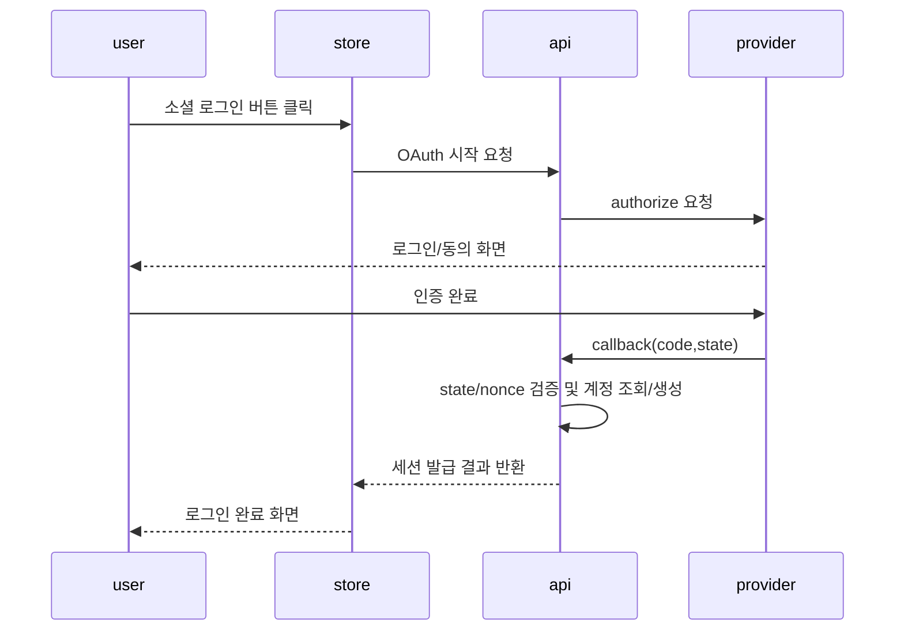
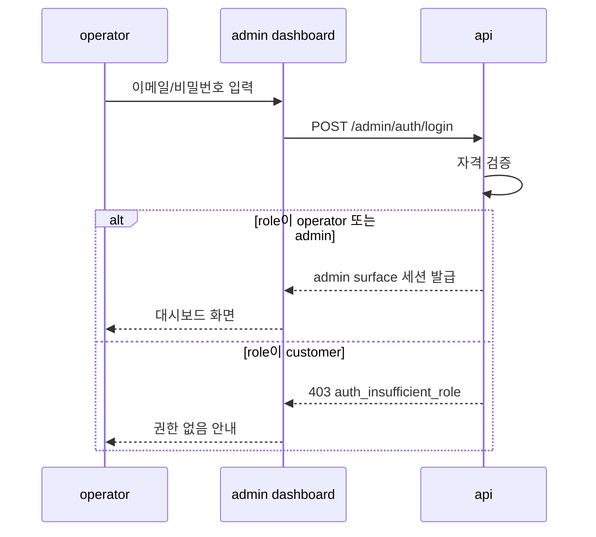

# Auth Domain API

## §2 핵심 사용자 흐름

### Store Surface (고객용)

#### 고객 회원가입(이메일)

1. `POST /auth/register`
2. 이메일 중복/비밀번호 정책 검증
3. 계정 생성(role=`customer`) 후 store surface 세션 발급

#### 고객 로그인(이메일)

1. `POST /auth/login`
2. 자격 검증 성공 시 store surface 세션 발급
3. `GET /auth/me`로 세션 확인

#### 고객 로그인(소셜)

1. `GET /auth/oauth/{provider}/start`
2. provider authorize 페이지 redirect
3. callback 수신: `GET /auth/oauth/{provider}/callback`
4. state/nonce 검증 후 store surface 세션 발급

#### 고객 비밀번호 재설정

1. `POST /auth/password-reset/request`
2. 재설정 토큰 발급 및 비밀번호 재설정 진입 링크 제공
3. `POST /auth/password-reset/confirm`
4. 새 비밀번호 저장 후 기존 세션 폐기

#### 고객 로그아웃

1. `POST /auth/logout`
2. store surface 서버 세션 무효화
3. `qc_access`, `qc_refresh` 쿠키 삭제/만료

### Admin Surface (운영자용)

#### 운영자 로그인(이메일 전용)

1. `POST /admin/auth/login`
2. 자격 검증 성공 시 역할 확인 — `operator` 또는 `admin`이 아니면 `auth_insufficient_role` 에러 반환
3. admin surface 세션 발급
4. `GET /admin/auth/me`로 세션 확인

> Admin surface는 OAuth를 지원하지 않는다. 회원가입(register) 엔드포인트도 제공하지 않는다.
> 운영자 계정은 기존 admin이 관리 화면에서 생성한다.

#### 운영자 로그아웃

1. `POST /admin/auth/logout`
2. admin surface 서버 세션 무효화
3. `qc_admin_access`, `qc_admin_refresh` 쿠키 삭제/만료

## 엔드포인트

### Store Auth 엔드포인트

| Method | Path                              | 설명                 |
| ------ | --------------------------------- | -------------------- |
| POST   | `/auth/login`                     | 고객 이메일 로그인   |
| POST   | `/auth/register`                  | 고객 이메일 회원가입 |
| GET    | `/auth/oauth/{provider}/start`    | OAuth 시작           |
| GET    | `/auth/oauth/{provider}/callback` | OAuth callback       |
| POST   | `/auth/logout`                    | 고객 로그아웃        |
| GET    | `/auth/me`                        | 고객 세션 조회       |
| POST   | `/auth/refresh`                   | 고객 세션 재발급     |
| POST   | `/auth/password-reset/request`    | 비밀번호 재설정 요청 |
| POST   | `/auth/password-reset/confirm`    | 비밀번호 재설정 확정 |

### Admin Auth 엔드포인트

| Method | Path                                 | 설명                 |
| ------ | ------------------------------------ | -------------------- |
| POST   | `/admin/auth/login`                  | 운영자 이메일 로그인 |
| POST   | `/admin/auth/logout`                 | 운영자 로그아웃      |
| GET    | `/admin/auth/me`                     | 운영자 세션 조회     |
| POST   | `/admin/auth/refresh`                | 운영자 세션 재발급   |
| POST   | `/admin/auth/password-reset/request` | 비밀번호 재설정 요청 |
| POST   | `/admin/auth/password-reset/confirm` | 비밀번호 재설정 확정 |

> Admin surface에는 `/admin/auth/register`, `/admin/auth/oauth/*` 엔드포인트가 없다.

### Surface 간 격리 규칙

- Store auth 엔드포인트(`/auth/*`)로 발급된 세션으로 admin API(`/admin/*`) 호출 시 `403` 반환
- Admin auth 엔드포인트(`/admin/auth/*`)에서 `customer` 역할 사용자 로그인 시도 시 `403 auth_insufficient_role` 반환
- 각 surface의 쿠키 네임스페이스가 독립적이므로 동일 브라우저에서 store/admin 세션이 공존 가능

## §5 로그인/로그아웃 보안 정책

### Rate Limit (auth)

#### Store surface

- `POST /auth/login`: 5 req / 15 min / IP
- `GET /auth/oauth/*/start`: 20 req / 15 min / IP
- `POST /auth/logout`: 30 req / 15 min / user

#### Admin surface

- `POST /admin/auth/login`: 3 req / 15 min / IP
- `POST /admin/auth/logout`: 30 req / 15 min / user

> Admin surface는 rate limit을 더 엄격하게 적용한다 (5 → 3 req/15min).

## §6 에러 정책

### 공통 에러 코드 (auth)

- `auth_invalid_credentials`
- `auth_account_locked`
- `auth_session_expired`
- `auth_insufficient_role` (admin surface에서 customer 역할 로그인 시도)
- `oauth_invalid_state`
- `oauth_exchange_failed`
- `oauth_provider_unavailable`

### 응답 규칙

- 메시지는 사용자 친화적이되 내부 사유 노출 금지
- 동일 실패 케이스는 항상 동일 코드 반환
- `auth_insufficient_role`은 "이 계정으로는 접근할 수 없습니다"로 표시 (역할 정보 미노출)
