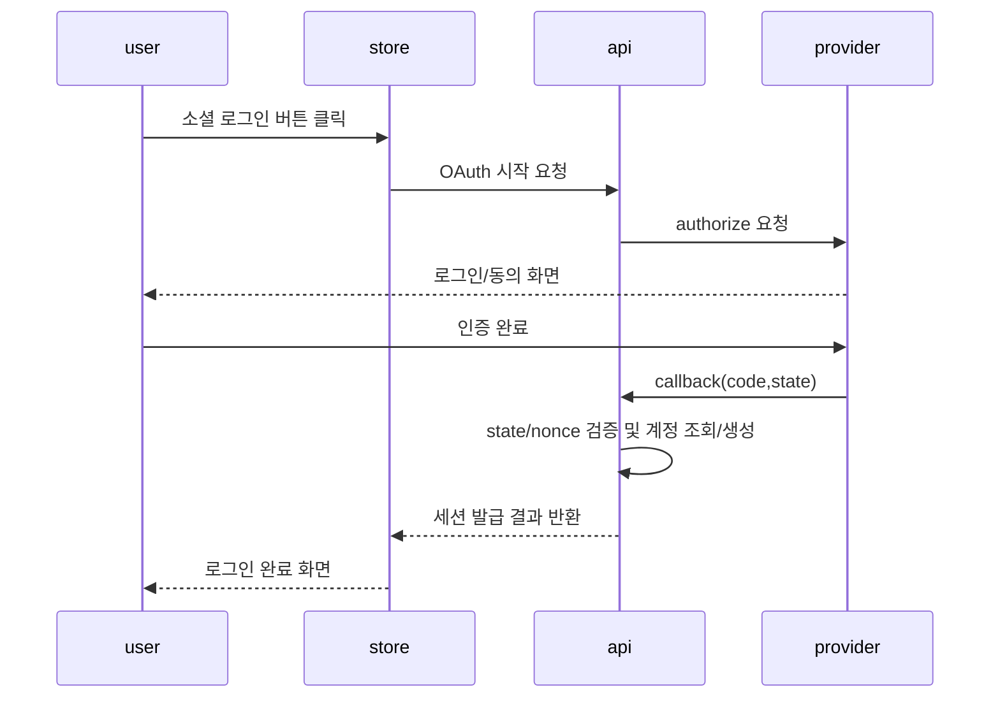

# Auth Domain API

## §2 핵심 사용자 흐름

### 고객 회원가입(이메일)

1. `POST /auth/register`
2. 이메일 중복/비밀번호 정책 검증
3. 계정 생성 후 세션 발급

### 고객 로그인(이메일)

1. `POST /auth/login`
2. 자격 검증 성공 시 세션 발급
3. `GET /auth/me`로 세션 확인

### 고객 로그인(소셜)

1. `GET /auth/oauth/{provider}/start`
2. provider authorize 페이지 redirect
3. callback 수신: `GET /auth/oauth/{provider}/callback`
4. state/nonce 검증 후 세션 발급

### 비밀번호 재설정

1. `POST /auth/password-reset/request`
2. 재설정 토큰 발급 및 비밀번호 재설정 진입 링크 제공
3. `POST /auth/password-reset/confirm`
4. 새 비밀번호 저장 후 기존 세션 폐기

### 로그아웃

1. `POST /auth/logout`
2. 서버 세션 무효화
3. 쿠키 삭제/만료

## 엔드포인트

| Method | Path                              | 설명                 |
| ------ | --------------------------------- | -------------------- |
| POST   | `/auth/login`                     | 이메일 로그인        |
| POST   | `/auth/register`                  | 이메일 회원가입      |
| GET    | `/auth/oauth/{provider}/start`    | OAuth 시작           |
| GET    | `/auth/oauth/{provider}/callback` | OAuth callback       |
| POST   | `/auth/logout`                    | 로그아웃             |
| GET    | `/auth/me`                        | 세션 사용자 조회     |
| POST   | `/auth/refresh`                   | 세션 재발급          |
| POST   | `/auth/password-reset/request`    | 비밀번호 재설정 요청 |
| POST   | `/auth/password-reset/confirm`    | 비밀번호 재설정 확정 |

## §5 로그인/로그아웃 보안 정책

### Rate Limit (auth)

- `POST /auth/login`: 5 req / 15 min / IP
- `GET /auth/oauth/*/start`: 20 req / 15 min / IP
- `POST /auth/logout`: 30 req / 15 min / user

## §6 에러 정책

### 공통 에러 코드 (auth)

- `auth_invalid_credentials`
- `auth_account_locked`
- `auth_session_expired`
- `oauth_invalid_state`
- `oauth_exchange_failed`
- `oauth_provider_unavailable`

### 응답 규칙

- 메시지는 사용자 친화적이되 내부 사유 노출 금지
- 동일 실패 케이스는 항상 동일 코드 반환
