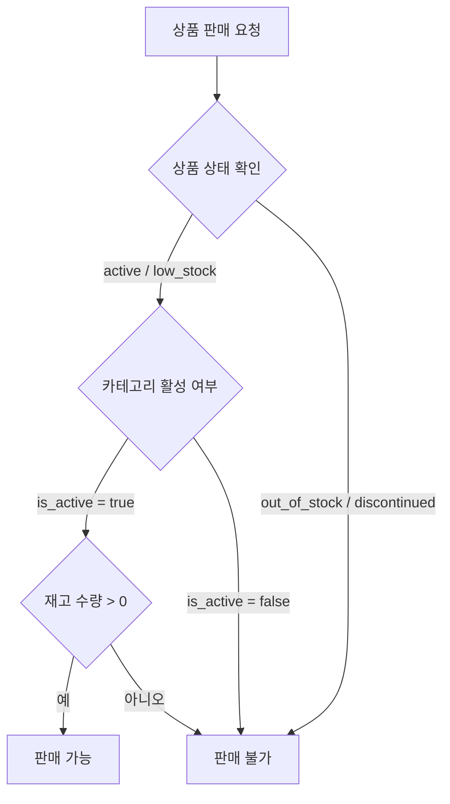

# Catalog Domain Overview

## §1 범위

- 이 문서는 catalog 도메인의 요구사항을 기존 PRD 원문 기준으로 묶어 관리한다.
- 재고 수량 계산/예약/가용 재고 규칙은 inventory 도메인에서 정의한다.

## §2 카테고리/SKU 정책

- 카테고리 (6종):

  | 표시명      | slug               |
  | ----------- | ------------------ |
  | 상온 간편식 | `convenience-food` |
  | 음료        | `beverage`         |
  | 위생용품    | `hygiene`          |
  | 세탁/청소   | `laundry-cleaning` |
  | 반려소모품  | `pet-supplies`     |
  | 셀프케어    | `self-care`        |

- SKU 정책:
  - SKU 수: 40~60
  - SKU 속성: `sku`, `name`, `brand`, `price`, `weight`, `status`, `is_substitutable`
  - 가격 단위: KRW(원)
  - 중량 단위: g(그램)
  - 상태: `active | low_stock | out_of_stock | discontinued`

## §3 이미지/목업 정책

- SKU당 이미지 2장:
  - `thumb_url` (1:1)
  - `detail_url` (4:3)
- 파일명 규칙:
  - `sku-{id}-thumb.webp`
  - `sku-{id}-detail.webp`
- 초기 구현:
  - 카테고리 공통 placeholder + 텍스트 배지 허용

## §4 상품 상태/판매조건

- 상품 상태:
  - `active`
  - `low_stock`
  - `out_of_stock`
  - `discontinued`
- 판매 가능 조건:
  - `active | low_stock`
  - 재고 수량 > 0
- `discontinued`는 신규 구매 불가, 주문 이력 조회만 허용

### 판매 가능 여부 판정 흐름

## §5 Stage 2 게이트 (카탈로그 부분)

### Exit Criteria

- SKU 데이터 seed 완료
- store에서 상품 탐색/장바구니 동작
- out_of_stock 노출 정책 적용

### Evidence

- SKU 정책표
- 이미지 naming 규칙 적용 스냅샷
