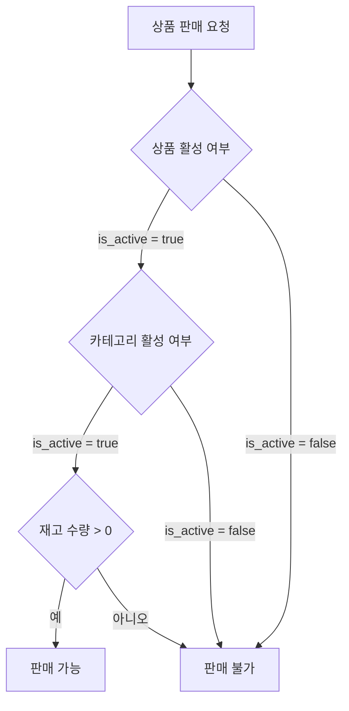

# Catalog Domain Overview

## §1 범위

- 이 문서는 catalog 도메인의 요구사항을 기존 PRD 원문 기준으로 묶어 관리한다.
- 조회(store/admin 상품 탐색) 및 admin 쓰기(상품/카테고리 CRUD, 이미지 업로드)를 포함한다.
- 재고 수량 계산/예약/가용 재고 규칙은 inventory 도메인에서 정의한다.

## §2 카테고리/SKU 정책

- 카테고리 (6종):

  | 표시명      | slug               |
  | ----------- | ------------------ |
  | 상온 간편식 | `convenience-food` |
  | 음료        | `beverage`         |
  | 위생용품    | `hygiene`          |
  | 세탁/청소   | `laundry-cleaning` |
  | 반려소모품  | `pet-supplies`     |
  | 셀프케어    | `self-care`        |

- SKU 정책:
  - SKU 수: 40~60
  - SKU 속성: `sku`, `slug`, `name`, `description`, `brand`, `price`, `weight`, `status`, `is_substitutable`, `display_order`, `tags`
  - 가격 단위: KRW(원)
  - 중량 단위: g(그램)
  - `is_active`: 판매 가능 여부 (boolean, default true)

## §3 이미지/목업 정책

- SKU당 이미지 2장:
  - `thumb_url` (1:1)
  - `detail_url` (4:3)
- 파일명 규칙:
  - `sku-{id}-thumb.webp`
  - `sku-{id}-detail.webp`
- 초기 구현:
  - 카테고리 공통 placeholder + 텍스트 배지 허용
- admin 업로드:
  - JPEG/PNG/WebP 허용, 최대 5MB
  - sharp로 리사이즈 (thumb 400×400, detail 800×600) 후 WebP 변환
  - MinIO(S3 호환) 버킷에 저장

## §4 상품 활성 상태/판매조건

- 상품 활성 상태 (저장):
  - `is_active = true` — 판매 의사 있음 (default)
  - `is_active = false` — 단종/비활성화 (admin 수동 설정). 신규 구매 불가, 주문 이력 조회만 허용
- 재고 표시 상태 (조회 시 계산, 저장하지 않음):
  - `in_stock` — `available > safety_threshold(5)`
  - `low_stock` — `available > 0 && available <= safety_threshold(5)`
  - `out_of_stock` — `available == 0`
- 판매 가능 조건 (세 조건 모두 충족):
  1. `product.is_active = true`
  2. `category.is_active = true`
  3. `available > 0`

### 판매 가능 여부 판정 흐름

## §5 재고 표시 상태 규칙

- 재고 표시 상태(`in_stock`, `low_stock`, `out_of_stock`)는 상품에 저장하지 않으며, 조회 시 inventory의 가용 수량으로 **계산**한다.
  - `available > safety_threshold(5)` → `in_stock`
  - `available > 0 && available <= safety_threshold(5)` → `low_stock`
  - `available == 0` → `out_of_stock`
- API 응답에 계산된 `stock_display` 필드로 포함한다.
- `is_active`는 admin만 변경할 수 있으며, 재고 변동에 의한 자동 전이 대상이 아니다.
- 이 설계는 상품의 판매 의사(`is_active`)와 재고 현실(`stock_display`)을 분리하여, 상태 동기화 이벤트 없이 항상 정확한 표시를 보장한다.

## §6 연관 도메인

- `inventory`: 상품 생성 시 재고 레코드 자동 생성, 재고 수준에 따른 상품 상태 자동 전이
- `cart`: 상품 가격 변경/품절/삭제 시 활성 장바구니 영향
- `order`: 주문 이력이 있는 상품은 삭제 불가

## §7 Stage 게이트 (카탈로그 부분)

### Stage 2 Exit Criteria (조회 기능)

- SKU 데이터 seed 완료
- store에서 상품 탐색/장바구니 동작
- out_of_stock 노출 정책 적용

### Admin CRUD Exit Criteria (쓰기 기능)

- admin에서 상품 생성/수정/삭제 가능
- admin에서 상품 이미지 업로드 가능 (thumb + detail)
- admin에서 상품 상태 변경 가능
- admin에서 카테고리 CRUD 가능
- 기존 store 카탈로그 조회 기능에 영향 없음

### Evidence

- SKU 정책표
- 이미지 naming 규칙 적용 스냅샷
- admin CRUD 기능 동작 검증
