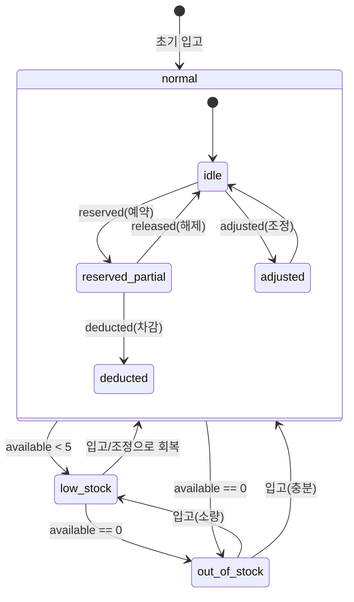

# Inventory Overview

## 목적

재고 도메인의 핵심 정책을 단일 문서로 정리하고, 주문/장바구니/배송 흐름과의 연계를 명확히 한다.

## 재고 수량 규칙 (PRD §3 원문)

- `on_hand`: 총 재고
- `reserved`: 주문 예약 재고
- `available`: `on_hand - reserved`

### 안전재고 임계치

- 안전재고 수량: **5개** (`safety_threshold = 5`)
- `low_stock` 조건: `available < safety_threshold`
- `out_of_stock` 조건: `available == 0`

## 재고 차감 타이밍 (PRD §3 원문)

- 주문 생성 시 `reserved` 증가
- 결제 실패/주문 취소 시 `reserved` 복원
- 배송 확정 시 `on_hand` 확정 차감

## 재고 생애주기

아래 상태 다이어그램은 재고의 상태 전이를 정의한다.

### 전이 트리거

| 전이              | 트리거              | 설명                              |
| ----------------- | ------------------- | --------------------------------- |
| `reserved` (예약) | 주문 생성           | `reserved` 증가, `available` 감소 |
| `released` (해제) | 주문 취소/결제 실패 | `reserved` 감소, `available` 복원 |
| `deducted` (차감) | 배송 확정           | `on_hand` 감소, `reserved` 감소   |
| `adjusted` (조정) | 운영자 수동 조정    | `on_hand` 직접 변경 (입고/보정)   |

## 동시성 규칙 (정책 원문)

이 섹션은 재고 도메인의 동시성 제어 **정책 원문**이다. 다른 문서에서 동시성을 참조할 경우 이 섹션을 기준으로 한다.

- **기본**: 낙관적 락(optimistic lock)
  - 업데이트 시 `version` 일치 조건으로 충돌 감지
  - 충돌 시 재시도(최대 3회)
- **고경합 SKU**: row lock 적용
  - 판단 기준: 동일 SKU 동시 요청 **3건/초 초과** 시
  - 트랜잭션 내 `SELECT ... FOR UPDATE` 로 직렬화
- **공통 제약**: 음수 재고 허용 금지 (`on_hand >= 0`, `reserved >= 0`, `available >= 0`)

## 연관 도메인

- `order`: 주문 생성 시 `reserved` 증가, 취소/실패 시 복원
- `cart`: 장바구니 만료/해제 시 예약 재고 복원 정책과 정합성 유지
- `delivery`: 배송 확정 시점에 `on_hand` 최종 차감

## MVP 범위

- 단일 창고 기준 재고 정책만 포함
- 다중 창고 분산 재고는 MVP 범위에서 제외
