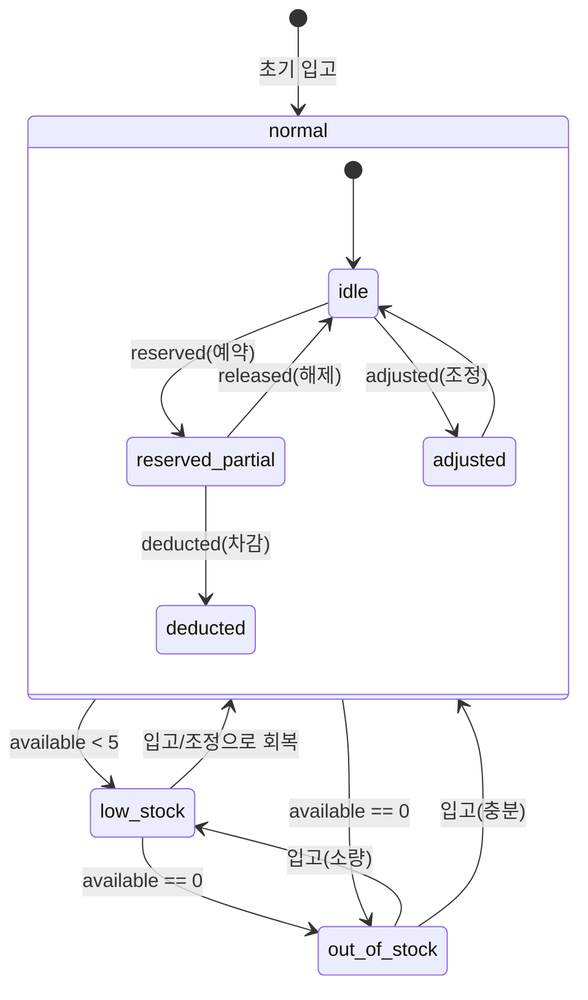

# Inventory Overview

## 목적

재고 도메인의 핵심 정책을 단일 문서로 정리하고, 주문/장바구니/배송 흐름과의 연계를 명확히 한다.

## 재고 수량 규칙 (PRD §3 원문)

- `on_hand`: 총 재고
- `reserved`: 주문 예약 재고
- `available`: `on_hand - reserved`

### 안전재고 임계치

- 안전재고 수량: **5개** (`safety_threshold = 5`)
- `low_stock` 조건: `0 < available ≤ safety_threshold`
- `out_of_stock` 조건: `available == 0`

## 재고 차감 타이밍 (PRD §3 원문)

- 주문 생성 시 `reserved` 증가
- 결제 실패/주문 취소 시 `reserved` 복원
- 배송 확정 시 `on_hand` 확정 차감

## 재고 생애주기

아래 상태 다이어그램은 재고의 상태 전이를 정의한다.

### 전이 트리거

| 전이              | 트리거              | 설명                              |
| ----------------- | ------------------- | --------------------------------- |
| `reserved` (예약) | 주문 생성           | `reserved` 증가, `available` 감소 |
| `released` (해제) | 주문 취소/결제 실패 | `reserved` 감소, `available` 복원 |
| `deducted` (차감) | 배송 확정           | `on_hand` 감소, `reserved` 감소   |
| `adjusted` (조정) | 운영자 수동 조정    | `on_hand` 직접 변경 (입고/보정)   |

## 동시성 규칙 (정책 원문)

이 섹션은 재고 도메인의 동시성 제어 **정책 원문**이다. 다른 문서에서 동시성을 참조할 경우 이 섹션을 기준으로 한다.

- **기본**: 낙관적 락(optimistic lock)
  - 업데이트 시 `version` 일치 조건으로 충돌 감지
  - 충돌 시 재시도(최대 3회)
- **고경합 SKU**: row lock 적용
  - 판단 기준: 동일 SKU 동시 요청 **3건/초 초과** 시
  - 트랜잭션 내 `SELECT ... FOR UPDATE` 로 직렬화
- **공통 제약**: 음수 재고 허용 금지 (`on_hand >= 0`, `reserved >= 0`, `available >= 0`)

## 엣지 케이스

- **가용 수량 0**: `available == 0`이면 해당 SKU는 `out_of_stock`으로 표시되며, 추가 예약(`reserve`) 요청을 거부한다.
- **예약 수량 > 가용 수량**: reserve 요청 시 `quantity > available`이면 실패 응답(400)을 반환한다. 부분 예약은 허용하지 않는다.
- **음수 결과 조정**: adjust 요청 결과 `on_hand < 0` 또는 `available < 0`이 되는 경우 요청을 거부한다.
- **on_hand 최대값**: `on_hand`의 상한은 `999,999`개로 제한한다. 초과 입고 시도는 거부.
- **동시 reserve + release**: 동일 SKU에 대해 reserve와 release가 동시에 도착할 수 있다. 낙관적 락(version)으로 직렬화하며, 충돌 시 재시도한다.

## 실패 시나리오

| 실패 상황 | 영향 | 대응 |
| --- | --- | --- |
| reserve 실패 (재고 부족) | 주문 생성 불가 | 주문 도메인에 실패 응답 반환. 대체상품 흐름 트리거 |
| reserve 실패 (version 충돌) | 일시적 지연 | 최대 3회 재시도 후 실패 응답 |
| release 실패 (이벤트 소비 실패) | 예약 재고 미복원 (phantom reserve) | DLQ 이동 → 운영자 확인 후 redrive |
| confirm-deduction 실패 | `on_hand` 미차감, 재고 정확도 저하 | DLQ 이동 → 수동 조정 또는 redrive |
| adjust 중 DB 장애 | 조정 미반영 | 트랜잭션 롤백. 운영자에게 재시도 안내 |
| catalog 도메인 장애 | 재고 도메인 독립 동작에는 영향 없음 | 상품 조회 시 catalog 장애 전파 가능 → 캐시 fallback 검토 |

## 복구 정책

- **phantom reserve (예약 미복원)**: DLQ에 적체된 release 이벤트를 redrive하여 복원한다. redrive 실패 시 운영자가 adjust API로 수동 보정한다.
- **on_hand 부정합**: 실제 재고와 시스템 재고가 불일치할 경우, 운영자가 adjust API로 `on_hand`을 보정하고 사유를 기록한다.
- **version 충돌 반복**: 동일 SKU에서 3회 초과 충돌이 지속되면 고경합 SKU로 판별하여 row lock 전환을 검토한다.

## 연관 도메인

- `catalog`: 상품 생성(`ProductCreated`) 시 재고 레코드 자동 생성. 상품 비활성화/삭제 시 재고 레코드 정리.
- `order`: 주문 생성 시 `reserved` 증가, 취소/결제 실패 시 복원. 트리거 이벤트는 `OrderCreated`, `OrderStatusChanged` (status=cancelled).
- `cart`: 장바구니 자체는 재고를 예약하지 않는다. 재고 예약/해제는 order 도메인의 주문 생성/취소 시점에 처리된다 (`04-cart/01-overview.md` §2 참조).
- `delivery`: 배송 확정 시점에 `on_hand` 최종 차감. 트리거 이벤트는 `DeliveryStatusChanged` (new_status=delivered).
- `notification`: 재고 수준 변동(`InventoryLevelChanged`) 이벤트를 notification이 소비하여 품절/재입고 알림 발송.

## MVP 범위

- 단일 창고 기준 재고 정책만 포함
- 다중 창고 분산 재고는 MVP 범위에서 제외
