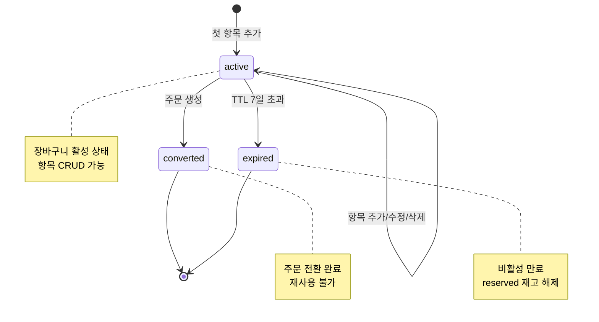

# Cart Domain Overview

## 1) 범위

- 이 문서는 cart 도메인의 요구사항을 기존 PRD 원문 기준으로 묶어 관리한다.
- 장바구니 정책은 store 기본 동작을 우선하며, 복수 스토어 장바구니와 위시리스트는 범위에서 제외한다.

## 2) 장바구니 정책 (PRD §4 원문)

- 수량 제한: 아이템당 최대 15
- 장바구니 최대 항목 수: 30개 (CartItem 기준)
- 장바구니 TTL: 7일 비활성 시 자동 만료
- 만료 시 reserved 재고는 즉시 해제
- 게스트 사용자 정책: MVP에서는 로그인 필수이며, 비로그인(게스트) 장바구니는 지원하지 않는다.

## 3) 장바구니 → 주문 전환 정책

- 주문 생성 시 장바구니 상태를 `converted`로 변경한다.
- 장바구니 항목(CartItem)은 주문 항목(OrderItem)으로 복사되며, 원본 장바구니는 재사용할 수 없다.
- 전환 완료된 장바구니에 대한 항목 추가/수정/삭제는 거부한다.
- 전환 시점에 `CartConverted` 이벤트를 발행한다.

## 4) 장바구니 생명주기

## 5) 연관 도메인

- `inventory`: 장바구니 만료 시 `reserved` 해제 정책과 정합성을 유지한다.
- `order`: 장바구니 항목으로 주문 생성 시 재고 예약/해제 흐름이 이어진다. 전환 시 cart 상태가 `converted`로 변경된다.

## 6) Stage 2 게이트 (cart 부분)

### Exit Criteria

- store에서 상품 탐색/장바구니 동작
