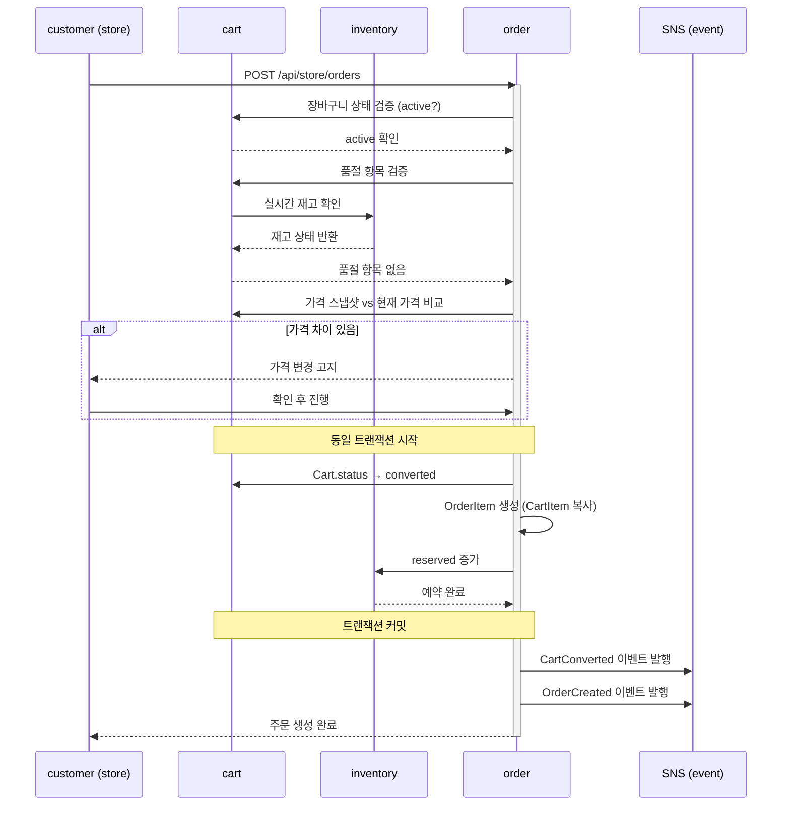
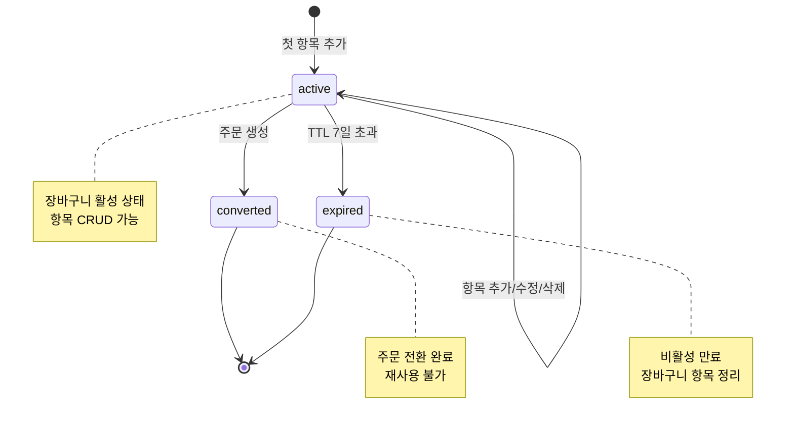

# Cart Domain Overview

## 1) 범위

- 이 문서는 cart 도메인의 요구사항을 기존 PRD 원문 기준으로 묶어 관리한다.
- 장바구니 정책은 store 기본 동작을 우선하며, 복수 스토어 장바구니와 위시리스트는 범위에서 제외한다.

## 2) 장바구니 정책 (PRD §4 원문)

- 수량 제한: 아이템당 최대 15
- 장바구니 최대 항목 수: 30개 (CartItem 기준)
- 장바구니 TTL: 7일 비활성 시 자동 만료
- 장바구니는 재고를 예약하지 않는다. 재고 예약(`reserved` 증가)은 **주문 생성 시점**에 inventory 도메인에서 수행한다 (`03-inventory/01-overview.md` 참조).
- 만료 시 장바구니 항목만 정리되며, 재고 변동은 발생하지 않는다.
- 게스트 사용자 정책: MVP에서는 로그인 필수이며, 비로그인(게스트) 장바구니는 지원하지 않는다.
- 활성 장바구니 정책: 사용자당 활성(`active`) 장바구니는 최대 1개. 주문 전환 또는 만료 후 다음 항목 추가 시 새 장바구니를 자동 생성한다.
- 중복 상품 추가: 동일 `product_id`를 장바구니에 재추가하면 기존 항목의 수량을 합산한다(upsert). 합산 결과가 아이템당 최대 수량(15)을 초과하면 거부한다.
- 가격 스냅샷 정책: `unit_price_snapshot`은 항목 추가 시점의 상품 가격을 기록한다. 상품 가격 변경 시 기존 장바구니 항목의 스냅샷은 갱신하지 않으며, 주문 전환 시 최신 가격으로 재검증하여 차이가 있으면 사용자에게 고지한다.
- 품절 상품 처리: 장바구니에 담긴 상품이 품절(`available == 0`)되어도 장바구니에서 자동 제거하지 않는다. 장바구니 조회 시 실시간 재고를 확인하여 품절 항목에 품절 표시를 노출하고, 품절 항목이 포함된 상태에서는 주문 전환을 차단한다. 사용자가 품절 항목을 직접 제거해야 주문 진행이 가능하다.
- 대체 가능 여부(`is_substitutable`): 상품 추가 시 해당 상품의 `is_substitutable` 속성을 CartItem에 복사한다. 장바구니 UI에서 사용자가 변경할 수 없으며, 주문 전환 시 대체상품 정책(`05-order/01-overview.md`)에 전달된다.

### TTL 만료 메커니즘

- `expires_at`은 장바구니 생성 시 `now + 7일`로 설정하며, 항목 추가/수정/삭제 시 `last_active_at`을 갱신하고 `expires_at`을 `now + 7일`로 재설정한다.
- 만료 감지는 주기적 배치(1시간 간격)로 `expires_at < now`인 장바구니를 조회하여 일괄 만료 처리한다.
- 배치당 최대 처리 건수는 500건이며, 처리 중 실패한 건은 다음 배치에서 재시도한다.

## 3) 장바구니 → 주문 전환 정책

- 주문 생성 시 장바구니 상태를 `converted`로 변경한다.
- 장바구니 항목(CartItem)은 주문 항목(OrderItem)으로 복사되며, 원본 장바구니는 재사용할 수 없다.
- 전환 완료된 장바구니에 대한 항목 추가/수정/삭제는 거부한다.
- 전환 시점에 `CartConverted` 이벤트를 발행한다.

### 전환 시퀀스

### 전환 실패 복구 정책

- 장바구니 상태 변경(`converted`)과 주문 생성은 동일 트랜잭션 내에서 수행한다.
- 트랜잭션 실패 시 장바구니 상태는 `active`로 유지되며, 사용자에게 재시도를 안내한다.
- `CartConverted` 이벤트는 트랜잭션 커밋 후 발행하여, 주문 생성이 확정된 경우에만 이벤트가 전파된다.

## 4) 장바구니 생명주기

### 상태 전이 트리거

| 전이                | 트리거                                | 주체           | 가드 조건                                    |
| ------------------- | ------------------------------------- | -------------- | -------------------------------------------- |
| `[*] → active`      | 첫 항목 추가                          | customer       | 기존 active 장바구니 없음                    |
| `active → active`   | 항목 추가/수정/삭제                   | customer       | 정책 제한 미초과 (수량 ≤ 15, 항목 ≤ 30)     |
| `active → converted` | 주문 생성 (`POST /api/store/orders`) | system         | 장바구니 항목 ≥ 1, 품절 항목 없음            |
| `active → expired`  | TTL 배치 만료 처리                    | system (batch) | `expires_at < now`                           |

## 5) 동시성/충돌 해소 정책

- 동일 사용자의 동시 요청(다중 탭/기기) 시 낙관적 락(optimistic lock)으로 충돌을 감지한다.
- Cart 엔터티에 `version` 필드를 두고, 수정 시 `version` 일치 조건으로 갱신한다.
- 충돌 감지 시 클라이언트에 `409 Conflict`를 반환하고, 최신 장바구니 상태를 함께 전달하여 사용자가 재시도할 수 있도록 한다.
- 재시도 횟수 제한 없음 (사용자 주도 재시도).

## 6) 연관 도메인

- `catalog`: 상품 가격 변경 시 기존 장바구니 스냅샷은 갱신하지 않으며 주문 전환 시 재검증한다. 상품 비활성화(`is_active = false`) 또는 카테고리 비활성화 시 해당 상품의 장바구니 추가를 차단한다.
- `inventory`: 장바구니 자체는 재고를 예약하지 않는다. 재고 예약/해제는 주문 생성/취소 시점에 inventory 도메인에서 관리한다. 장바구니 조회 시 실시간 재고를 확인하여 품절 여부를 표시한다.
- `order`: 장바구니 항목으로 주문 생성 시 재고 예약 흐름이 이어진다. 전환 시 cart 상태가 `converted`로 변경된다.
- `notification`: `CartExpired`(만료 안내), `CartConverted`(주문 전환 완료) 이벤트를 notification이 소비하여 사용자 알림 발송 (`../12-notification/05-events.md`)

## 7) Stage 2 게이트 (cart 부분)

### Exit Criteria

- store에서 상품 탐색/장바구니 동작
