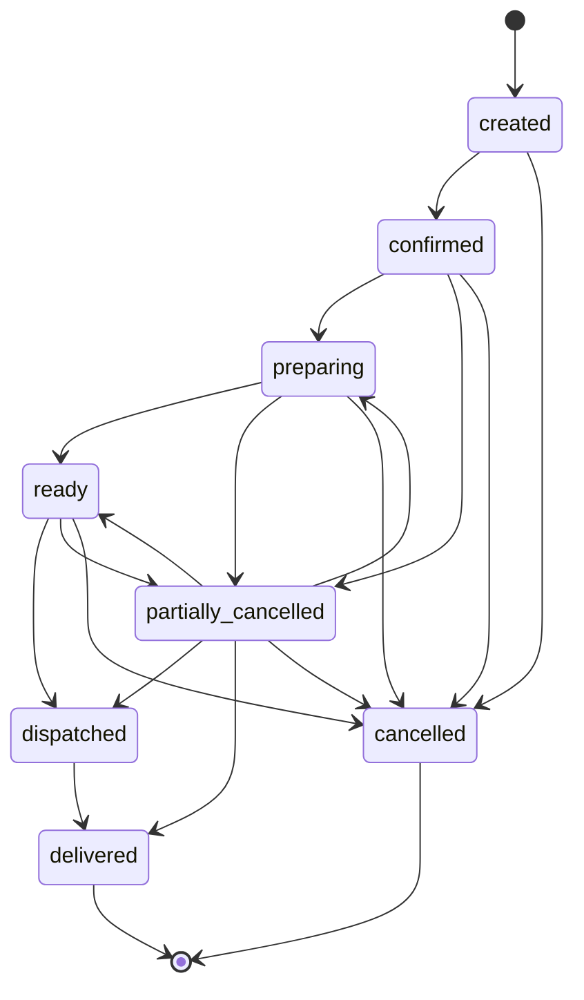
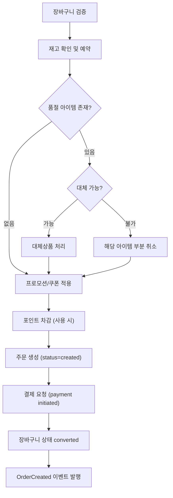
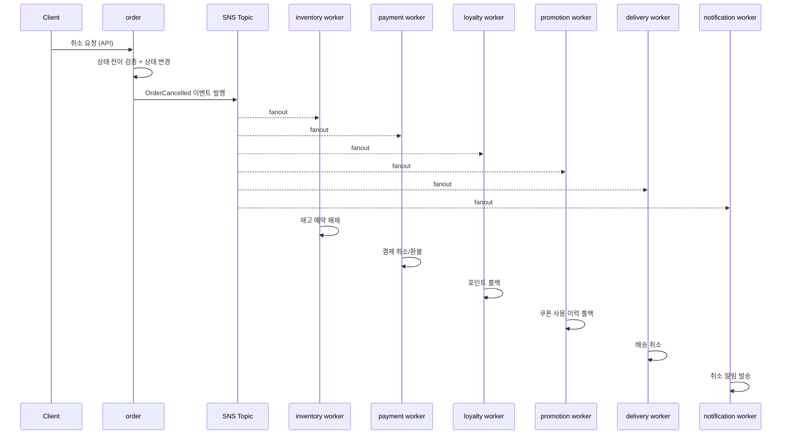

# Order Overview

## 목적

주문 도메인의 핵심 정책을 단일 문서로 정리하고, 결제/재고/배송/프로모션/포인트/알림 연계를 크로스레퍼런스로 명확히 한다.

## MVP 범위

### 포함

- 장바구니 기반 주문 생성
- 주문 단건/목록 조회
- 주문 상태 전이 (고객 취소 + 운영자 전이)
- 부분 품절 처리 및 대체상품 흐름
- 주문 취소 시 연쇄 효과 (재고/결제/포인트/배송/알림)

### 제외

- 선물하기/대리 주문
- 예약 주문 (시간 지정 주문 생성)
- 주문 수정 (생성 후 아이템 변경)
- 분할 배송
- 반품/교환

## 주문 정책

### 주문 상태

- `created`: 주문 생성 완료, 결제 대기
- `confirmed`: 결제 확인 완료, 이행 준비
- `preparing`: 피킹/패킹 진행 중
- `ready`: 출고 준비 완료, 배차 대기
- `dispatched`: 배차 완료, 배송 중
- `delivered`: 배송 완료 (종료 상태)
- `cancelled`: 전체 취소 (종료 상태)
- `partially_cancelled`: 일부 아이템 취소, 잔여 아이템 이행 진행

### 주문 상태 머신

### 상태 전이 규칙

- `created -> confirmed|cancelled`
- `confirmed -> preparing|partially_cancelled|cancelled`
- `preparing -> ready|partially_cancelled|cancelled`
- `ready -> dispatched|partially_cancelled|cancelled`
- `partially_cancelled -> preparing|ready|dispatched|delivered|cancelled`
- `dispatched -> delivered`
- `delivered`, `cancelled`는 종료 상태

불법 전이는 API 레벨과 DB 레벨에서 모두 차단.

### 상태 전이 트리거

| 전이 | 트리거 | 수행 주체 | 전제 조건 |
| --- | --- | --- | --- |
| `created` → `confirmed` | `PaymentCaptured` 이벤트 수신 | system | 재고 예약 완료 + 결제 승인 완료 |
| `created` → `cancelled` | 고객 취소 요청 또는 `PaymentFailed` 수신 | customer / system | — |
| `confirmed` → `preparing` | 운영자 피킹 시작 | operator | — |
| `confirmed` → `partially_cancelled` | 부분 품절 확인 (대체 불가 아이템) | system / operator | `is_substitutable=false`인 아이템 품절 |
| `confirmed` → `cancelled` | 운영자 전체 취소 | operator | — |
| `preparing` → `ready` | 피킹/패킹 완료 | operator | 모든 활성 아이템 준비 완료 |
| `preparing` → `partially_cancelled` | 준비 중 부분 품절 발견 | operator | — |
| `preparing` → `cancelled` | 운영자 전체 취소 | operator | — |
| `ready` → `dispatched` | `DeliveryDispatched` 이벤트 수신 | system | 배송 기사 배정 완료 |
| `ready` → `partially_cancelled` | 출고 직전 부분 취소 | operator | — |
| `ready` → `cancelled` | 운영자 전체 취소 | operator | — |
| `partially_cancelled` → `preparing` | 잔여 아이템 피킹 재개 | operator | 취소되지 않은 아이템 존재 |
| `partially_cancelled` → `ready` | 잔여 아이템 준비 완료 | operator | — |
| `partially_cancelled` → `dispatched` | 잔여 아이템 배차 완료 | system | — |
| `partially_cancelled` → `delivered` | 잔여 아이템 배송 완료 | system | — |
| `partially_cancelled` → `cancelled` | 잔여 전체 취소 | operator / customer | 남은 활성 아이템 없음 |
| `dispatched` → `delivered` | `DeliveryStatusChanged`(delivered) 수신 | system | — |

> **SLA 기준 시각**: delivery 도메인의 SLA 목표 시각(`sla_target_at`)은 `confirmed` 전이 시각(= `PaymentCaptured` 수신 시각)을 기준으로 산정한다. `../07-delivery/01-overview.md` 참조.

### 취소 가능 상태 요약

| 수행 주체 | 취소 가능 상태 | 취소 유형 |
| --- | --- | --- |
| customer | `created` | 전체 취소 |
| operator | `created`, `confirmed`, `preparing`, `ready`, `partially_cancelled` | 전체 취소 |
| system / operator | `confirmed`, `preparing`, `ready` | 부분 취소 (아이템 단위) |

- `dispatched` 이후 고객/운영자 취소 불가 (반품 절차로 전환 — MVP 제외)

## 주문 생성 흐름

- 장바구니 검증: 상태 `active`, 아이템 1개 이상
- 재고 확인: inventory 도메인에 예약 요청 (`reserved` 증가)
- 프로모션 적용: `../08-promotion/01-overview.md` 계산 순서 참조
- 포인트 차감: `../09-loyalty/01-overview.md` 사용 규칙 참조

### 단계별 실패 처리

| 단계 | 실패 시 처리 |
| --- | --- |
| 재고 확인/예약 | 전체 품절이면 주문 생성 거부. 부분 품절이면 대체/부분 취소 진행 |
| 프로모션 적용 | 프로모션 조건 미달 시 할인 없이 진행 (주문 생성은 차단하지 않음) |
| 포인트 차감 | 잔액 부족 시 포인트 사용 거부, 사용자에게 금액 재확인 요청 |
| 결제 요청 | `PaymentFailed` 수신 시 주문 `cancelled` 전이, 재고 예약 해제, 포인트 복원 |

## 부분 실패/부분 품절

- 일부 아이템 품절 시:
  - 대체 허용 SKU(`is_substitutable=true`)이면 대체 제안
  - 대체 미허용이면 해당 아이템 부분 취소 처리
- 주문 전체 취소 여부는 사용자 선택 정책을 따른다
- 모든 아이템이 취소되면 주문 전체가 `cancelled`로 전이

## 대체상품 정책

### 대체 가능 조건

- `is_substitutable=true`인 SKU만 대체 가능

### 대체 우선순위

- 대체 우선순위: 동일 카테고리 → 유사 가격대 → 동일 브랜드

### 가격 차이 정책

- 대체 상품 가격이 원상품 가격의 `120%` 이하이면 자동 적용
- 대체 상품 가격이 원상품 가격의 `120%` 초과이면 동기 승인 요청 수행

### 가격 차이 처리 규칙

| 상황 | 처리 |
| --- | --- |
| 대체 상품이 원상품보다 저렴 | 차액만큼 주문 총액 감소, 환불 대상에 포함 |
| 대체 상품이 원상품 대비 120% 이내로 비쌈 | 차액만큼 주문 총액 증가, 추가 결제 처리 |
| 대체 상품이 원상품 대비 120% 초과로 비쌈 | 사용자 승인 필요, 승인 시 추가 결제 |

- 대체 적용 후 프로모션 할인은 **재계산하지 않는다** (주문 생성 시점 스냅샷 유지)
- 대체 적용 후 포인트 적립은 **최종 결제 금액** 기준으로 산정

### 대체 승인 흐름

- 동기 승인 요청 제한 시간은 `10분`으로 고정
- 사용자가 `10분` 내 승인하면 대체 적용 후 주문 진행
- 사용자가 거절하면 해당 아이템은 부분 취소로 전환
- `10분` 내 응답이 없으면 해당 아이템은 자동으로 부분 취소 처리
- 승인 대기 중 대체 대상 상품이 품절되면 자동 부분 취소 처리

> 대체 승인은 **동기 API 기반** 흐름이다. 사용자가 Store UI에서 직접 승인/거절하며, 타임아웃은 서버 측 스케줄러 또는 TTL 기반으로 처리한다.

## 동시성 정책

- **상태 전이**: 낙관적 락(optimistic lock) 적용
  - 전이 시 현재 `status` + `version` 일치 조건으로 충돌 감지
  - 충돌 시 클라이언트에 409 Conflict 반환, 재시도는 클라이언트 판단
- **중복 주문 방지**: 동일 장바구니(`cart_id`)에 대한 중복 주문 생성 차단
  - `cart_id` + `status != cancelled` 유니크 제약으로 방지
- **대체 승인 동시성**: 동일 아이템에 대한 승인/거절 중복 요청 방지
  - `approval_state`가 `pending_approval`일 때만 승인/거절 허용

## 취소 시 연쇄 효과 (크로스레퍼런스)

주문 취소(전체/부분) 시 `OrderCancelled` 이벤트를 발행하고, 각 도메인 소비자가 비동기로 후속 처리한다.

| 후속 처리 | 담당 도메인 | 처리 내용 | 정책 참조 |
| --- | --- | --- | --- |
| 재고 복원 | inventory | `reserved` 감소, `available` 복원 | `../03-inventory/01-overview.md` |
| 결제 환불 | payment | 결제 취소/환불 처리 | `../06-payment/01-overview.md` |
| 포인트 롤백 | loyalty | 적립 포인트 회수 + 사용 포인트 복원 | `../09-loyalty/01-overview.md` |
| 프로모션 롤백 | promotion | 쿠폰 사용 이력 롤백, 사용 카운트 복원 | `../08-promotion/01-overview.md` |
| 배송 취소 | delivery | 배차 취소, SLA 해제 | `../07-delivery/01-overview.md` |
| 알림 발송 | notification | 취소 완료 알림 | `../12-notification/01-overview.md` |

### 주문 취소 연쇄 시퀀스 (이벤트 기반)

## 연관 도메인

| 도메인 | 연관 내용 | 참조 |
| --- | --- | --- |
| cart | 장바구니 → 주문 전환, `CartConverted` 이벤트 수신 | `../04-cart/01-overview.md` |
| inventory | 주문 생성 시 재고 예약, 취소 시 복원, 배송 확정 시 차감 | `../03-inventory/01-overview.md` |
| payment | 결제 요청/승인/취소/환불 연동 | `../06-payment/01-overview.md` |
| delivery | 배차/배송 상태 연동, SLA 기준 시각 제공 | `../07-delivery/01-overview.md` |
| promotion | 주문 생성 시 프로모션/쿠폰 할인 적용 | `../08-promotion/01-overview.md` |
| loyalty | 포인트 적립(배송 완료 후)/사용(주문 생성 시)/롤백(취소 시) | `../09-loyalty/01-overview.md` |
| notification | 주문 생성/상태 변경/취소 알림 발송 | `../12-notification/01-overview.md` |
| review | 배송 완료 후 리뷰 작성 가능 | `../10-review/01-overview.md` |
| inquiry | 주문 기반 고객 문의 생성 | `../11-inquiry/01-overview.md` |

## Stage 게이트 (주문 범위)

### Stage 3 — Order Core

- `POST /orders`, `GET /orders`, `GET /orders/:id`
- 주문 상태 모델과 전이 규칙 적용
- 상태 전이 제약 설계
- 부분 품절/대체 처리 규칙
- 주문 생성/조회 성공
- 불법 상태 전이 차단
- 대체상품 흐름 동작

### Stage 6 — Admin Operations

- admin에서 상태 전이, 실패 이벤트 관리
- 운영자가 상태 전이/redrive 수행 가능
