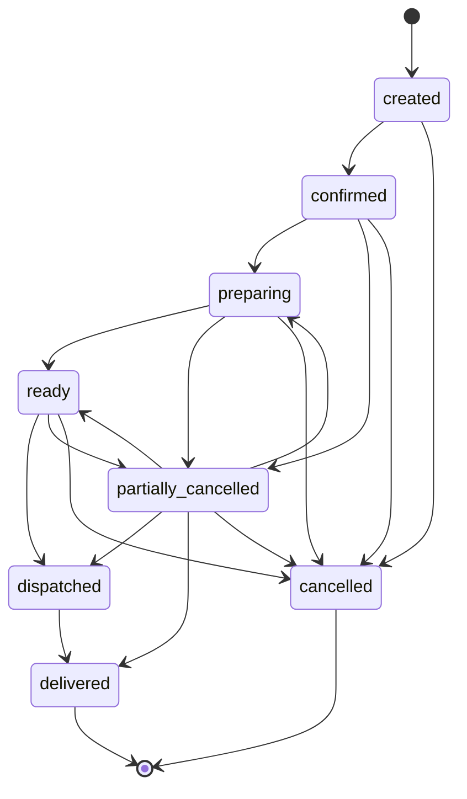
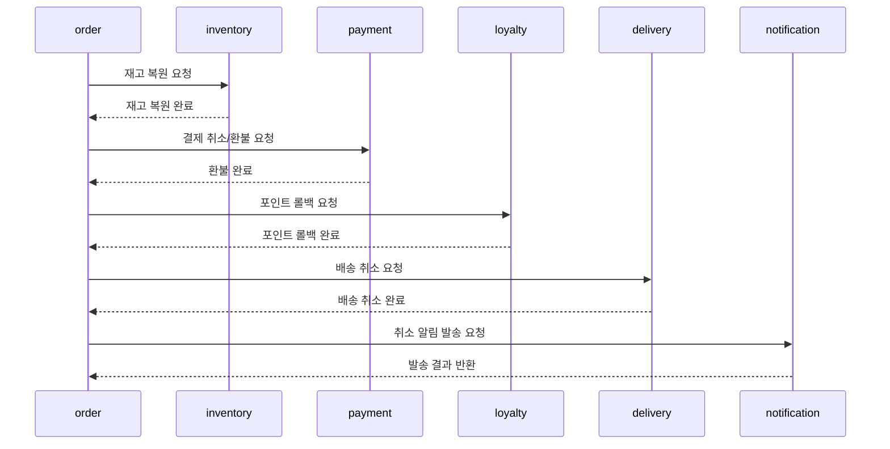

# Order Overview

## 목적

주문 도메인의 핵심 정책을 단일 문서로 정리하고, 결제/재고/배송/포인트/알림 연계를 크로스레퍼런스로 명확히 한다.

## 주문 정책 (PRD §5 원문)

### 주문 상태

- `created`
- `confirmed`
- `preparing`
- `ready`
- `dispatched`
- `delivered`
- `cancelled`
- `partially_cancelled`

### 주문 상태 머신

### 상태 전이 규칙

- `created -> confirmed|cancelled`
- `confirmed -> preparing|partially_cancelled|cancelled`
- `preparing -> ready|partially_cancelled|cancelled`
- `ready -> dispatched|partially_cancelled|cancelled`
- `partially_cancelled -> preparing|ready|dispatched|delivered|cancelled`
- `dispatched -> delivered`
- `delivered`, `cancelled`는 종료 상태

불법 전이는 API 레벨과 DB 레벨에서 모두 차단.

### 부분 실패/부분 품절

- 일부 아이템 품절 시:
  - 대체 허용 SKU면 대체 제안
  - 대체 미허용이면 부분 취소 처리
- 주문 전체 취소 여부는 사용자 선택 정책을 따른다.

## 대체상품 정책 (PRD §6 원문)

### 대체 가능 조건

- `is_substitutable=true`인 SKU만 대체 가능

### 대체 우선순위

- 대체 우선순위: 동일 카테고리 -> 유사 가격대 -> 동일 브랜드

### 가격 차이 정책

- 가격 차이 정책:
  - 대체 상품 가격이 원상품 가격의 `120%` 이하이면 자동 적용
  - 대체 상품 가격이 원상품 가격의 `120%` 초과이면 동기 승인 요청 수행

### 대체 승인 흐름

- 동기 승인 요청 제한 시간은 `10분`으로 고정
- 사용자가 `10분` 내 승인하면 대체 적용 후 주문 진행
- 사용자가 거절하면 해당 아이템은 부분 취소로 전환
- `10분` 내 응답이 없으면 해당 아이템은 자동으로 부분 취소 처리

## 취소 시 연쇄 효과 (크로스레퍼런스)

- inventory 복원: `../03-inventory/01-overview.md`의 재고 차감/복원 정책 참조
- payment 환불: `../06-payment/01-overview.md`의 주문 취소 연계 환불 정책 참조
- loyalty 롤백: `../09-loyalty/01-overview.md`의 주문 취소 연계 포인트 롤백 정책 참조
- delivery 취소: 배송 상태 정책은 delivery 도메인 문서에서 단일 소스로 관리하고 order에서는 크로스레퍼런스만 유지
- notification 알림: 주문 취소 알림 정책은 notification 도메인 문서에서 단일 소스로 관리

### 주문 취소 연쇄 시퀀스

## Stage 게이트 (주문 범위)

### Stage 3 — Order Core

- `POST /orders`, `GET /orders/:id`
- 주문 상태 모델과 전이 규칙 적용
- 상태 전이 제약 설계
- 부분 품절/대체 처리 규칙
- 주문 생성/조회 성공
- 불법 상태 전이 차단
- 대체상품 흐름 동작

### Stage 6 — Admin Operations

- admin에서 상태 전이, 실패 이벤트 관리
- 운영자가 상태 전이/redrive 수행 가능
