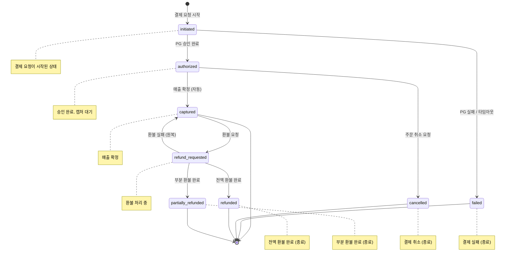

# Payment Overview

## 목적

결제 도메인의 핵심 정책을 단일 문서로 정리하고, 주문 취소/환불 연결 지점을 명확히 한다.

## 결제 상태 머신

### 전이 규칙 요약

| 출발 상태           | 도착 상태            | 트리거                      | 주체          |
| ------------------- | -------------------- | --------------------------- | ------------- |
| `initiated`         | `authorized`         | PG 승인 응답 수신 (webhook) | 시스템 (PG)   |
| `initiated`         | `failed`             | PG 실패 또는 30초 타임아웃  | 시스템        |
| `authorized`        | `captured`           | PG 승인 즉시 자동 매출 확정 | 시스템        |
| `authorized`        | `cancelled`          | 주문 취소 요청              | 사용자        |
| `captured`          | `refund_requested`   | 주문 취소/환불 요청         | 사용자/운영자 |
| `refund_requested`  | `refunded`           | PG 전액 환불 완료           | 시스템 (PG)   |
| `refund_requested`  | `partially_refunded` | PG 부분 환불 완료           | 시스템 (PG)   |
| `refund_requested`  | `captured`           | PG 환불 실패 시 원복        | 시스템        |

- 종료 상태: `captured`, `failed`, `cancelled`, `refunded`, `partially_refunded` — 이후 전이 불가.
- `captured`는 환불 요청이 없으면 종료 상태로 유지한다.

## 결제 정책

### 타임아웃

- 결제 요청 후 **30초** 내 PG 응답이 없으면 `failed_timeout` 코드로 종료한다.

### 매출 확정 (Capture) 정책

- MVP에서는 **자동 capture** 정책을 적용한다: PG 승인(`authorized`) 즉시 매출 확정(`captured`)으로 전이.
- 수동 capture(배송 완료 후 확정)는 MVP 범위에서 제외한다.

### 주문:결제 카디널리티

- MVP 단계에서 Order:Payment 관계는 **1:1**로 제한한다.
- 부분 결제(split payment) 및 분할 결제는 MVP 범위에서 제외한다.

### 중복 결제 방지

- 중복 결제 방지를 위한 idempotency key 필수.
- 동일 주문에 진행 중인 결제(`initiated`/`authorized`)가 존재하면 신규 결제 요청을 거절한다.

### 결제 금액 산출

- 결제 금액 = 주문 총액 - 프로모션 할인 - 포인트 사용
- 산출 시점: 주문 생성 시 확정한 금액을 결제 요청에 사용한다.
- 결제 요청 시 서버에서 주문 금액과 결제 요청 금액의 일치를 검증한다.
- 최소 결제 금액: **100원** (PG 최소 단위)
- 통화: **KRW** (원 단위, 소수점 없음)

### 결제 수단

- MVP 지원: **카드 결제** (신용/체크) 단일 수단
- 확장 후보: 계좌이체, 간편결제(카카오페이, 네이버페이)
- 결제 수단별 PG 응답 코드 → 내부 `failure_code` 매핑은 `02-api.md` 참조

### 결제 재시도 정책

- `failed` 이후 사용자 재시도 가능, 재시도 시 새로운 idempotency key를 사용한다.
- 동일 주문 최대 결제 시도 횟수: **5회**
- 5회 초과 시 주문 자동 취소 처리, 운영자 알림 발송

## 환불 정책

### 전액 환불

- 주문 취소(`cancelled`) 시 결제 금액 전액을 환불한다.
- 환불 요청 시 결제 상태를 `refund_requested`로 전이하고, PG 환불 완료 시 `refunded`로 전이한다.

### 부분 환불

- 주문 부분 취소(`partially_cancelled`) 시 취소된 아이템 금액을 부분 환불한다.
- 부분 환불 금액 = 취소된 아이템 단가 × 수량 (프로모션 할인은 남은 아이템에 재배분하지 않고, 취소 아이템의 원래 할인 적용 금액 기준)
- 환불 완료 시 `partially_refunded`로 전이한다.

### 환불 소요 시간

- PG 환불 요청 후 응답 타임아웃: **30초** (결제 타임아웃과 동일)
- 실제 환불 반영: 카드사 기준 **3~5 영업일** (사용자 안내용)

### 환불 불가 조건

- `initiated`, `failed`, `cancelled` 상태: 매출 확정 전이므로 환불 대상 아님
- `refunded`, `partially_refunded` 상태: 이미 환불 완료

## 동시성/충돌 해소 정책

- **동일 주문 동시 결제 요청**: idempotency key로 중복 방지 + `order_id` 기준 진행 중 결제 존재 여부 확인. 이미 `initiated`/`authorized` 상태의 결제가 있으면 신규 결제 요청 거절.
- **결제 진행 중 주문 취소 요청**: `initiated` 상태에서 취소 요청 수신 시 즉시 `cancelled` 처리. PG 승인이 뒤늦게 도착하면 자동 환불 처리.
- **상태 전이 충돌**: 낙관적 잠금(optimistic locking) 적용. `version` 필드 기반 동시 갱신 충돌 감지.

## 장애 복구 정책

### 결제 성공 후 이벤트 발행 실패

- `PaymentCaptured` 발행 실패 시: 결제 상태는 `captured` 유지, outbox 패턴으로 재발행 보장
- 재발행 최대 재시도: **3회** (이벤트 도메인 공통 정책 준수)
- 3회 실패 시 DLQ 이동, 운영자 알림

### 결제-주문 상태 불일치 감지

- 대사(reconciliation) 배치: **10분 주기**로 결제 `captured` 상태인데 주문이 `created`에 머물러 있는 건을 탐지
- 탐지 시 운영자 알림 발송, 수동 상태 정합 처리

### PG 장애 시 대응

- PG 통신 실패 시 circuit breaker 적용 (`../13-event/01-overview.md` §5 유형 C 참조)
- circuit open 상태에서 결제 요청은 즉시 `failed_gateway` 처리
- 복구 후 미완료 결제 건은 사용자 재시도로 처리 (자동 재시도 없음)

## 연관 도메인

- **order**: 주문 생성 이후 결제 진입점은 `../05-order/01-overview.md`를 따른다.
- **order**: 주문 취소 시 결제 취소/환불 연결은 order 취소 시퀀스(`../05-order/01-overview.md` §취소 시 연쇄 효과)와 함께 적용한다.
- **promotion**: 결제 금액은 프로모션 할인 적용 후 금액이다 (`../08-promotion/01-overview.md` 참조).
- **loyalty**: 포인트 사용분 차감 후 결제 금액이 산출된다 (`../09-loyalty/01-overview.md` 참조).
- **loyalty**: `PaymentCaptured` 이벤트로 포인트 적립을 트리거한다.
- **delivery**: `PaymentCaptured` 이벤트를 트리거로 배송 레코드가 생성되며, 배송 SLA 시작 시점은 결제 `captured` 완료 시각을 기준으로 한다 (`../07-delivery/01-overview.md` 참조).
- **notification**: 결제 완료/실패/취소/환불 시 사용자 알림을 발송한다 (`../12-notification/01-overview.md` 참조).
- **event**: 이벤트 envelope 및 DLQ/재시도 정책은 `../13-event/01-overview.md`를 따른다.

## Stage Gate

### Stage 3 — Payment Core

#### Entry Criteria

- Order 도메인 주문 생성/조회 구현 완료

#### 구현 목표

- `POST /payments`, `GET /payments/:id`, `POST /payments/:id/cancel`
- 결제 상태 머신과 전이 규칙 적용
- idempotency key 기반 중복 결제 방지
- 30초 타임아웃 처리

#### 학습 목표

- PG 연동 흐름 (webhook 기반 비동기 응답)
- idempotency 설계

#### Exit Criteria

- 결제 생성/조회/취소 성공
- 불법 상태 전이 차단
- 동일 idempotency key 중복 요청 시 동일 결과 반환
- 30초 타임아웃 → `failed_timeout` 처리

#### Evidence

- 상태 전이 테스트 결과
- idempotency 중복 요청 테스트 결과
- 타임아웃 시나리오 테스트 결과
