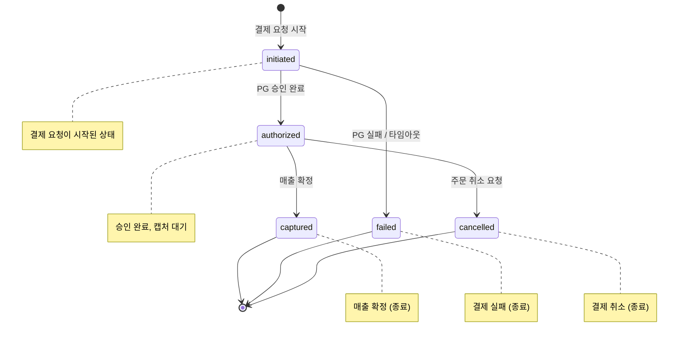

# Payment Overview

## 목적

결제 도메인의 핵심 정책을 단일 문서로 정리하고, 주문 취소/환불 연결 지점을 명확히 한다.

## 결제 상태 머신

### 전이 규칙 요약

| 출발 상태    | 도착 상태    | 트리거                |
| ------------ | ------------ | --------------------- |
| `initiated`  | `authorized` | PG 승인 응답 수신     |
| `initiated`  | `failed`     | PG 실패 또는 타임아웃 |
| `authorized` | `captured`   | 매출 확정 처리        |
| `authorized` | `cancelled`  | 주문 취소 요청        |

- 종료 상태: `captured`, `failed`, `cancelled` — 이후 전이 불가.

## 결제 정책

### 타임아웃

- 결제 요청 후 **30초** 내 PG 응답이 없으면 `failed_timeout` 코드로 종료한다.

### 주문:결제 카디널리티

- MVP 단계에서 Order:Payment 관계는 **1:1**로 제한한다.
- 부분 결제(split payment) 및 분할 결제는 MVP 범위에서 제외한다.

### 중복 결제 방지

- 중복 결제 방지를 위한 idempotency key 필수.
- 주문 취소 시 결제 취소/환불 정책 연결.

## 연관 도메인

- order: 주문 생성 이후 결제 진입점은 `../05-order/01-overview.md`를 따른다.
- order: 주문 취소 시 결제 취소/환불 연결은 order 취소 흐름과 함께 적용한다.
