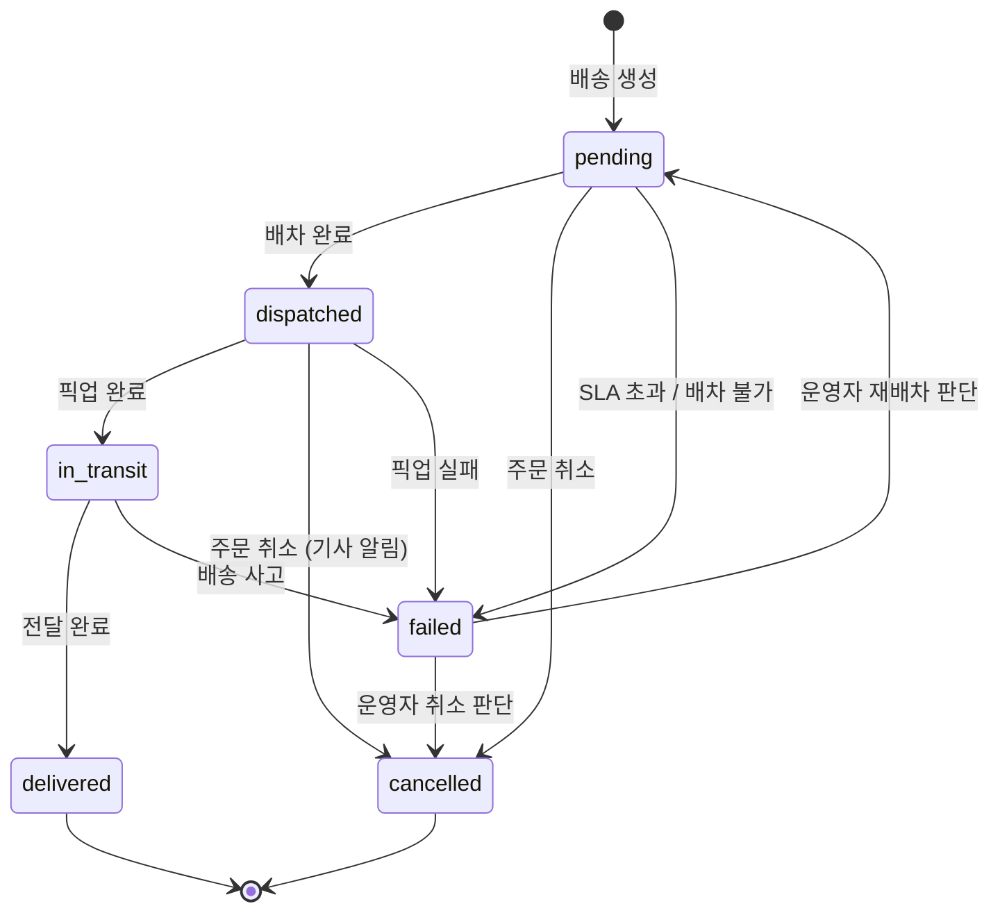
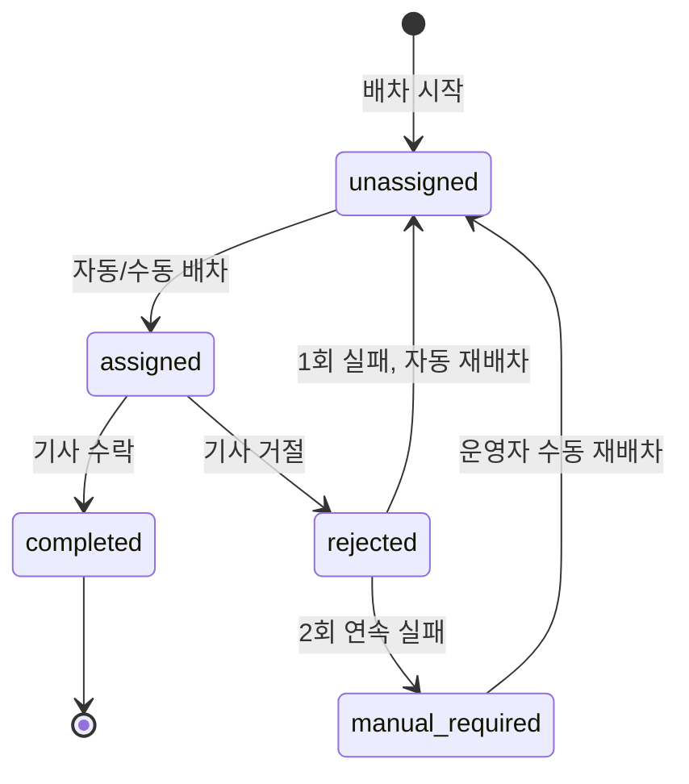

# Delivery Overview

## 목적

배송 도메인의 핵심 정책을 단일 문서로 정리하고, 주문/운영/이벤트 연계를 크로스레퍼런스로 명확히 한다.

## MVP 범위

### 포함

- 즉시 배송 (`instant`): 결제 완료 후 30분 내 배송 목표
- 예약 배송 (`scheduled`): 1시간 슬롯 기반 배송
- 자동/수동 배차 및 재배차
- 배송 상태 추적 (지도 추적 제외)
- SLA 위반 모니터링 및 운영자 알림

### 제외 (초기)

- 실시간 지도 추적
- 다중 창고 최적 라우팅
- 예약 배송 슬롯 선택 UI/API (P1)
- 기사 앱 (외부 시스템으로 가정)

## 배송 생성 규칙

- **생성 트리거**: 결제 완료(`PaymentCaptured`) 이벤트 수신 시 Delivery 레코드 자동 생성
- **배송 모드 결정**: 주문 시 선택한 배송 모드(`instant` / `scheduled`)를 Delivery에 기록

### SLA 목표 시각 산정

| 배송 모드   | `sla_target_at` 산정 기준                | 허용 범위        |
| ----------- | ---------------------------------------- | ---------------- |
| `instant`   | 결제 완료(`payment.captured_at`) + 30분  | 없음 (30분 절대) |
| `scheduled` | 예약 슬롯 시작 시각                      | ±15분            |

- 예약 배송 슬롯 단위: **1시간** (예: 14:00–15:00)
- SLA 위반 판정: `sla_target_at` + 허용 범위를 초과한 시점

## 배송 상태 머신

### 상태 전이 규칙

| 출발 상태    | 도착 상태    | 트리거                              | 주체           |
| ------------ | ------------ | ----------------------------------- | -------------- |
| `(생성)`     | `pending`    | `PaymentCaptured` 이벤트 수신       | 시스템         |
| `pending`    | `dispatched` | 배차 완료 (자동/수동)               | 시스템/운영자  |
| `pending`    | `cancelled`  | 주문 취소 요청                      | 시스템         |
| `pending`    | `failed`     | SLA 초과 또는 배차 불가             | 시스템         |
| `dispatched` | `in_transit` | 기사 픽업 완료 확인                 | 기사(외부)     |
| `dispatched` | `cancelled`  | 주문 취소 요청 (기사에게 취소 알림) | 시스템         |
| `dispatched` | `failed`     | 픽업 실패                           | 기사(외부)     |
| `in_transit` | `delivered`  | 기사 전달 완료 확인                 | 기사(외부)     |
| `in_transit` | `failed`     | 배송 사고                           | 기사(외부)/시스템 |
| `failed`     | `pending`    | 운영자 재배차 판단                  | 운영자         |
| `failed`     | `cancelled`  | 운영자 취소 판단                    | 운영자         |

- 종료 상태: `delivered`, `cancelled` — 이후 전이 불가
- `failed`는 **비종료 상태** — 운영자 개입으로 `pending` 복귀 또는 `cancelled` 전이 가능
- 불법 전이는 API 레벨에서 차단

### 취소 규칙

| 현재 상태    | 취소 가능 | 비고                                 |
| ------------ | --------- | ------------------------------------ |
| `pending`    | ✅        | 즉시 취소                            |
| `dispatched` | ✅        | 기사에게 취소 알림 후 취소           |
| `in_transit` | ❌        | 배송 중 취소 불가 — 반품 절차로 안내 |
| `delivered`  | ❌        | 배송 완료 후 취소 불가               |
| `failed`     | ✅        | 운영자 판단으로 취소 가능            |

## 배차 상태 머신

### 배차 상태 전이 규칙

| 출발 상태         | 도착 상태         | 트리거                           |
| ----------------- | ----------------- | -------------------------------- |
| `(시작)`          | `unassigned`      | Delivery 생성 시                 |
| `unassigned`      | `assigned`        | 자동 배차 또는 운영자 수동 배차  |
| `assigned`        | `completed`       | 기사 수락/픽업                   |
| `assigned`        | `rejected`        | 기사 거절 또는 배차 타임아웃     |
| `rejected`        | `unassigned`      | 자동 재배차 (1회 실패 시)        |
| `rejected`        | `manual_required` | 2회 연속 실패                    |
| `manual_required` | `unassigned`      | 운영자 수동 재배차 실행          |

## 재배차 정책

- 배차 실패 1회: **즉시** 자동 재배차 (다른 기사 대상)
- 2회 연속 실패: 운영자 개입 필요 — 운영 알림 발송
- 재배차 시도 간격: 즉시 (자동), 운영자 판단 (수동)
- 자동 재배차와 운영자 수동 배차가 동시에 실행된 경우: **먼저 완료된 배차를 채택**, 후속 배차는 무시 (낙관적 잠금)

## 동시성/충돌 해소 정책

- 배송 상태 전이는 `version` 필드 기반 **낙관적 잠금**으로 동시 갱신을 방지
- 동일 배송에 대한 동시 상태 전이 요청 중 먼저 도착한 요청만 수용
- 자동 재배차 중 운영자 수동 배차 실행 시: 운영자 명령 **우선** (자동 재배차 결과 무시)

## SLA 위반 시 후속 조치

1. SLA 위반 판정 시점에 `DeliveryStatusChanged` 이벤트 발행 (status → `failed`)
2. 운영자 알림 발송 (notification 도메인)
3. 고객에게 지연 안내 알림 발송
4. Admin 배차 관리 화면의 SLA 위반 필터에 노출

## 실패 시나리오

| 시나리오                     | 조치                                            |
| ---------------------------- | ----------------------------------------------- |
| 주문 취소 도착 (배송 중)     | `in_transit` 상태에서는 취소 불가, 반품 안내     |
| 결제 취소/환불 후 배송 생성  | `PaymentCaptured` 외 이벤트에서는 생성하지 않음  |
| 기사 앱 장애                 | 배차 타임아웃 → `rejected` → 재배차 정책 적용   |
| 동시 배차 요청 충돌          | 낙관적 잠금으로 먼저 도착한 요청만 수용          |

## Stage 6 게이트 (배송 운영 부분)

### 구현 목표

- SLA 위반 주문 운영 뷰 제공
- 운영자 수동 배차/재배차 기능

### Exit Criteria

- 운영자가 상태 전이/redrive 수행 가능
- SLA 위반 배송 필터 동작 확인

## 크로스레퍼런스

- 주문 상태 연동: `../05-order/01-overview.md` — 주문 취소 시 배송 취소 연쇄
- 결제 완료 트리거: `../06-payment/01-overview.md` — `PaymentCaptured` 이벤트로 배송 생성
- 알림 연동: `../12-notification/01-overview.md` — 배차/배송 상태 변경 알림
- 이벤트 공통 규격: `../13-event/01-overview.md` — envelope/idempotency/DLQ 정책
- 운영 단계 기준: `../00-overview.md`
