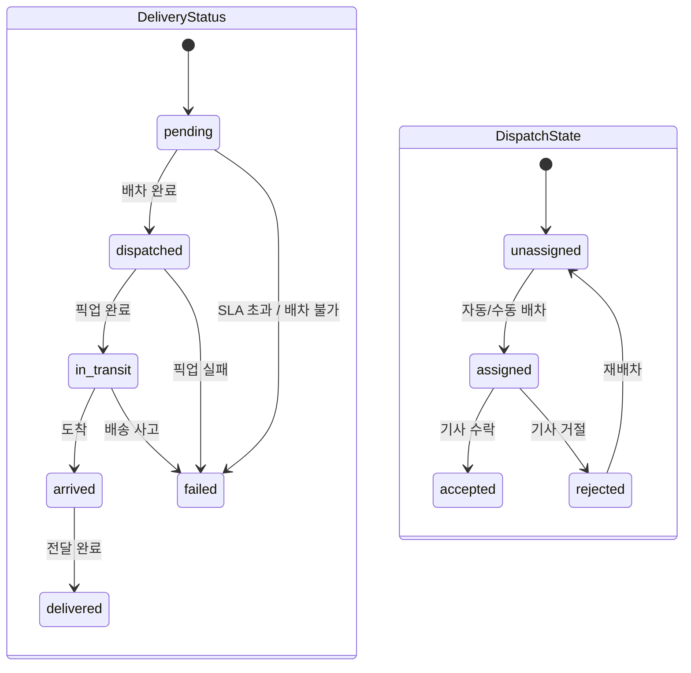

# Delivery Overview

## 목적

배송 도메인의 핵심 정책을 단일 문서로 정리하고, 주문/운영 연계를 크로스레퍼런스로 명확히 한다.

## 배송 정책 (PRD §8 원문)

- 배송 모드:
  - `instant` (즉시)
  - `scheduled` (예약)
- SLA:
  - 즉시: 30분 목표
  - 예약: 슬롯 기준 +/- 15분 허용

### SLA 목표 시각 산정

| 배송 모드   | SLA 목표 시각 (`sla_target_at`) | 허용 범위        |
| ----------- | ------------------------------- | ---------------- |
| `instant`   | 주문 `paid` 시각 + 30분         | 없음 (30분 절대) |
| `scheduled` | 예약 슬롯 시작 시각             | ±15분            |

- 예약 배송 슬롯 단위: **1시간** (예: 14:00–15:00)
- SLA 위반 판정: `sla_target_at` 기준 허용 범위를 초과한 시점

### 재배차 정책

- 배차 실패 1회: 자동 재시도
- 2회 연속 실패: 운영자 개입 필요(알림)

## 배송·배차 상태 머신

- 노드 수: 10 (DeliveryStatus 6 + DispatchState 4)
- `failed` 상태 진입 후 재배차가 필요하면 운영자 개입 경로를 통해 `pending`으로 롤백 가능

## Stage 6 게이트 (배송 운영 부분)

### 구현 목표

- SLA 위반 주문 운영 뷰 제공

### Exit Criteria

- 운영자가 상태 전이/redrive 수행 가능

## 크로스레퍼런스

- 주문 상태 연동: `../05-order/01-overview.md`
- 운영 단계 기준: `../00-overview.md`
