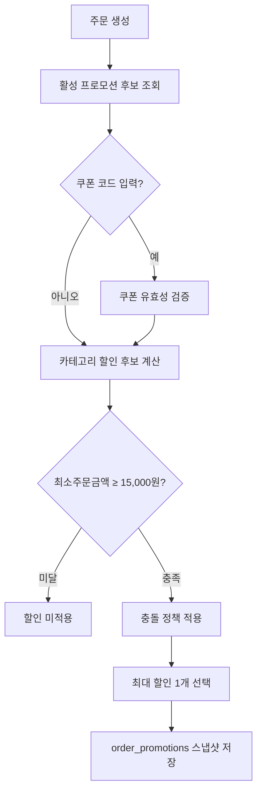

# Promotion Overview

## 목적

프로모션 도메인의 할인 정책·쿠폰 규칙·충돌 해소 전략을 단일 문서로 정리하고, 주문/결제/포인트 연계를 크로스레퍼런스로 명확히 한다.

## Stage Gate

- **Stage 3**: 쿠폰(정액) + 카테고리 할인(정률) + 충돌 해소 + 최소주문금액 검증
- **Stage 4**: 복수 쿠폰 동시 적용, 타임딜, 프로모션 스케줄러

## 적용 범위

- 쿠폰 1종(정액/정률 택1)
- 카테고리 할인 1종
- 최소주문금액 조건: **15,000원**

### 데이터 모델(운영 시뮬레이션 기준)

- `promotions`: 할인 정책 본체(타입/할인값/유효기간/활성상태)
- `coupons`: 코드 기반 프로모션 세부(코드/사용 한도/유효기간)
- `promotion_categories`: 카테고리 할인 대상 범위
- `coupon_redemptions`: 사용자-주문 단위 쿠폰 사용 이력
- `order_promotions`: 최종 주문에 적용된 할인 결과 스냅샷

### 계산 순서

1. 주문 시점에 활성 프로모션 후보 조회(기간/상태 필터)
2. 쿠폰 코드 입력 시 코드 유효성 검증(존재/만료/사용량/사용자별 제한)
3. 카테고리 할인 후보 계산(주문 아이템 카테고리 기반)
4. 최소주문금액 조건 검증 — **15,000원** 미달 시 할인 미적용
5. 충돌 정책 적용(동시 적용 금지)
6. 사용자에게 가장 유리한 할인 1개 선택
7. 선택 결과를 `order_promotions`로 고정 저장

### 쿠폰 사용 규칙

- 쿠폰 코드는 대소문자 구분 없이 비교하되 저장은 원본 보존
- 동일 주문에는 동일 쿠폰 재적용 불가
- 사용자별 사용 제한(`per_user_limit`) 초과 시 거절
- 전체 사용 제한(`max_uses`) 초과 시 거절
- 만료 쿠폰은 조회는 가능하나 적용 불가
- 주문 취소/결제 실패 시 쿠폰 사용 이력 롤백 정책을 명시적으로 적용

### 충돌 정책

- 쿠폰과 카테고리 할인은 동시 적용 불가(초기)
- 사용자에게 더 유리한 할인 자동 선택
- 동일 할인액이면 쿠폰 우선(사용자 체감 일관성)
- 선택 근거(`best_price_policy`, `coupon_priority_on_tie`)를 `order_promotions.selected_by_rule`에 기록

### 운영/보안 정책

- 무차별 코드 대입 방지: 사용자/IP 단위 rate limit 적용
- 실패 사유 코드 표준화: `coupon_not_found`, `coupon_expired`, `coupon_limit_exceeded`, `promotion_min_order_not_met`
- 감사 로그 기록: 쿠폰 적용 성공/실패, 운영자 수동 비활성화, 정책 변경 이력

### 정합성/동시성 정책

- 사용량 증가는 트랜잭션으로 처리해 초과 발급 방지
- `coupon_redemptions`는 (coupon, user, order) 중복 방지 제약 필요
- 주문 할인 결과는 계산 후 재조회가 아닌 스냅샷 값을 신뢰 원천으로 사용

### 검증 시나리오

- 최소주문금액 미달 시 할인 미적용
- 만료 직전 쿠폰 동시 요청 2건에서 초과 사용 차단
- 쿠폰/카테고리 할인 동시 후보 발생 시 최대 할인 1개만 적용
- 주문 취소 후 쿠폰 재사용 가능 여부가 정책과 일치
