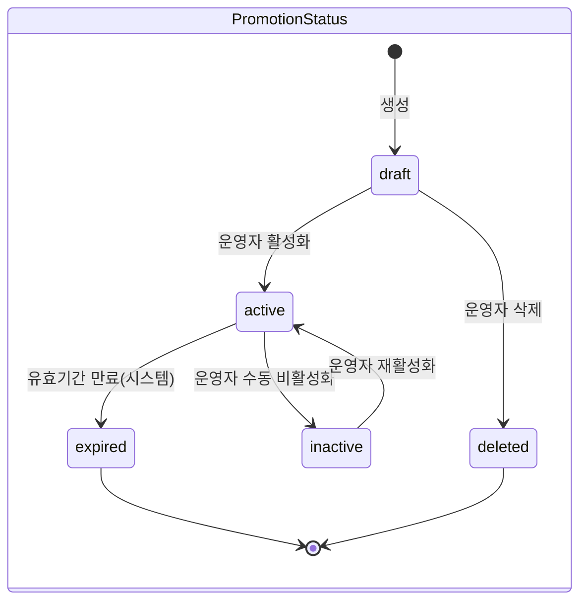
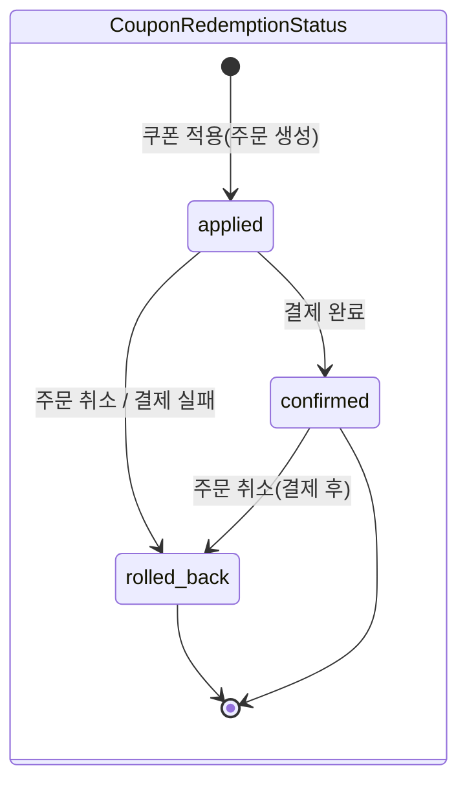
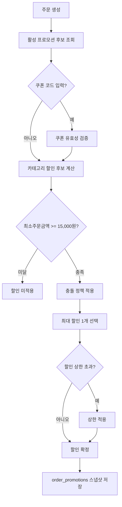

# Promotion Overview

## 목적

프로모션 도메인의 할인 정책·쿠폰 규칙·충돌 해소 전략을 단일 문서로 정리하고, 주문/결제/포인트 연계를 크로스레퍼런스로 명확히 한다.

## Stage Gate

- **Stage 3**: 쿠폰(정액) + 카테고리 할인(정률) + 충돌 해소 + 최소주문금액 검증
- **Stage 4**: 복수 쿠폰 동시 적용, 타임딜, 프로모션 스케줄러

## 적용 범위

- 쿠폰 1종(정액/정률 택1)
- 카테고리 할인 1종
- 최소주문금액 조건: **15,000원** (단일 소스: `../00-overview.md §5 비즈니스 수치 기본값`)
- 최대 할인 상한: 정률 할인 시 **주문금액의 50%, 최대 10,000원** 중 작은 값 적용

### 프로모션 타입

| 타입 값          | 설명       | `discount_value` 해석             | 최대 할인 상한                       |
| ---------------- | ---------- | --------------------------------- | ------------------------------------ |
| `fixed_amount`   | 정액 할인  | 절대 금액(KRW 원 단위, 정수)      | `discount_value` 자체               |
| `percentage`     | 정률 할인  | 할인율(1~50 정수, 단위: %)        | 계산 금액과 `max_discount_amount` 중 작은 값 |

### 데이터 모델(운영 시뮬레이션 기준)

- `promotions`: 할인 정책 본체(타입/할인값/유효기간/활성상태)
- `coupons`: 코드 기반 프로모션 세부(코드/사용 한도/유효기간)
- `promotion_categories`: 카테고리 할인 대상 범위 — 대상 slug은 `../02-catalog/01-overview.md §2` 카테고리 6종 참조
- `coupon_redemptions`: 사용자-주문 단위 쿠폰 사용 이력
- `order_promotions`: 최종 주문에 적용된 할인 결과 스냅샷

## 프로모션 상태 머신

### 프로모션 상태 전이 규칙

| 출발 상태  | 도착 상태  | 트리거                      | 수행 주체 |
| ---------- | ---------- | --------------------------- | --------- |
| `draft`    | `active`   | 운영자 활성화               | operator  |
| `draft`    | `deleted`  | 운영자 삭제                 | operator  |
| `active`   | `inactive` | 운영자 수동 비활성화        | operator  |
| `active`   | `expired`  | 유효기간 종료(배치/스케줄러)| system    |
| `inactive` | `active`   | 운영자 재활성화             | operator  |

- 종료 상태: `expired`, `deleted` — 이후 전이 불가
- `active` 상태의 프로모션만 주문 시점에 후보로 조회됨
- `active → inactive` 전이 시 진행 중인 주문에 이미 적용된 할인은 유지(스냅샷 기준)

## 쿠폰 사용 상태 머신

### 쿠폰 사용 상태 전이 규칙

| 출발 상태    | 도착 상태    | 트리거                 |
| ------------ | ------------ | ---------------------- |
| `applied`    | `confirmed`  | 주문 결제 완료         |
| `applied`    | `rolled_back`| 주문 취소 또는 결제 실패 |
| `confirmed`  | `rolled_back`| 결제 후 주문 취소      |

## 계산 순서

1. 주문 시점에 활성 프로모션 후보 조회(기간/상태 필터, `status = active`)
2. 쿠폰 코드 입력 시 코드 유효성 검증(존재/만료/사용량/사용자별 제한)
3. 카테고리 할인 후보 계산(주문 아이템 카테고리 기반 — 해당 카테고리 아이템 금액 합산에 정률 적용)
4. 최소주문금액 조건 검증 — **15,000원** 미달 시 할인 미적용 (정확히 15,000원은 충족으로 판정)
5. 충돌 정책 적용(동시 적용 금지)
6. 사용자에게 가장 유리한 할인 1개 선택
7. 최대 할인 상한 적용 (정률 할인: `max_discount_amount` cap)
8. 선택 결과를 `order_promotions`로 고정 저장

### 쿠폰 사용 규칙

- 쿠폰 코드는 대소문자 구분 없이 비교하되 저장은 원본 보존
- 동일 주문에는 동일 쿠폰 재적용 불가
- 사용자별 사용 제한(`per_user_limit`, 기본: 1회, 쿠폰별 설정 가능) 초과 시 거절
  - 계산 범위: 쿠폰 유효기간 내 사용 이력 기준 (만료/rolled_back 제외, `applied` + `confirmed` 카운트)
- 전체 사용 제한(`max_uses`) 초과 시 거절
- 만료 쿠폰은 조회는 가능하나 적용 불가
- 주문 취소/결제 실패 시 쿠폰 사용 이력 롤백 정책 적용 (아래 "롤백 정책" 참조)

### 충돌 정책

- 쿠폰과 카테고리 할인은 동시 적용 불가(초기)
- 사용자에게 더 유리한 할인 자동 선택
  - 비교 기준: 원 단위 절대 금액. 카테고리 할인은 해당 카테고리 아이템 금액 합산에 정률 적용한 결과 금액으로 비교
  - "동일 할인액" 판정: 원 단위 정확히 일치 시 tie
- 동일 할인액이면 쿠폰 우선(사용자 체감 일관성)
- 선택 근거(`best_price_policy`, `coupon_priority_on_tie`)를 `order_promotions.selected_by_rule`에 기록

### 롤백 정책 (주문 취소/결제 실패)

- `coupon_redemptions` 레코드 상태를 `rolled_back`으로 변경 (삭제하지 않음 — 감사 추적 보존)
- 쿠폰 사용 카운트(`max_uses` 소비분, `per_user_limit` 소비분) 복원
- 만료 쿠폰 롤백: 쿠폰이 롤백 시점에 이미 만료된 경우 사용 카운트는 복원하되, 해당 쿠폰은 재사용 불가 (만료 상태 유지)
- 부분 취소(`partially_cancelled`) 시: 할인 전액 유지. 부분 취소로 최소주문금액 미달 시 할인 전체 회수 후 결제금액 재계산
- `order_promotions` 스냅샷에 `rolled_back_at`, `rollback_reason` 기록
- 롤백 주체: `OrderStatusChanged` 이벤트를 promotion 도메인이 소비하여 처리 (이벤트 기반)

### 운영/보안 정책

- 무차별 코드 대입 방지: 사용자/IP 단위 rate limit 적용
  - 쿠폰 검증 API: 사용자당 **분당 10회**, IP당 **분당 30회**
  - 임계 초과 시: **5분** 차단, `429 Too Many Requests` + `Retry-After` 헤더 반환
- 실패 사유 코드 표준화: `coupon_not_found`, `coupon_expired`, `coupon_limit_exceeded`, `promotion_min_order_not_met`, `coupon_already_applied`, `promotion_inactive`
- 감사 로그 기록: 쿠폰 적용 성공/실패, 운영자 수동 비활성화, 정책 변경 이력, 롤백 이력

### 정합성/동시성 정책

- 사용량 증가는 트랜잭션으로 처리해 초과 발급 방지
- `coupon_redemptions`는 (coupon, user, order) 중복 방지 제약 필요
- 주문 할인 결과는 계산 후 재조회가 아닌 스냅샷 값을 신뢰 원천으로 사용
- `active → inactive` 전이 시 진행 중인 주문에 이미 적용된 할인은 `order_promotions` 스냅샷 기준으로 유지

### 실패 시나리오

| 시나리오                                       | 처리 정책                                                  |
| ---------------------------------------------- | ---------------------------------------------------------- |
| 프로모션 서비스 조회 불가 (일시 장애)          | 할인 미적용 상태로 주문 진행, 사용자에게 "할인 적용 불가" 안내 |
| `order_promotions` 스냅샷 저장 실패            | 주문 생성 트랜잭션 롤백 (할인 적용과 주문 생성은 원자적)     |
| 쿠폰 적용 중 프로모션이 만료됨                 | 이미 적용된 할인은 스냅샷 기준 유지, 신규 적용 거절         |
| 롤백 처리 중 실패 (이벤트 소비 실패)           | DLQ 이동 후 운영자 redrive, 수동 복구 절차                  |

### 검증 시나리오

- 최소주문금액 미달 시 할인 미적용
- 최소주문금액 정확히 15,000원 시 할인 적용 (경계 조건)
- 만료 직전 쿠폰 동시 요청 2건에서 초과 사용 차단
- 쿠폰/카테고리 할인 동시 후보 발생 시 최대 할인 1개만 적용
- 주문 취소 후 쿠폰 재사용 가능 여부가 정책과 일치
- 정률 할인 시 `max_discount_amount` cap 적용 확인
- 활성 프로모션이 주문 처리 중 만료되는 경우 스냅샷 유지 확인
- 동시에 같은 쿠폰의 마지막 1매를 2명이 적용하는 경우 1명만 성공
- 부분 취소로 최소주문금액 미달 시 할인 전체 회수 확인
- rate limit 임계 초과 시 차단 및 복구 확인

## 크로스레퍼런스

- 주문 상태 연동: `../05-order/01-overview.md` — 주문 취소 시 promotion 롤백 포함
- 결제 연동: `../06-payment/01-overview.md` — 결제 실패 시 쿠폰 롤백 트리거
- 포인트 연동: `../09-loyalty/01-overview.md` — 할인 적용 후 결제금액 기준 포인트 적립
- 카테고리 참조: `../02-catalog/01-overview.md` — 카테고리 할인 대상 slug 정의
- 이벤트 인프라: `../13-event/01-overview.md` — 이벤트 엔벨로프, 멱등성, DLQ 정책
- 알림 연동: `../12-notification/01-overview.md` — 할인 적용 알림 발송
- 비즈니스 수치 원천: `../00-overview.md §5` — 최소주문금액, 최대 할인 상한, per_user_limit 기본값
