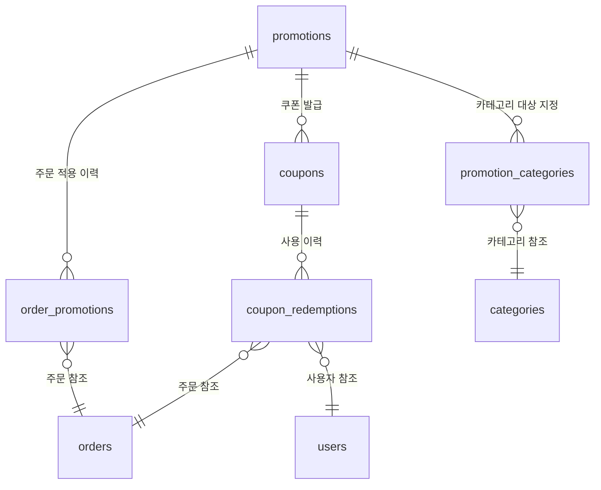

# Promotion Data

## 범위

프로모션 도메인의 데이터 모델, 필드 정의, 제약 조건, 정합성 정책을 정의한다.

## 엔터티 관계

## promotions

할인 정책 본체.

| 필드                  | 타입      | 필수 | 제약                                                | 설명                     |
| --------------------- | --------- | ---- | --------------------------------------------------- | ------------------------ |
| `id`                  | UUID      | Y    | PK                                                  | 프로모션 식별자          |
| `name`                | string    | Y    | 1~100자                                             | 프로모션 명칭            |
| `description`         | string    | N    | 최대 500자                                          | 프로모션 설명            |
| `type`                | enum      | Y    | `fixed_amount`, `percentage`                        | 할인 타입                |
| `discount_value`      | integer   | Y    | 양수, percentage: 1~50                              | 할인값 (원 또는 %)       |
| `max_discount_amount` | integer   | N    | 양수, percentage 타입 시 필수                       | 정률 할인 최대 상한 (원) |
| `min_order_amount`    | integer   | Y    | ≥ 0, 기본값 15000                                   | 최소주문금액 (원)        |
| `status`              | enum      | Y    | `draft`, `active`, `inactive`, `expired`, `deleted` | 프로모션 상태            |
| `starts_at`           | timestamp | Y    | `starts_at` < `ends_at`                             | 유효기간 시작            |
| `ends_at`             | timestamp | Y    | `starts_at` < `ends_at`                             | 유효기간 종료            |
| `created_at`          | timestamp | Y    | 자동 생성                                           | 생성 시각                |
| `updated_at`          | timestamp | Y    | 자동 갱신                                           | 최종 수정 시각           |
| `created_by`          | UUID      | Y    | FK → users                                          | 생성자 (운영자)          |

- 삭제 정책: **soft delete** — `status`를 `deleted`로 전이, 물리 삭제 없음
- 인덱스: `(status, starts_at, ends_at)` — 활성 프로모션 조회 최적화

## coupons

코드 기반 프로모션 세부.

| 필드             | 타입      | 필수 | 제약                          | 설명                  |
| ---------------- | --------- | ---- | ----------------------------- | --------------------- |
| `id`             | UUID      | Y    | PK                            | 쿠폰 식별자           |
| `promotion_id`   | UUID      | Y    | FK → promotions               | 연결 프로모션         |
| `code`           | string    | Y    | 4~20자, 영숫자+하이픈, UNIQUE | 쿠폰 코드 (원본 보존) |
| `max_uses`       | integer   | Y    | 양수                          | 전체 사용 한도        |
| `used_count`     | integer   | Y    | ≥ 0, 기본값 0                 | 현재 사용 수          |
| `per_user_limit` | integer   | Y    | 양수, 기본값 1                | 사용자별 사용 한도    |
| `starts_at`      | timestamp | Y    | `starts_at` < `ends_at`       | 쿠폰 유효기간 시작    |
| `ends_at`        | timestamp | Y    | `starts_at` < `ends_at`       | 쿠폰 유효기간 종료    |
| `created_at`     | timestamp | Y    | 자동 생성                     | 생성 시각             |
| `updated_at`     | timestamp | Y    | 자동 갱신                     | 최종 수정 시각        |

- 삭제 정책: 쿠폰은 프로모션에 종속 — 프로모션 삭제 시 함께 soft delete
- 인덱스: `(code)` UNIQUE — 코드 조회 최적화 (대소문자 무시 비교는 앱 레벨)

## promotion_categories

카테고리 할인 대상 범위. 카테고리 slug은 `../02-catalog/01-overview.md §2` 기준.

| 필드            | 타입   | 필수 | 제약                 | 설명               |
| --------------- | ------ | ---- | -------------------- | ------------------ |
| `id`            | UUID   | Y    | PK                   | 레코드 식별자      |
| `promotion_id`  | UUID   | Y    | FK → promotions      | 연결 프로모션      |
| `category_slug` | string | Y    | FK → categories.slug | 대상 카테고리 slug |

- 유니크 제약: `(promotion_id, category_slug)` — 동일 프로모션에 동일 카테고리 중복 지정 방지

## coupon_redemptions

사용자-주문 단위 쿠폰 사용 이력.

| 필드              | 타입      | 필수 | 제약                                       | 설명          |
| ----------------- | --------- | ---- | ------------------------------------------ | ------------- |
| `id`              | UUID      | Y    | PK                                         | 레코드 식별자 |
| `coupon_id`       | UUID      | Y    | FK → coupons                               | 사용된 쿠폰   |
| `user_id`         | UUID      | Y    | FK → users                                 | 사용자        |
| `order_id`        | UUID      | Y    | FK → orders                                | 적용 주문     |
| `status`          | enum      | Y    | `applied`, `confirmed`, `rolled_back`      | 사용 상태     |
| `redeemed_at`     | timestamp | Y    | 자동 생성                                  | 적용 시각     |
| `rolled_back_at`  | timestamp | N    | `status = rolled_back` 시 기록             | 롤백 시각     |
| `rollback_reason` | string    | N    | `status = rolled_back` 시 필수, 최대 200자 | 롤백 사유     |

- 유니크 제약: `(coupon_id, user_id, order_id)` — 동일 조합 중복 방지
- 삭제 정책: 삭제 없음 — 감사 추적 보존. 롤백 시 상태 전이.

## order_promotions

최종 주문에 적용된 할인 결과 스냅샷. 이 테이블이 할인 금액의 **신뢰 원천(SSOT)**.

| 필드               | 타입      | 필수 | 제약                                          | 설명                               |
| ------------------ | --------- | ---- | --------------------------------------------- | ---------------------------------- |
| `id`               | UUID      | Y    | PK                                            | 레코드 식별자                      |
| `order_id`         | UUID      | Y    | FK → orders, UNIQUE                           | 적용 주문 (주문당 1건)             |
| `promotion_id`     | UUID      | Y    | FK → promotions                               | 적용된 프로모션                    |
| `coupon_id`        | UUID      | N    | FK → coupons                                  | 적용된 쿠폰 (쿠폰 할인 시)         |
| `discount_type`    | enum      | Y    | `fixed_amount`, `percentage`                  | 적용된 할인 타입                   |
| `discount_value`   | integer   | Y    | 양수                                          | 적용된 할인값 (원 또는 %)          |
| `discount_amount`  | integer   | Y    | 양수                                          | **실제 할인 금액** (원, 계산 결과) |
| `selected_by_rule` | enum      | Y    | `best_price_policy`, `coupon_priority_on_tie` | 선택 근거                          |
| `applied_at`       | timestamp | Y    | 자동 생성                                     | 할인 적용 시각                     |
| `removed_at`       | timestamp | N    |                                               | 할인 제거 시각 (제거 시)           |
| `rolled_back_at`   | timestamp | N    |                                               | 롤백 시각 (주문 취소 시)           |
| `rollback_reason`  | string    | N    | 최대 200자                                    | 롤백 사유                          |

- 유니크 제약: `(order_id)` — 주문당 할인 1건
- 삭제 정책: 삭제 없음 — 제거/롤백 시 타임스탬프 기록

## 정합성/동시성 정책

- 사용량 증가(`coupons.used_count`)는 트랜잭션으로 처리해 초과 발급 방지
- `coupon_redemptions`는 `(coupon_id, user_id, order_id)` 중복 방지 제약으로 이중 적용 차단
- 주문 할인 결과는 `order_promotions.discount_amount` 스냅샷 값을 신뢰 원천으로 사용 (재계산 금지)
- 롤백 시 `coupons.used_count` 감소도 동일 트랜잭션 내 처리

## 데이터 보존 정책

| 엔터티                 | 보존 기간                                     |
| ---------------------- | --------------------------------------------- |
| `promotions`           | 무기한 (soft delete, 감사/이력 목적)          |
| `coupons`              | 프로모션 종속, 프로모션과 동일                |
| `coupon_redemptions`   | 무기한 (감사 로그 역할)                       |
| `order_promotions`     | 주문 보존 정책과 동일 (주문 도메인 정책 따름) |
| `promotion_categories` | 프로모션 종속, 프로모션과 동일                |
