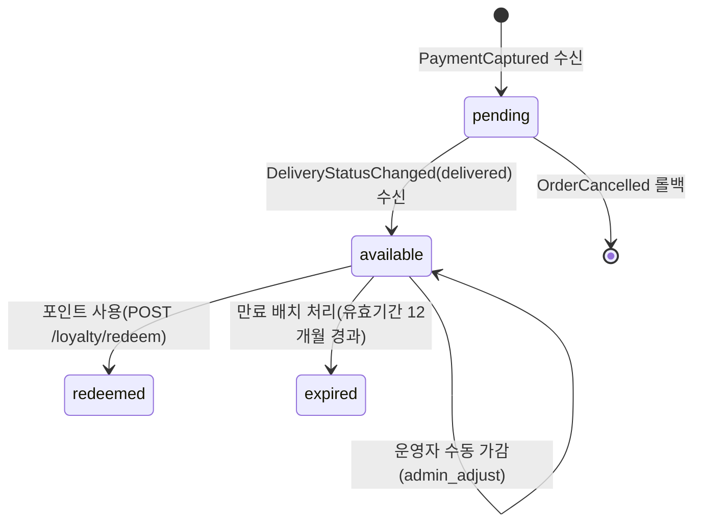

# Loyalty Overview

## 목적

고객 재구매를 유도하기 위한 포인트 적립·사용·만료 라이프사이클을 관리한다.
결제 확정 주문에 대해 포인트를 적립하고, 주문 결제 시 포인트를 사용할 수 있게 하며, 유효기간 경과 포인트를 자동 소멸 처리한다.

## 도메인 범위

### 포함 (MVP)

- 기본 적립: 결제 확정 주문에 대해 포인트 적립
- 사용: 주문 결제 시 포인트 차감
- 만료: 유효기간 경과 포인트 자동 소멸
- 운영 조정: 운영자 수동 가감(사유 필수)
- 잔액 조회: 상태별 잔액 및 만료 예정 포인트 확인

### 제외 (초기)

- 등급별 차등 적립률
- 이벤트/캠페인 보너스 적립
- 포인트 선물/양도
- 외부 제휴 포인트 전환

## 포인트 수명주기

MVP 기본 흐름은 **지연 적립(deferred)** 방식을 채택한다.
결제 확정(`PaymentCaptured`) 시 `pending` 상태로 적립하고, 배송 완료(`DeliveryStatusChanged`, `new_status=delivered`) 확인 시 `available`로 전환한다.

### 포인트 상태 모델

| 상태       | 설명                         | 진입 조건                      |
| ---------- | ---------------------------- | ------------------------------ |
| `pending`  | 확정 대기 포인트(배송 전)    | `PaymentCaptured` 이벤트 수신  |
| `available`| 즉시 사용 가능 포인트        | `DeliveryStatusChanged`(`new_status=delivered`) 수신|
| `redeemed` | 주문 결제에 사용된 포인트    | `POST /loyalty/redeem` 호출    |
| `expired`  | 만료로 소멸된 포인트         | 만료 배치 처리                 |

> **운영자 수동 조정**은 상태 전이가 아니라 `available` 잔액의 증감으로 처리한다.
> ledger에 `admin_adjust` source_type으로 기록되며, 상태는 `available` 유지.

## 적립 공식

| 항목                | 기준값                                  |
| ------------------- | --------------------------------------- |
| 기본 적립률         | 실결제 금액의 **1%** (원 미만 절사)     |
| 최소 적립 주문 금액 | **5,000원** 미만 주문은 적립 제외       |
| 최소 사용 포인트    | **1,000원**                             |
| 포인트 유효기간     | 적립일 기준 **12개월**                  |
| 포인트 잔액 상한    | 제한 없음 (상한 미적용)                 |

### 적립 기준 금액

- **실결제 금액** = 주문 원가 - 프로모션 할인 - 포인트 사용 금액
- 포인트로 결제한 부분에 대해서는 추가 적립하지 않는다.
- 프로모션 할인이 적용된 경우 할인 후 실결제 금액 기준으로 적립한다.

### 적립 규칙

- 적립 트리거: `PaymentCaptured` 이벤트 소비 (비동기, 외부 API 노출 없음)
- 적립 단위: 주문 단위 계산
- 5,000원 미만 실결제 금액은 적립 제외
- 주문 취소(`OrderCancelled`) 시 적립 rollback
- 결제 환불(`PaymentRefunded`) 시 적립 rollback (운영자 수동 환불 등 주문 취소 없이 환불이 발생한 경우)
- 부분 취소(`partially_cancelled`) 시 취소된 아이템 금액 비례 차감 (아래 부분 취소 정책 참조)

### 사용 규칙

- 최소 사용 포인트 임계치(`min_redeem_points = 1,000원`) 적용
- 보유 `available` 포인트를 초과한 사용 요청 차단
- 포인트 사용 금액은 주문 총액을 초과할 수 없음
- 1개 주문당 포인트 사용 이력은 1건만 허용 (중복 생성 금지)
- 포인트 사용은 `POST /loyalty/redeem` 동기 API 호출로 처리

## 유효기간/소멸 규칙

- 포인트 적립 시 `expires_at = earned_at + 12개월`을 기록
- 만료 배치가 유효기간 경과분을 `expired` 상태의 ledger 기록으로 전환
- 만료 이벤트(`PointsExpired`)는 notification 도메인으로 전달하여 사용자 알림

### 만료 배치 상세

| 항목          | 정책                                                  |
| ------------- | ----------------------------------------------------- |
| 실행 주기     | 매일 00:00 KST (1일 1회)                              |
| 실행 방식     | 스케줄 기반 배치 (cron / scheduled task)               |
| 멱등성        | `expires_at` 기준 조회 → 이미 `expired` 상태면 skip   |
| 부분 실패     | 건별 처리, 실패 건은 다음 배치에서 재처리              |
| 성능 제한     | 1회 실행당 최대 10,000건 처리, 초과 시 다음 배치 이월 |
| 실패 복구     | 배치 실패 시 운영 알림 발송, 수동 재실행 가능          |

## 부분 취소 포인트 정책

- 주문이 `partially_cancelled` 상태가 되면 취소된 아이템 금액 기준으로 **비례 차감** 처리
- 비례 차감 공식: `rollback_amount = 기존_적립_포인트 × (취소_아이템_금액 / 원_주문_금액)`
- 부분 취소 후 남은 실결제 금액이 5,000원 미만이 되어도 기존 적립분은 유지 (소급 전액 롤백 하지 않음)
- 부분 취소 rollback은 ledger에 `order_cancel` source_type으로 기록

## 대사(Reconciliation) 정책

| 항목              | 정책                                                     |
| ----------------- | -------------------------------------------------------- |
| 실행 주기         | 매일 02:00 KST (만료 배치 이후)                          |
| 비교 대상         | `LoyaltyAccount.available_balance` vs `SUM(PointLedger)` |
| 신뢰 원천         | `PointLedger` 합계를 기준으로 `LoyaltyAccount` 보정      |
| 불일치 처리       | 차이 발생 시 운영 알림 발송 + 자동 보정 적용             |
| 불일치 임계치     | 1원 이상 차이 시 알림 대상                               |

## 감사/운영 정책

- ledger에는 `source_type` 기록: `order_payment`, `order_cancel`, `review_reward`, `event_reward`, `admin_adjust`
- 수동 조정은 운영자 권한(`operator|admin`) + 사유 + 요청 ID 필수
- 결제/취소/환불과 포인트 ledger의 정합성 점검 배치 운영

## 동시성/정합성 규칙

- 차감/적립은 트랜잭션으로 처리하여 이중 차감 방지
- ledger 포인트 값은 양수만 허용, 방향은 `transaction_type`으로 표현
- 사용자별 잔액(`LoyaltyAccount`)은 ledger 합계와 주기적 대사

## 검증 시나리오

### 도메인 내부

- 동시 결제 2건에서 포인트 이중 차감 방지
- 주문 취소 시 사용 포인트 복원 + 적립 rollback 일관성 확인
- 만료 배치 실행 후 잔액과 ledger 합계 일치
- 운영자 수동 조정 이력 추적 가능

### 크로스도메인

- `PaymentCaptured` 이벤트 수신 후 포인트 적립 정합성 (`pending` 생성 확인)
- `DeliveryStatusChanged`(`new_status=delivered`) 이벤트 수신 후 `pending → available` 전환 정합성
- 주문 부분 취소 후 포인트 비례 rollback 정합성
- 쿠폰 사용 주문의 포인트 적립 기준 금액이 실결제 금액인지 확인
- `OrderCancelled` 수신 시 `pending` 포인트 전액 rollback 확인

## 연관 도메인

| 도메인       | 관계                                   | 참조                                   |
| ------------ | -------------------------------------- | -------------------------------------- |
| order        | 주문 취소/부분취소 시 포인트 롤백      | `../05-order/01-overview.md`           |
| payment      | 결제 확정 시 포인트 적립 트리거        | `../06-payment/01-overview.md`         |
| delivery     | 배송 완료 시 pending→available 전환    | `../07-delivery/01-overview.md`        |
| promotion    | 할인 적용 시 적립 기준 금액 산정       | `../08-promotion/01-overview.md`       |
| notification | 적립/만료/조정 알림 발송               | `../12-notification/01-overview.md`    |
| event        | 이벤트 envelope/멱등성/DLQ 공통 정책   | `../13-event/01-overview.md`           |

## Stage Gate

- **Stage**: Stage 4 — 결제/배송 연동 이후 포인트 적립·사용 활성화
- **Entry Criteria**: 주문(05-order), 결제(06-payment), 배송(07-delivery) 도메인 구현 완료
- **Exit Criteria**: 적립·사용·만료·조정 시나리오 통과, ledger 대사 정합성 검증 완료
