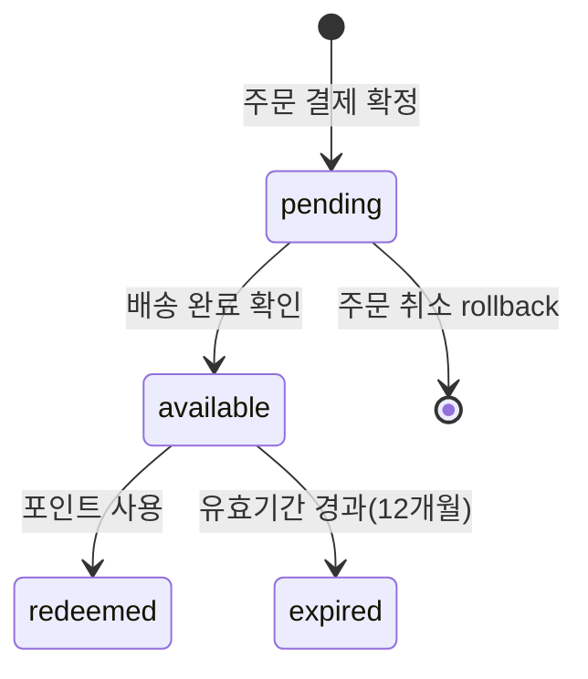

## 9a) 적립 포인트 정책

### 정책 범위

- 기본 적립: 결제 확정 주문에 대해 포인트 적립
- 사용: 주문 결제 시 포인트 차감
- 만료: 유효기간 경과 포인트 자동 소멸
- 운영 조정: 운영자 수동 가감(사유 필수)

### 포인트 수명주기

### 포인트 상태 모델

- `pending`: 확정 대기 포인트(배송 완료 전 등)
- `available`: 즉시 사용 가능 포인트
- `redeemed`: 주문 결제에 사용된 포인트
- `expired`: 만료로 소멸된 포인트

### 적립 공식

| 항목                | 기준값                            |
| ------------------- | --------------------------------- |
| 기본 적립률         | 결제금액의 **1%** (원 미만 절사)  |
| 최소 적립 주문 금액 | **5,000원** 미만 주문은 적립 제외 |
| 최소 사용 포인트    | **1,000원**                       |
| 포인트 유효기간     | 적립일 기준 **12개월**            |

### 적립 규칙

- 적립 시점: 기본은 `paid`, 환불/취소 가능성을 고려해 `pending`으로 적립 후 `delivered` 시 `available` 전환 가능
- 적립 단위: 주문 단위 계산(카테고리/이벤트 정책으로 가중치 가능)
- 5,000원 미만 주문은 적립 제외
- 주문 취소/결제 취소 시 적립 rollback

### 사용 규칙

- 최소 사용 포인트 임계치(`min_redeem_points`) 적용
- 보유 포인트를 초과한 사용 요청 차단
- 포인트 사용 금액은 주문 총액을 초과할 수 없음
- 1개 주문의 포인트 사용 이력은 중복 생성 금지

### 유효기간/소멸 규칙

- 포인트 적립 시 `expires_at`를 기록
- 만료 배치가 만료분을 `expire` ledger로 전환
- 만료 이벤트는 사용자 알림(향후 단계)과 연결 가능

### 감사/운영 정책

- ledger에는 `source_type`(`order_payment`, `order_cancel`, `review_reward`, `event_reward`, `admin_adjust`) 기록
- 수동 조정은 운영자 권한(`operator|admin`) + 사유/요청 ID 필수
- 결제/취소/환불과 포인트 ledger의 정합성 점검 배치 운영

### 동시성/정합성 규칙

- 차감/적립은 트랜잭션으로 처리하여 이중 차감 방지
- ledger 포인트 값은 양수만 허용, 방향은 `transaction_type`으로 표현
- 사용자별 잔액(`loyalty_account`)은 ledger 합계와 주기적 대사

### 검증 시나리오

- 동시 결제 2건에서 포인트 이중 차감 방지
- 주문 취소 시 사용 포인트 복원 + 적립 rollback 일관성 확인
- 만료 배치 실행 후 잔액과 ledger 합계 일치
- 운영자 수동 조정 이력 추적 가능

### Stage Gate

- **Stage**: Stage 4 — 결제/배송 연동 이후 포인트 적립·사용 활성화
- **Entry Criteria**: 주문(05-order), 결제(06-payment), 배송(07-delivery) 도메인 구현 완료
- **Exit Criteria**: 적립·사용·만료·조정 시나리오 통과, ledger 대사 정합성 검증 완료
