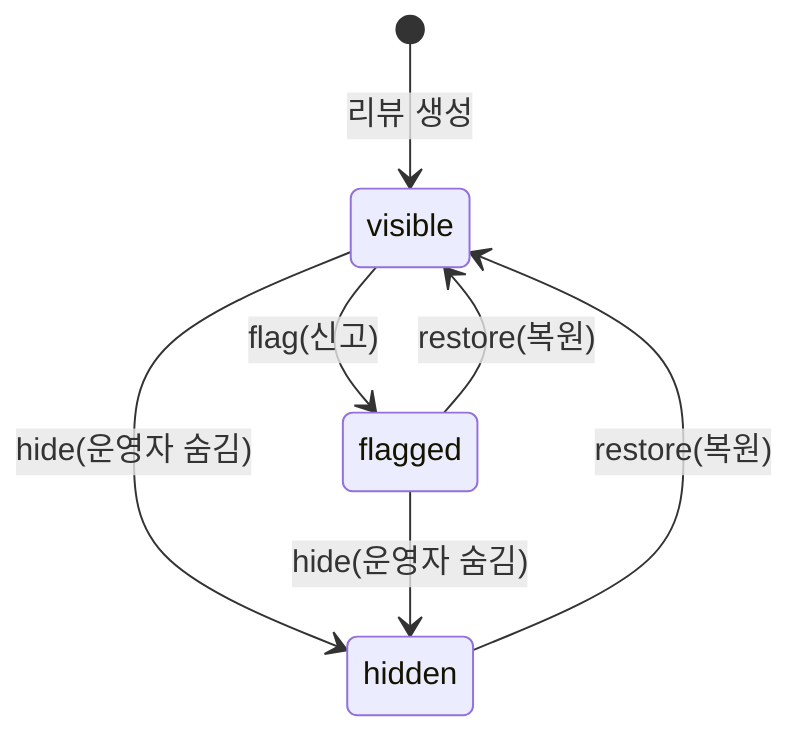

# Review Domain Overview

## 1) 범위

- 이 문서는 review 도메인의 요구사항을 기존 PRD 원문 기준으로 묶어 관리한다.

## 2) 리뷰 상태 머신

리뷰는 생성 시점부터 아래 상태 전이를 따른다.

- `visible` — 정상 노출 상태 (기본값)
- `flagged` — 사용자 신고 접수 상태; 운영자 검토 대기
- `hidden` — 운영자가 숨김 처리한 상태; 고객에게 비노출

## 3) 리뷰/댓글 정책 (PRD §10 원문)

### 리뷰 작성 정책

- 리뷰 작성 가능 조건:
  - 주문 상태 `delivered`
  - 리뷰 대상 SKU를 실제 구매한 사용자
- 사용자당 `order_item` 기준 리뷰 1개(수정은 허용, 중복 생성 금지)
- 평점 범위: `1..5`
- 리뷰 상태: `visible|hidden|flagged`

### 길이 제한

| 필드                | 최대 길이   |
| ------------------- | ----------- |
| 리뷰 제목 (`title`) | **100자**   |
| 리뷰 본문 (`body`)  | **2,000자** |
| 댓글 본문 (`body`)  | **500자**   |

### 리뷰 댓글 정책

- 댓글 작성 권한: `customer|operator|admin`
- 숨김/삭제 권한: `operator|admin`
- 댓글 삭제는 soft delete를 기본으로 하고 감사 로그를 남김

## 4) Stage 2 — Catalog and Cart (리뷰 읽기)

### 구현 목표

- 상품 리뷰 요약/목록 조회(읽기)

### Exit Criteria

- 상품 상세에서 리뷰 요약/목록 조회 성공

## 5) Stage 3 — Order Core (리뷰 쓰기)

### 구현 목표

- 배송 완료 주문 기반 리뷰 작성/수정 API
- 리뷰 댓글 작성 API

### Exit Criteria

- 비구매자 리뷰 작성 차단 + 구매자 리뷰 작성 성공
- 리뷰 댓글 작성/조회 성공

## 6) Stage 6 — Admin Operations (모더레이션)

### 구현 목표

- 리뷰 댓글/리뷰 숨김(모더레이션) 운영 기능

### Exit Criteria

- 운영자가 부적절 리뷰/댓글을 숨김 처리 가능
