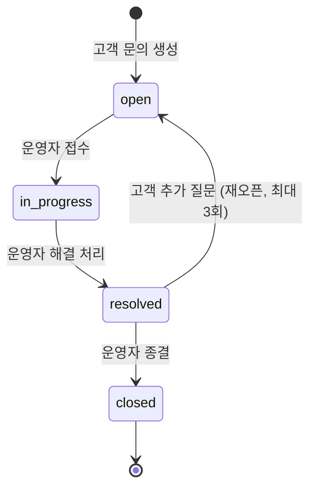

# Inquiry Overview

## 목적

고객 문의 도메인의 핵심 정책을 단일 문서로 정리하고, 운영 응답 SLA와 Stage 6 운영 게이트를 명확히 한다.

## MVP 범위

### 포함

- 고객 문의 생성 (주문 연결 선택적)
- 문의 목록/상세 조회
- 운영자 답변 등록 및 내부 메모
- 문의 상태 전이 (open → in_progress → resolved → closed)
- 재오픈 (resolved → open, 횟수 제한)
- SLA 추적 (1차 응답 24시간 이내)

### 제외

- 첨부파일(이미지/문서) 업로드
- 실시간 채팅 상담
- 자동 답변(챗봇)
- 카테고리별 SLA 차등 적용
- 문의 자동 할당(라운드로빈 등)

## 고객 문의 정책 (PRD §11 원문)

### 문의 기본 정책

- 문의 카테고리: `order|payment|delivery|product|account|other`
- 문의 상태: `open|in_progress|resolved|closed`
- 고객은 자신의 문의만 조회 가능
- 주문 관련 문의 시 `order_id`를 선택적으로 연결 가능

### 문의 본문 길이 제한

- 문의 제목(`title`) 최대 길이: **200자**
- 문의 본문(`content`) 최대 길이: **5,000자**
- 운영자 답변 본문(`reply.content`) 최대 길이: **10,000자**
- 고객 재오픈 추가 질문 본문: 최대 **5,000자**

### 응답 정책

- 1차 응답 목표: 24시간 이내
- 답변/상태 변경 권한: `operator|admin`
- 상태 전이는 `open -> in_progress -> resolved -> closed`를 기본으로 함

### 문의 상태 머신

### 상태 전이 트리거

| 전이 | 트리거 | 수행 주체 | 전제 조건 |
| --- | --- | --- | --- |
| `[*]` → `open` | 고객 문의 생성 | customer | — |
| `open` → `in_progress` | 운영자 접수 | operator, admin | — |
| `in_progress` → `resolved` | 운영자 해결 처리 | operator, admin | 최소 1개 답변 등록 |
| `resolved` → `closed` | 운영자 종결 | operator, admin | — |
| `resolved` → `open` | 고객 추가 질문 (재오픈) | customer | `reopen_count < 3` |

### 재오픈(Reopen) 정책

- `resolved` 상태에서 고객이 추가 질문을 등록하면 `open`으로 전이한다.
- `closed` 상태에서는 재오픈이 불가하며, 새 문의를 생성하도록 안내한다.
- 재오픈 시 기존 답변 이력은 유지되며, 새 답변이 추가된다.
- **재오픈 횟수 제한**: 최대 **3회**. 초과 시 재오픈 불가, 새 문의 생성 안내.
- 재오픈 시 SLA 타이머가 재시작된다 (재오픈 시각 기준 24시간 이내 1차 응답).

### SLA 정책

- **SLA 측정 기준**: `created_at` (최초 생성) 또는 재오픈 시 `reopened_at` 기준으로 `last_replied_at`까지의 시간
- **1차 응답 목표**: 24시간 이내
- **에스컬레이션 정책**:
  - 12시간 경과: Admin inbox에 "주의" 표시
  - 20시간 경과: 담당 운영자에게 알림 발송
  - 24시간 초과: "SLA 위반" 표시, 운영 대시보드에 노출, observability 알림 트리거

## 동시성 정책

- **상태 전이**: 낙관적 락(optimistic lock) 적용
  - 전이 시 현재 `status` + `version` 일치 조건으로 충돌 감지
  - 충돌 시 클라이언트에 409 Conflict 반환, 재시도는 클라이언트 판단
- **담당자 할당**: MVP에서는 수동 할당. 운영자가 inbox에서 문의를 선택하여 자신에게 할당
- **중복 답변 방지**: 동일 문의에 대한 답변은 담당 운영자 또는 미할당 문의에 대해서만 허용

## 실패 시나리오 및 복구

| 시나리오 | 영향 | 복구 방법 |
| --- | --- | --- |
| 문의 생성 시 주문 조회 실패 | `order_id` 연결 없이 문의 생성 | `order_id` null로 생성 허용, 운영자가 수동 연결 |
| 답변 등록 후 이벤트 발행 실패 | 고객 알림 미발송 | 답변은 DB에 커밋 완료. 이벤트는 outbox 패턴 또는 재시도로 보장 |
| SLA 타이머 서비스 장애 | 에스컬레이션 미작동 | observability 지표로 SLA 위반 문의를 사후 탐지, 수동 처리 |
| 상태 전이 동시 충돌 | 409 Conflict | 클라이언트가 최신 상태를 재조회 후 재시도 |

## 연관 도메인

| 도메인 | 연관 내용 | 참조 |
| --- | --- | --- |
| order | 주문 기반 문의 생성 (`order_id` 연결) | `../05-order/01-overview.md` |
| notification | 답변 등록/상태 변경/재오픈 시 고객 알림 | `../12-notification/01-overview.md` |
| observability | 문의 1차 응답 시간 KPI, SLA 위반 알림 | `../14-observability/01-overview.md` |
| event | 이벤트 발행 envelope/멱등성/DLQ 규격 | `../13-event/01-overview.md` |

## Stage 6 게이트

### 구현 목표

- admin에서 상태 전이, 실패 이벤트 관리
- SLA 위반 주문 운영 뷰 제공
- 고객 문의 inbox/상세/답변/상태 전이
- 리뷰 댓글/리뷰 숨김(모더레이션) 운영 기능

### 학습 목표

- 운영 UX 설계와 권한 정책
- 실무형 incident 대응 흐름
- 고객 커뮤니케이션 SLA(문의 응답) 운영 방식

### Exit Criteria

- admin 권한 정책 통과
- 운영자가 상태 전이/redrive 수행 가능
- 운영자가 문의 답변/상태 전이를 수행 가능
- 운영자가 부적절 리뷰/댓글을 숨김 처리 가능
- SLA 위반 문의가 Admin inbox에 정상 표시

### Evidence

- admin 플로우 스크린샷
