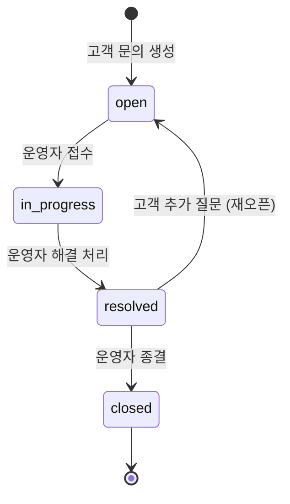

# Inquiry Overview

## 목적

고객 문의 도메인의 핵심 정책을 단일 문서로 정리하고, 운영 응답 SLA와 Stage 6 운영 게이트를 명확히 한다.

## 고객 문의 정책 (PRD §11 원문)

### 문의 기본 정책

- 문의 카테고리: `order|payment|delivery|product|account|other`
- 문의 상태: `open|in_progress|resolved|closed`
- 고객은 자신의 문의만 조회 가능

### 문의 본문 길이 제한

- 문의 본문(`content`) 최대 길이: **5,000자**
- 답변 본문(`reply.content`) 최대 길이: **10,000자**

### 응답 정책

- 1차 응답 목표: 24시간 이내
- 답변/상태 변경 권한: `operator|admin`
- 상태 전이는 `open -> in_progress -> resolved -> closed`를 기본으로 함

### 문의 상태 머신

### 재오픈(Reopen) 정책

- `resolved` 상태에서 고객이 추가 질문을 등록하면 `open`으로 전이한다.
- `closed` 상태에서는 재오픈이 불가하며, 새 문의를 생성하도록 안내한다.
- 재오픈 시 기존 답변 이력은 유지되며, 새 답변이 추가된다.

## Stage 6 게이트

### 구현 목표

- admin에서 상태 전이, 실패 이벤트 관리
- SLA 위반 주문 운영 뷰 제공
- 고객 문의 inbox/상세/답변/상태 전이
- 리뷰 댓글/리뷰 숨김(모더레이션) 운영 기능

### 학습 목표

- 운영 UX 설계와 권한 정책
- 실무형 incident 대응 흐름
- 고객 커뮤니케이션 SLA(문의 응답) 운영 방식

### Exit Criteria

- admin 권한 정책 통과
- 운영자가 상태 전이/redrive 수행 가능
- 운영자가 문의 답변/상태 전이를 수행 가능
- 운영자가 부적절 리뷰/댓글을 숨김 처리 가능

### Evidence

- admin 플로우 스크린샷
