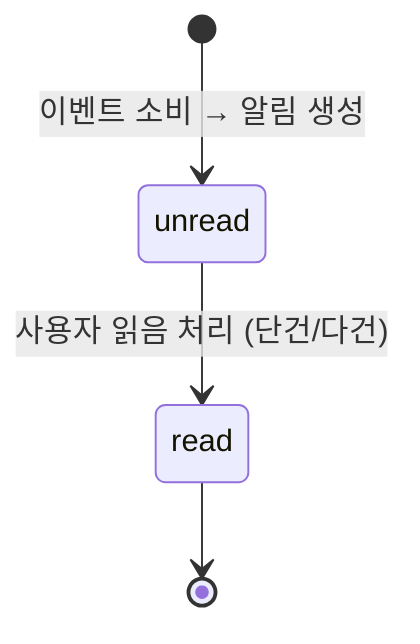

# Notification Domain Overview

## 문서 상태

- 본 문서는 **기존 PRD(01~05)에 미포함된 알림 도메인을 신규 정의**하기 위해 추가되었다.
- MVP 범위는 store 사용자 대상 in-app 알림이며, 운영 알림은 observability 도메인에서 다룬다.

## 도메인 목적

- 주문/배송/결제/리뷰/장바구니/포인트/문의 흐름에서 사용자에게 필요한 상태 변화를 빠르게 전달한다.
- 이벤트 기반 비동기 처리로 주문 처리 경로와 알림 전달 경로를 분리한다.
- 사용자는 알림 목록에서 읽음 상태를 관리하고 최근 변경 이력을 확인한다.

## 도메인 경계

- 포함
  - 주문 생성/상태 변경 알림 생성 정책
  - 결제 완료/실패/취소/환불 알림 생성 정책
  - 배송 상태 변경 알림 생성 정책
  - 리뷰 요청/리뷰 등록 관련 사용자 알림
  - 장바구니 만료(`CartExpired`) 및 주문 전환(`CartConverted`) 알림 생성 정책
  - 포인트 적립/사용/만료/조정 관련 사용자 알림
  - 고객 문의 접수/답변/상태 변경/재오픈 알림 생성 정책
  - 프로모션(카테고리 할인) 적용 알림 생성 정책
  - 사용자별 알림 목록 조회 및 읽음 처리
- 제외
  - 관리자 운영 경보(장애/지연/큐 적체/저재고 경고/재고 조정)는 `../14-observability/01-overview.md` 범위
  - 이메일/SMS/push 실제 발송 인프라 구현
  - 예외: `InquiryReopened` 운영자 알림은 notification 도메인에서 처리

## 알림 상태 머신

- `unread` — 생성 직후 기본 상태. 목록에서 시각적 강조 표시
- `read` — 사용자가 읽음 처리한 상태. `read_at` 타임스탬프 기록

### 상태 전이 트리거

| 전이                | 트리거                               | 수행 주체 | 전제 조건         |
| ------------------- | ------------------------------------ | --------- | ----------------- |
| `[생성]` → `unread` | 이벤트 소비 완료 (notifications 큐)  | system    | 멱등 키 중복 아님 |
| `unread` → `read`   | 단건 읽음 처리 (항목 클릭/읽음 액션) | customer  | 본인 소유 알림    |
| `unread` → `read`   | 다건 읽음 처리 (선택 항목 일괄)      | customer  | 본인 소유 알림    |
| `unread` → `read`   | 전체 읽음 처리                       | customer  | 본인 소유 알림    |

- `read` → `unread` 역전이는 허용하지 않음 (읽음 처리는 비가역)
- 삭제 정책: MVP에서는 사용자 삭제 미지원. 보존 정책에 따라 시스템이 만료 처리

## 알림 채널 전략

- 초기(MVP): in-app only
- 확장 후보: push, email, SMS
- 확장 원칙
  - 채널 확장은 이벤트 소비 결과를 채널 라우팅으로 분기하는 방식으로 추가한다.
  - 채널별 템플릿/게이트웨이 상세는 별도 문서에서 정의한다.

## 연관 도메인

| 도메인        | 연관 내용                                                                                                                          | 참조                                 |
| ------------- | ---------------------------------------------------------------------------------------------------------------------------------- | ------------------------------------ |
| event         | 공통 envelope 규격을 준수한 이벤트를 `notifications` 큐에서 소비                                                                   | `../13-event/01-overview.md`         |
| order         | 주문 생성/상태 변경/취소/대체상품 승인·결과 알림 매핑                                                                              | `../05-order/05-events.md`           |
| payment       | 결제 완료/실패/취소/환불 이벤트 소비하여 사용자 알림 생성                                                                          | `../06-payment/05-events.md`         |
| delivery      | 배송 생성/배차/상태변경/배차실패/배송취소 알림 매핑                                                                                | `../07-delivery/05-events.md`        |
| review        | 리뷰 작성 가능 시점 및 작성 완료 후 후속 알림 정책 연계                                                                            | `../10-review/05-events.md`          |
| inventory     | 품절/재입고 상태 변경 고객 알림                                                                                                    | `../03-inventory/05-events.md`       |
| cart          | `CartExpired`(만료 안내) 및 `CartConverted`(전환 완료) 사용자 알림                                                                 | `../04-cart/05-events.md`            |
| loyalty       | `PointsEarned`(적립), `PointsRedeemed`(사용), `PointsExpired`(만료), `PointsAdjusted`(조정) 알림                                   | `../09-loyalty/05-events.md`         |
| promotion     | `PromotionApplied`(카테고리 할인 적용) 사용자 알림                                                                                 | `../08-promotion/05-events.md`       |
| inquiry       | `InquiryCreated`(접수), `InquiryReplied`(답변), `InquiryStatusChanged`(상태 변경) 고객 알림, `InquiryReopened`(재오픈) 운영자 알림 | `../11-inquiry/05-events.md`         |
| observability | 알림 소비 지연/DLQ 적체 관측 지표 제공                                                                                             | `../14-observability/01-overview.md` |

## 이벤트 아키텍처 연결

- PRD 정책 기준: `../13-event/01-overview.md`
- 아키텍처 기준: `../../02-architecture/backend/02-eventing.adr.md`
- fanout 구조에서 notifications 큐는 독립 소비자로 동작하며 멱등 소비를 전제로 한다.

## 동시성/충돌 해소 정책

- **중복 알림 방지**: `source_event_id` (원본 이벤트의 `eventId`) 유니크 제약으로 동일 이벤트에 대한 중복 알림 생성 차단
- **다건 읽음 처리**: ID 목록 기반 일괄 업데이트. 부분 실패 시 실패 항목 목록을 응답에 포함
- **이벤트 순서 역전**: 완전 순서 보장보다 최신 상태 노출 우선. `created_at` 기준 최신순 정렬로 사용자 경험 보장

## 알림 전달 SLA

- 이벤트 발행 시점부터 알림 레코드 생성까지 p95 **30초 이내**
- SLA 위반 감지는 `../14-observability/01-overview.md`의 `event_processing_latency` 지표로 모니터링
- SLA 위반 시 운영 대응: consumer scale-out 또는 queue backlog 원인 분석

## 엣지 케이스

| 상황                                                           | 처리 정책                                                            |
| -------------------------------------------------------------- | -------------------------------------------------------------------- |
| 대량 이벤트 동시 발생 (예: 프로모션 일괄 적용)                 | notifications 큐 독립 소비, backlog 증가 시 SLA 지표 알림 발동       |
| 이벤트 순서 역전 (OrderCancelled가 OrderCreated보다 먼저 도착) | 각 이벤트를 독립 알림으로 생성, 목록은 `created_at` 기준 최신순 정렬 |
| 소비 실패 후 DLQ 이동                                          | 알림 미생성 상태 유지, redrive 후 정상 생성                          |
| 동일 이벤트 중복 수신                                          | `source_event_id` 유니크 제약으로 중복 생성 차단, 기존 알림 유지     |
| 사용자 탈퇴 후 이벤트 도착                                     | `user_id` 유효성 검증 실패 시 알림 미생성, ack 처리                  |

## 실패 시나리오 및 복구

| 실패 유형                  | 영향               | 복구 방법                                   |
| -------------------------- | ------------------ | ------------------------------------------- |
| notifications 큐 소비 실패 | 해당 알림 미생성   | 자동 재시도 3회 → DLQ 이동 → 운영자 redrive |
| DB 쓰기 실패               | 알림 레코드 미저장 | nack → 재시도. 반복 실패 시 DLQ             |
| 읽음 처리 API 실패         | 읽음 상태 미반영   | 클라이언트 재시도 (멱등 API)                |
| 대량 backlog 적체          | 알림 전달 지연     | consumer scale-out, SLA 알림 발동           |

## 알림 보존 정책

- MVP 보존 기간: **90일**
- 90일 경과 알림은 배치 작업으로 정리 (soft delete)
- 사용자당 최대 조회 범위: 최근 90일 이내 알림

## 성공 기준(MVP)

- 사용자 알림 목록에서 최신순 확인 가능
- 읽음/미읽음 상태가 일관되게 유지
- 동일 이벤트 중복 소비 시 중복 알림이 생성되지 않음
- 주문/배송/결제 핵심 상태 변경이 누락 없이 사용자에게 노출
- 이벤트 발행 후 p95 30초 이내 알림 생성

## Stage 게이트

### Stage 4 — Event Fanout (Notification Consumer 기본 구현)

#### 구현 목표

- `OrderCreated` 이벤트 소비 → 알림 레코드 생성
- `notifications` 큐 독립 소비자 구현
- 멱등 소비 (`source_event_id` 유니크 제약) 적용

#### 학습 목표

- 이벤트 소비자 분리 패턴 이해
- 멱등 알림 생성 전략 설계

#### Exit Criteria

- `OrderCreated` 이벤트 1건 → 알림 1건 생성 확인
- 동일 이벤트 재수신 시 중복 알림 미생성 확인
- 알림 목록 API에서 생성된 알림 조회 가능

#### Evidence

- 알림 생성 로그
- 중복 소비 테스트 결과

### Stage 5 — Reliability (전체 이벤트 매핑 + 신뢰성)

#### 구현 목표

- 전체 소비 이벤트(28건) 매핑 완료
- DLQ 이동 및 redrive 정상 동작

#### Exit Criteria

- 주요 이벤트(order/payment/delivery) 알림 생성 확인
- DLQ 이동 및 redrive 후 알림 정상 생성

#### Evidence

- 이벤트 유형별 알림 생성 샘플
- DLQ redrive 테스트 로그
