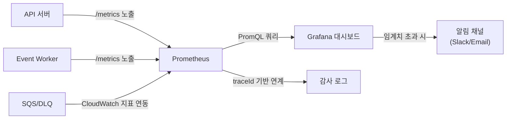

# Observability Domain Overview

이 문서는 observability 도메인의 co-located 요구사항 문서다.

## 도메인 목적

- API/Queue/Worker 운영 상태를 하나의 지표 체계로 관측한다.
- 임계치 기반 알림으로 장애 감지와 복구 시간을 단축한다.
- traceId 기반 감사/추적 정책으로 주문 단위 end-to-end 추적을 보장한다.

## 아키텍처 기준

- 기본 관측 스택은 Prometheus + Grafana를 사용한다.
- 필수 지표/알림 임계치 표준은 PRD 정책을 단일 기준으로 유지한다.
- 운영 표준은 traceId 기반 상호 연계를 전제로 한다.

### 관측 아키텍처 개요

## 6) 관측/알림 정책

### 필수 지표

- `queue_depth`
- `worker_processed_total`
- `worker_failed_total`
- `event_processing_latency`
- `dlq_message_count`
- `inquiry_first_response_latency`
- `review_moderation_count`

### 알림 임계치(기본)

- API 오류율 1% 초과(5분)
- p99 지연 2초 초과(5분)
- DLQ 메시지 5건 초과
- Queue depth 1000 초과

### 롤백 기준

- 배포 후 5분 내 오류율 5% 초과 시 자동 롤백을 수행한다.
- 롤백 판단 지표는 Prometheus에서 수집한 API 오류율을 기준으로 한다.
- 자동 롤백 실패 시 운영자 수동 롤백 절차를 즉시 개시한다.

## 7) 감사/추적 정책

- 모든 이벤트 처리 로그에 `traceId`, `eventId`, `consumer` 기록
- 주문 단위 추적 가능해야 함(end-to-end)
- redrive 수행 기록은 별도 감사 로그 필수

## KPI 측정 연결

> KPI 목표 및 측정 방식은 [00-overview.md §3 성공 지표](../00-overview.md#3-성공-지표-kpi-7개)를 참조한다.

- 관측 도메인은 KPI의 측정 신뢰성과 운영 판단 근거를 제공한다.
- 운영 복구 시간, DLQ 복구 성공률, 문의 1차 응답 시간은 대시보드와 알림 정책의 핵심 연결 항목이다.

## Stage 7 Gate

### Stage 7 — Observability and Hardening

#### 구현 목표

- metrics/alerts/dashboard 완성
- rollback/drill(runbook) 수행
- 문의 응답 시간/리뷰 신고 처리율 지표 포함

#### 학습 목표

- SLO/알림 임계치 설계
- 배포 실패 복구 전략

#### Exit Criteria

- 핵심 지표 대시보드 확인
- 장애 drill 통과
- 롤백 기준 적용 확인(배포 후 5분 내 오류율 5% 초과 시 자동 롤백 동작 검증)

#### Evidence

- 대시보드 캡처
- drill 리포트
