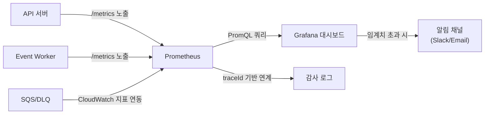

# Observability Domain Overview

이 문서는 observability 도메인의 co-located 요구사항 문서다.

## 도메인 목적

- API/Queue/Worker 운영 상태를 하나의 지표 체계로 관측한다.
- 임계치 기반 알림으로 장애 감지와 복구 시간을 단축한다.
- traceId 기반 감사/추적 정책으로 주문 단위 end-to-end 추적을 보장한다.

## MVP 범위

### 포함

- Prometheus + Grafana 기반 메트릭 수집/시각화/알림
- KPI 7개 전체 대시보드 매핑
- traceId 기반 주문 단위 end-to-end 추적
- 감사 로그 수집 및 조회 (이벤트 처리, redrive)
- 임계치 기반 알림 및 에스컬레이션
- 배포 자동 롤백 (오류율 기준)

### 제외

- APM(Application Performance Monitoring) 통합 (Datadog, New Relic 등)
- 분산 트레이싱 UI (Jaeger, Zipkin 등 — traceId 기반 로그 추적으로 대체)
- 사용자 행동 분석 (analytics/BI)
- 비용 모니터링
- Prometheus HA 구성 (MVP 이후 확장)

## 아키텍처 기준

- 기본 관측 스택은 Prometheus + Grafana를 사용한다.
- 필수 지표/알림 임계치 표준은 PRD 정책을 단일 기준으로 유지한다.
- 운영 표준은 traceId 기반 상호 연계를 전제로 한다.

### 관측 아키텍처 개요

## 6) 관측/알림 정책

### 필수 지표

#### API/서비스 지표

- `api_request_total` — API 요청 총량 (counter)
- `api_error_total` — API 오류 총량 (counter)
- `api_request_duration_seconds` — API 응답 지연 (histogram)

#### 이벤트/큐 지표

- `queue_depth` — 큐별 대기 메시지 수
- `worker_processed_total` — worker 처리 총량
- `worker_failed_total` — worker 실패 총량
- `event_processing_latency` — 이벤트 처리 지연
- `dlq_message_count` — DLQ 메시지 수
- `duplicate_event_skipped_total` — 멱등 키 중복으로 건너뛴 이벤트 수

#### 비즈니스 지표

- `order_created_total` — 주문 생성 총량
- `order_completed_total` — 주문 완료(delivered) 총량
- `review_created_total` — 리뷰 생성 총량
- `inquiry_first_response_latency` — 문의 1차 응답 지연
- `review_moderation_count` — 리뷰 신고 처리량

#### 운영/복구 지표

- `dlq_redrive_total` — redrive 시도 총량
- `dlq_redrive_success_total` — redrive 성공 총량

### 알림 임계치(기본)

| 지표                                               | 임계치      | 관찰 윈도우 | 용도                  |
| -------------------------------------------------- | ----------- | ----------- | --------------------- |
| API 오류율 (`api_error_total / api_request_total`) | 1% 초과     | 5분         | 서비스 이상 감지      |
| API p95 지연                                       | 500ms 초과  | 5분         | KPI 위반 감지         |
| API p99 지연                                       | 2초 초과    | 5분         | 심각한 성능 저하 감지 |
| DLQ 메시지 수                                      | 5건 초과    | —           | 처리 실패 누적 감지   |
| Queue depth                                        | 1,000 초과  | —           | 소비자 적체 감지      |
| 문의 1차 응답 지연                                 | 20시간 초과 | —           | SLA 위반 임박 감지    |

> **KPI 측정 vs 알림 구분**: `p95 ≤ 500ms`는 KPI 달성 여부 측정 기준(`00-overview.md §3`)이고, `p99 > 2s`는 심각한 성능 저하에 대한 운영 알림 트리거 기준이다. 두 지표는 목적이 다르므로 대시보드 패널과 알림 규칙에 각각 별도로 구성한다.

### 알림 에스컬레이션 정책

| 단계 | 경과 시간      | 조치                                              |
| ---- | -------------- | ------------------------------------------------- |
| 1차  | 즉시           | 운영 Slack 채널에 알림 발송                       |
| 2차  | 5분 후 미응답  | 담당 on-call 운영자에게 개인 알림(Slack DM/Email) |
| 3차  | 15분 후 미응답 | 상위 관리자에게 에스컬레이션                      |
| 4차  | 30분 후 미응답 | 전체 운영팀 알림 + 장애 대응 채널 개설            |

### 롤백 기준

- 배포 후 5분 내 오류율 5% 초과 시 자동 롤백을 수행한다.
- 롤백 판단 지표는 Prometheus에서 수집한 API 오류율(`api_error_total / api_request_total`)을 기준으로 한다.
- 자동 롤백 실패 시 운영자 수동 롤백 절차를 즉시 개시한다.

#### 롤백 기술 상세

- **트리거 메커니즘**: Prometheus alerting rule → Alertmanager webhook → 배포 파이프라인 롤백 API 호출
- **롤백 대상**: API 서버 및 Event Worker를 동시에 이전 버전으로 롤백한다.
- **롤백 검증**: 롤백 후 3분간 오류율을 재관찰하여 정상 복귀를 확인한다.
- **롤백 후 조치**: 롤백 원인 분석 → 수정 → 재배포 전 staging 환경 검증 필수
- **롤백 실패 시**: 수동 롤백 runbook을 즉시 실행하고, 장애 대응 채널에 상황을 공유한다.

### Prometheus 수집 설정

- **스크레이프 간격**: 15초
- **스크레이프 타임아웃**: 10초
- **서비스 디스커버리**: 정적 설정(MVP), DNS 기반 디스커버리(확장)
- **TSDB 보존 기간**: 로컬 15일, 장기 보존은 외부 저장소(S3 등)로 원격 쓰기 구성
- **메트릭 경로**: 모든 서비스는 `/metrics` 경로로 Prometheus exposition format 노출

## 7) 감사/추적 정책

- 모든 이벤트 처리 로그에 `traceId`, `eventId`, `consumer` 기록
- 주문 단위 추적 가능해야 함(end-to-end)
- redrive 수행 기록은 별도 감사 로그 필수

### traceId 생성 및 전파 규칙

- **포맷**: UUID v4
- **생성 시점**: API 서버 진입점에서 요청당 1회 생성. 클라이언트가 `x-trace-id` 헤더를 제공하면 해당 값을 사용한다.
- **HTTP 전파**: 모든 내부/외부 HTTP 호출 시 `x-trace-id` 요청 헤더에 포함
- **이벤트 전파**: SNS 발행 시 이벤트 envelope의 `traceId` 필드에 포함 (`../13-event/01-overview.md` §2 참조)
- **로그 출력**: 모든 구조화 로그(JSON)에 `traceId` 필드 포함 필수
- **응답 헤더**: API 응답에 `x-trace-id` 헤더를 포함하여 클라이언트 측 디버깅 지원

## KPI 측정 연결

> KPI 목표 및 측정 방식은 [00-overview.md §3 성공 지표](../00-overview.md#3-성공-지표-kpi-7개)를 참조한다.

- 관측 도메인은 KPI의 측정 신뢰성과 운영 판단 근거를 제공한다.
- 아래 매핑 테이블은 각 KPI의 측정 메트릭, 집계 방식, 대시보드 연결을 정의한다.

### KPI ↔ 메트릭 매핑

| KPI                | 목표        | Prometheus 메트릭                                 | 집계 방식                                                                                                       | 대시보드 패널 |
| ------------------ | ----------- | ------------------------------------------------- | --------------------------------------------------------------------------------------------------------------- | ------------- |
| 주문 성공률        | 98% 이상    | `order_created_total`, `order_completed_total`    | `rate(order_completed_total) / rate(order_created_total)`                                                       | 핵심 카드     |
| 중복 처리 오류     | 0건         | `duplicate_event_skipped_total`                   | `sum(duplicate_event_skipped_total)` — skip은 멱등 정상 동작이며, 실제 중복 side-effect 발생은 감사 로그로 추적 | 핵심 카드     |
| DLQ 복구 성공률    | 95% 이상    | `dlq_redrive_total`, `dlq_redrive_success_total`  | `rate(dlq_redrive_success_total) / rate(dlq_redrive_total)`                                                     | 큐 운영 패널  |
| 운영 복구 시간     | 10분 이내   | 알림 발생 시각 → 복구 완료 시각                   | 감사 로그 기반 집계                                                                                             | 큐 운영 패널  |
| p95 주문 조회 지연 | 500ms 이하  | `api_request_duration_seconds{handler="/orders"}` | `histogram_quantile(0.95, rate(...))`                                                                           | 시계열 그래프 |
| 리뷰 작성 전환율   | 25% 이상    | `review_created_total`, `order_completed_total`   | `sum(review_created_total) / sum(order_completed_total)`                                                        | 핵심 카드     |
| 문의 1차 응답 시간 | 24시간 이내 | `inquiry_first_response_latency`                  | `histogram_quantile(0.95, rate(...))`                                                                           | 시계열 그래프 |

## 장애 시나리오 및 복구 정책

| 시나리오               | 영향                          | 복구 방법                                                                   |
| ---------------------- | ----------------------------- | --------------------------------------------------------------------------- |
| Prometheus 다운        | 메트릭 수집 중단, 알림 미발생 | Prometheus HA 구성(MVP 이후). 단기 장애 시 CloudWatch 지표로 대체 관측      |
| Grafana 접근 불가      | 대시보드 조회 불가            | Prometheus API 직접 쿼리 또는 Alertmanager 독립 알림으로 운영 지속          |
| 감사 로그 쓰기 실패    | 추적 데이터 유실              | 로그 버퍼링(파일 기반 fallback) 후 복구 시 일괄 적재. 유실 구간은 수동 점검 |
| Alert 채널 전송 실패   | 운영자 알림 미수신            | 다중 채널 구성(Slack + Email 동시). 단일 채널 실패 시 대체 채널로 전달      |
| 메트릭 스크레이프 지연 | 알림 발생 지연                | 스크레이프 타임아웃 초과 시 `up` 메트릭 기반 알림으로 감지                  |

## 연관 도메인

| 도메인       | 연관 내용                                                              | 참조                                |
| ------------ | ---------------------------------------------------------------------- | ----------------------------------- |
| order        | 주문 성공률, 주문 조회 지연 KPI 메트릭 수집                            | `../05-order/01-overview.md`        |
| review       | 리뷰 작성 전환율, 리뷰 신고 처리량 메트릭 수집                         | `../10-review/01-overview.md`       |
| inquiry      | 문의 1차 응답 시간 KPI, SLA 위반 알림 연동                             | `../11-inquiry/01-overview.md`      |
| notification | 운영 경보는 observability 범위, 사용자 알림은 notification 범위로 분리 | `../12-notification/01-overview.md` |
| event        | 큐 상태/처리율/실패율/DLQ 지표 수집, 이벤트 envelope traceId 연계      | `../13-event/01-overview.md`        |

## Stage 7 Gate

### Stage 7 — Observability and Hardening

#### 구현 목표

- metrics/alerts/dashboard 완성
- rollback/drill(runbook) 수행
- 문의 응답 시간/리뷰 신고 처리율 지표 포함

#### 학습 목표

- SLO/알림 임계치 설계
- 배포 실패 복구 전략

#### Exit Criteria

- 핵심 지표 대시보드 확인 (KPI 7개 전체 매핑 검증)
- 장애 drill 통과
- 롤백 기준 적용 확인(배포 후 5분 내 오류율 5% 초과 시 자동 롤백 동작 검증)

#### Evidence

- 대시보드 캡처
- drill 리포트
