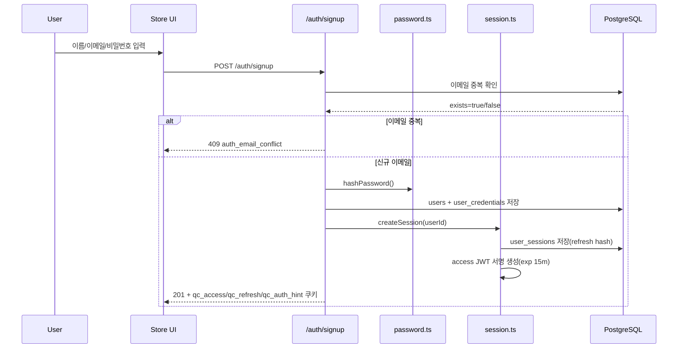
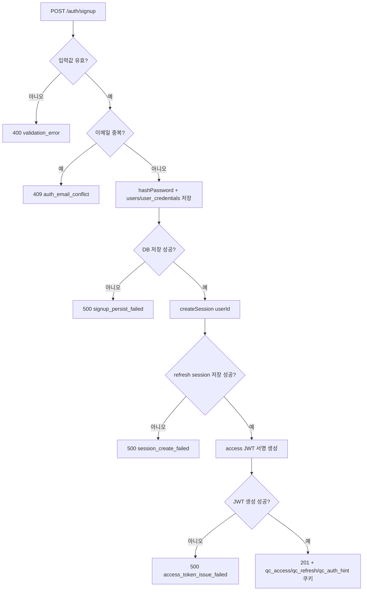
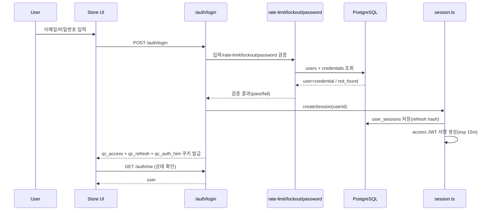
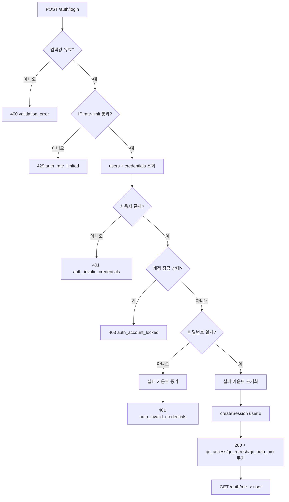
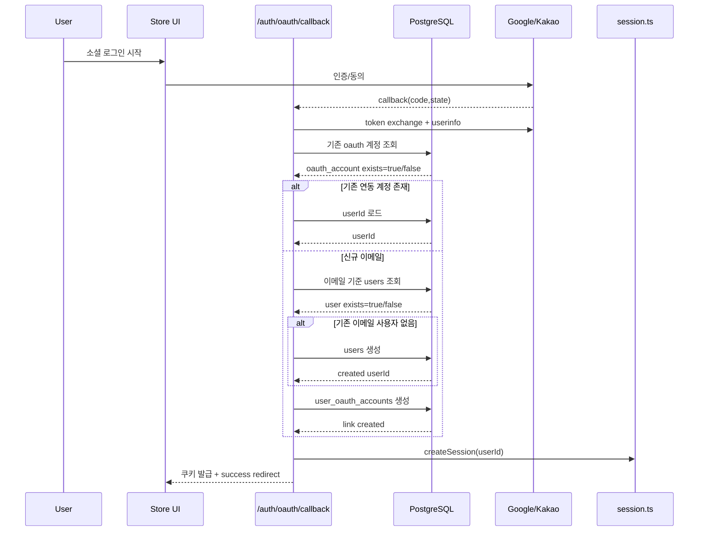
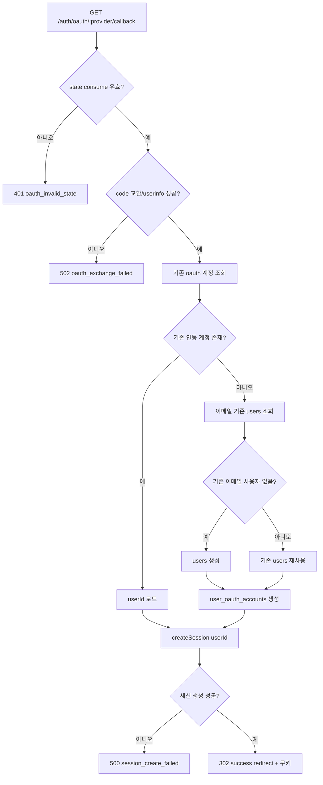
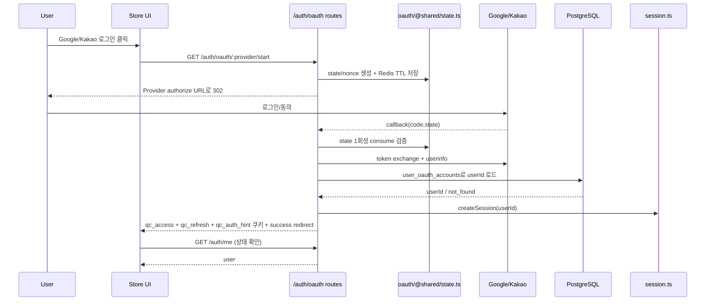
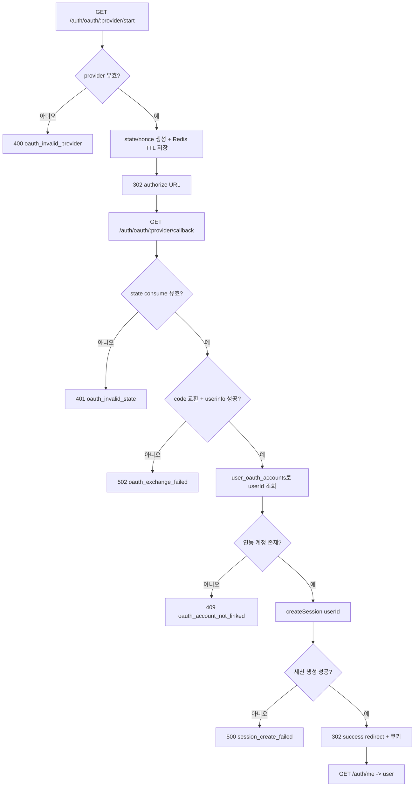

# 01. 로그인 인증 모델 개요 (JWT 하이브리드)

## 핵심 질문

> 이 서비스의 로그인 인증은 access JWT + stateful refresh 기준에서 어떻게 동작하는가?

## 한 줄 답

이 서비스는 **access JWT(로컬 검증) + stateful refresh(DB 세션 검증) 하이브리드 인증**을 중심으로, Email 로그인과 Google/Kakao OAuth를 같은 세션 모델로 수렴해 처리한다.

---

## 현재 흐름

### 1) 이메일 회원가입 흐름

상세 분기(Flowchart):

### 2) 이메일 로그인 흐름

상세 분기(Flowchart):

### 3) 소셜 첫 로그인(자동 회원가입) 흐름

상세 분기(Flowchart):

### 4) 소셜 로그인(기존 연동 계정) 흐름

상세 분기(Flowchart):

---

## 로그인 채널 통합 — Email/OAuth를 동일 세션 계약으로 수렴

**Problem** — 인증 채널(Email, Google, Kakao)별로 세션 모델이 다르면 권한/만료/로그아웃 정책이 채널마다 달라져 운영과 디버깅 복잡도가 급증한다.

통합하지 않았을 때 실제로 자주 발생하는 문제는 아래와 같다.

1. **로그아웃 일관성 붕괴**
   - Email 로그인은 DB 세션 revoke, OAuth 로그인은 프론트 토큰 삭제만 수행하면, 같은 "로그아웃"이라도 보안 강도가 달라진다.
   - 결과적으로 OAuth 경로에서 탈취된 refresh 토큰이 서버에 남아 재사용될 수 있다.

2. **만료 정책 불일치로 인한 장애성 문의 증가**
   - Email은 Access 15분/Refresh 14일, OAuth는 provider 토큰 만료에 종속되면 사용자 체감이 채널마다 달라진다.
   - 어떤 사용자는 하루 뒤 자동 로그아웃되고, 어떤 사용자는 오래 유지되어 "왜 내 계정만 자꾸 풀리나" 유형의 CS가 반복된다.

3. **권한 반영 지연(보안 사고 위험)**
   - 관리자 권한 박탈 시 Email 세션은 즉시 무효화되지만, OAuth 경로는 캐시된 provider 정보만 보고 통과하면 권한 회수가 늦어진다.
   - 운영자는 "권한을 내렸는데도 접근된다"는 치명적 이슈를 채널별로 따로 추적해야 한다.

4. **관측/감사 추적 단절**
   - Email은 `audit_logs`에 남고 OAuth는 외부 provider 로그에만 남으면, incident 타임라인을 하나로 재구성하기 어렵다.
   - 동일 사용자 이벤트를 채널별로 수동 매핑해야 해서 MTTR(복구 시간)이 길어진다.

5. **프론트 상태 판정 분기 폭발**
   - Email은 쿠키 기반 `/auth/me`, OAuth는 별도 콜백 상태값으로 판정하면 화면 진입 조건이 라우트마다 달라진다.
   - 결과적으로 로그인 직후 홈 진입/리다이렉트/토스트 처리 버그가 채널별로 따로 발생한다.

**Action** — 채널별 로그인은 라우트 단계에서 분기하되, 최종 세션 발급은 `createSession`으로 단일화한다. 이후 상태 확인도 `/auth/me` 하나로 통일한다.

실행 관점에서의 통합 규칙은 다음처럼 고정한다.

1. **채널별 차이는 "인증 수단 검증"까지만 허용**
   - Email: 비밀번호 검증, lockout/rate-limit 적용
   - OAuth: state/nonce 검증, code exchange, provider userinfo 검증
   - 공통점: 검증이 끝난 시점부터는 동일하게 userId를 확보하고 동일 세션 발급 경로로 진입

2. **세션 생성/회전/폐기는 단일 모듈만 사용**
   - 로그인 성공: `createSession`
   - 토큰 재발급: refresh rotation 로직 동일 적용
   - 로그아웃/보안 이벤트: `revokeSession` 계열 로직으로 일괄 폐기

3. **프론트 상태 판정은 `/auth/me` 단일 소스만 사용**
   - 쿠키 값을 프론트에서 추측해 로그인 상태를 판정하지 않는다.
   - 로그인 성공 직후, 로그아웃 직후, 콜백 직후 모두 `['auth','me']` 재조회로 수렴한다.

**Result** — 로그인 방식이 달라도 쿠키 정책, 세션 만료, revoke, 감사 로그를 같은 규약으로 다룰 수 있다. ✅ 서비스 운영 일관성 확보.

통합 이후 기대할 수 있는 운영 결과는 다음과 같다.

1. **보안 이벤트 대응 단순화**
   - "특정 사용자 강제 로그아웃"을 채널 구분 없이 한 번의 세션 폐기 루프로 처리한다.
   - 사고 대응 플레이북이 단일화되어 야간 장애 대응 속도가 빨라진다.

2. **인증 관련 CS 감소**
   - 채널별 만료 체감 차이가 줄어 "로그인 유지가 들쑥날쑥"한 불만이 감소한다.
   - 문제 재현 시나리오가 채널별 3세트가 아닌 공통 1세트로 축소된다.

3. **관측 가능성 향상**
   - login/refresh/logout/revoke 이벤트가 동일 감사 모델에 기록되어 추적 경로가 짧아진다.
   - incident 회고 시 "어느 채널에서만 예외"인지 즉시 분리 가능해 원인 분석 시간이 단축된다.

4. **프론트 구현 복잡도 축소**
   - 라우트 가드와 초기 로딩 판정이 `/auth/me` 기준 하나로 정리된다.
   - OAuth callback 전용 예외 분기가 줄어 회귀 버그 확률이 낮아진다.

---

## 이 프로젝트에서의 적용

| 결정                       | 해결하는 문제         |
| -------------------------- | --------------------- |
| Email/OAuth 공통 세션 수렴 | 채널별 인증 정책 분산 |

---

> **근거 문서**: [ADR-0002: Backend Stack](../../02-architecture/backend/01-backend.adr.md), [prd/01-auth/overview](../../01-prd/01-auth/01-overview.md)

---

## 다음 문서

[02. JWT + Stateful Refresh 하이브리드 선택 이유](./02-why-jwt-hybrid.md) — 왜 access JWT와 stateful refresh를 함께 쓰는가?
