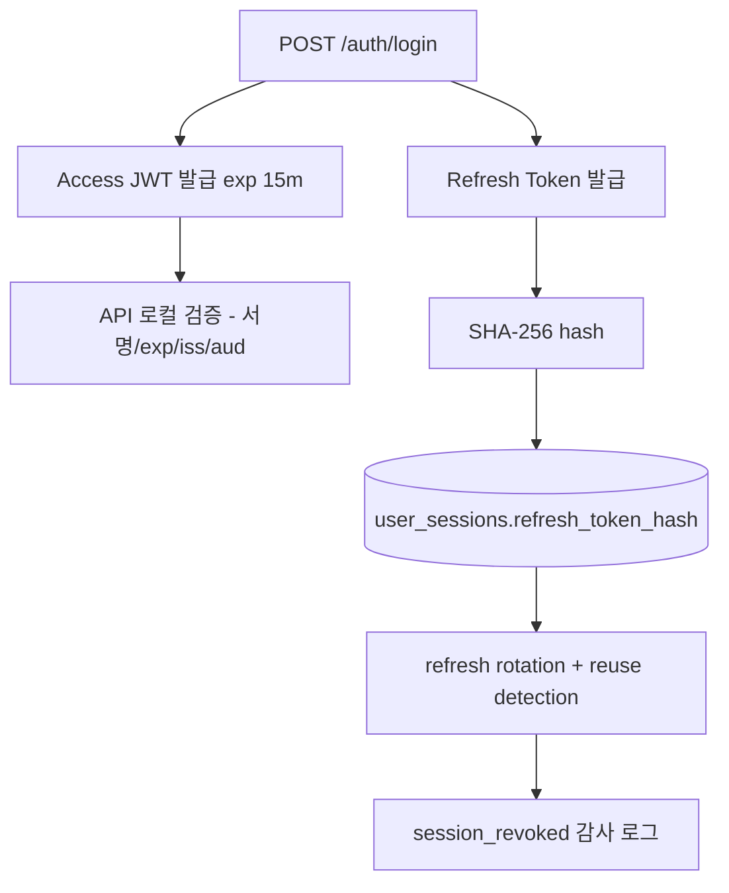
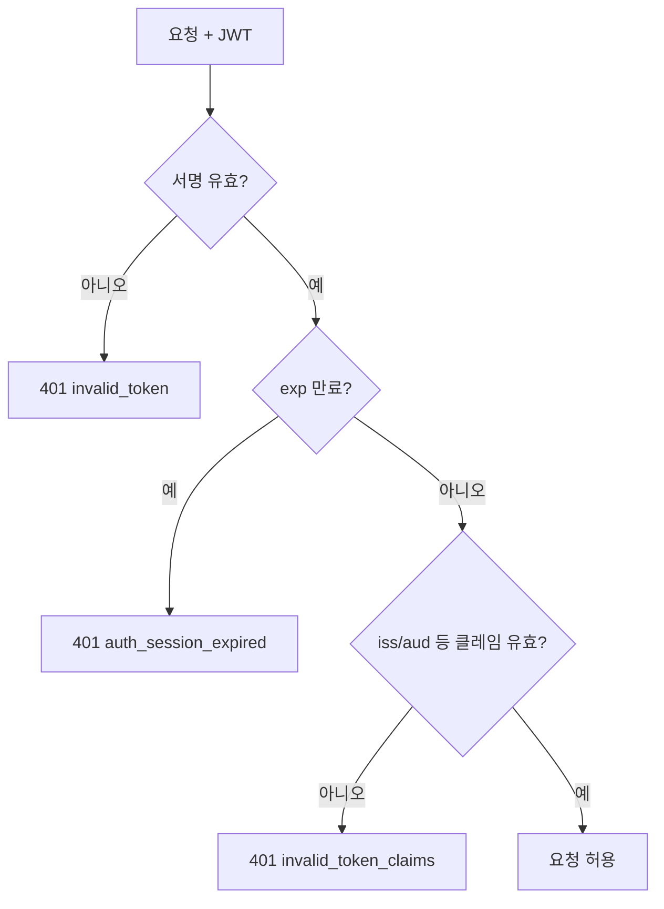

# 02. JWT + Stateful Refresh 하이브리드 선택 이유

## 핵심 질문

> 왜 이 프로젝트는 access JWT + stateful refresh 하이브리드 방식을 사용하나?

## 한 줄 답

검증 성능(로컬 JWT 검증)과 운영 제어력(refresh revoke/reuse detection)을 함께 만족하려면 access JWT + stateful refresh 하이브리드가 현재 요구사항에 가장 적합하다.

---

## 현재 접근 방식

---

## JWT 자체검증이란 무엇인가

JWT 자체검증은 API 서버가 토큰 문자열만 받아서, 별도 저장소 조회 없이 서명과 클레임(`exp`, `iss`, `aud`)을 로컬에서 확인해 인증을 통과시키는 방식이다.

검증 절차를 단순화하면 아래와 같다.

1. 토큰의 서명 유효성 검증(위조 여부 확인)
2. 만료 시간(`exp`) 검사
3. 발급자/대상(`iss`/`aud`) 등 클레임 검사
4. 모두 통과하면 요청 허용

즉, 핵심은 "토큰 자체에 필요한 정보가 들어 있어 매 요청마다 DB/Redis 조회가 없어도 된다"는 점이다.

---

## JWT 자체검증만으로 운영이 어려운 이유

문제는 "검증이 빠르다"와 "운영 제어가 쉽다"가 같은 말이 아니라는 점이다.

### 1) 즉시 폐기(revoke) 어려움

JWT는 발급 시점에 정해진 `exp`까지 유효하다. 사용자가 로그아웃하거나 운영자가 강제 로그아웃을 걸어도, 토큰이 살아 있는 동안은 자체검증만으로는 차단이 어렵다.

- 우회책: denylist(블랙리스트) 저장소를 매 요청 조회
- 결과: 결국 서버 저장소 조회가 필요해져 "순수 stateless" 이점이 줄어든다.

### 2) refresh 재사용 탐지(reuse detection) 어려움

`docs/01-prd/01-auth/01-overview.md`는 "기존 refresh 재사용 탐지 시 세션 강제 폐기"를 요구한다.
이 정책을 지키려면 "이 토큰이 이미 회전되어 폐기된 토큰인지"를 서버가 기억해야 한다.

- 자체검증 JWT만으로는 "이전 토큰 사용 이력"을 알 수 없다.
- 그래서 `user_sessions.refresh_token_hash` 같은 서버 상태가 필요하다.

### 3) 강제 로그아웃/사고 대응 일관성 저하

보안 사고(토큰 탈취 의심, 계정 보호 조치) 시 운영자는 즉시 세션 차단이 가능해야 한다.
자체검증 JWT만 사용하면 "토큰 만료를 기다리는 모델"이 되기 쉬워 대응 지연이 생긴다.

---

## JWT-only vs 하이브리드 비교

| 항목                    | JWT-only(순수 stateless)          | 하이브리드(JWT access + stateful refresh) |
| ----------------------- | --------------------------------- | ----------------------------------------- |
| access 검증 경로        | 서명/클레임 로컬 검증             | 서명/클레임 로컬 검증                     |
| refresh 검증 경로       | 자체적으로 모델 부재              | DB hash + revoked/expiry 검증             |
| 즉시 revoke             | 기본적으로 어려움(`exp`까지 유효) | refresh 세션 revoke로 즉시 반영           |
| refresh reuse detection | 별도 상태 저장 없이는 어려움      | 회전 이력/해시 기반으로 탐지 가능         |
| 운영 복잡도             | revoke 보완 레이어 필요           | 정책 집행 경로가 명확(세션 저장소 기준)   |

요약하면, JWT-only는 빠르지만 revoke/reuse 정책이 약하고, 하이브리드는 access 검증 성능을 유지하면서 refresh 수명주기 제어를 강화한다.

---

## 현대적 패턴: 대규모 서비스가 revoke를 다루는 방식

대규모 서비스는 보통 "access는 짧은 JWT", "refresh는 stateful revoke" 패턴으로 운영한다.

| 패턴                                      | 핵심 아이디어                                           | 장점                                    | 한계                            |
| ----------------------------------------- | ------------------------------------------------------- | --------------------------------------- | ------------------------------- |
| Short-lived Access JWT + Refresh Rotation | access JWT 수명을 10~15분으로 짧게, refresh는 회전/폐기 | 고QPS 검증 비용 절감 + 보안 윈도우 축소 | refresh 저장소 운영 필요        |
| JWT + `jti` denylist                      | 강제 차단 시 `jti`를 Redis denylist에 기록              | access JWT 즉시 차단 가능               | 매 요청 denylist 조회 비용 증가 |
| JWT + Introspection(RFC 7662)             | 고위험 API만 token active 상태 조회                     | 중앙 정책 즉시 반영                     | 네트워크 홉/의존성 증가         |
| Sender-constrained token(DPoP/MTLS)       | 탈취 토큰 재사용을 키 바인딩으로 제한                   | 재사용 공격면 축소                      | revoke 자체를 대체하지 못함     |

즉, 현대적 운영은 "JWT를 버리는 것"이 아니라 "JWT를 어디까지 stateless로 둘지"를 분리해 설계한다.

---

## 질문 정리: DB 조회가 비싼가, 왜 JWT를 유지하나

결론부터 말하면, DB/Redis 조회가 "항상 너무 비싸서 못 쓴다"는 뜻은 아니다. 다만 인증 경로에서 요청마다 반복되면 누적 비용이 커진다.

- JWT 자체검증: 토큰 서명/클레임을 프로세스 내부에서 확인하므로 저장소 조회가 없다.
- 하이브리드: access는 로컬 JWT 검증, refresh는 DB 확인이 필요하므로 저장소 비용을 refresh 경로로 집중시킨다.
- 그래서 팀들은 트래픽 규모와 보안 요구에 따라 "검증 비용"과 "운영 제어력" 중 우선순위를 정한다.

이 프로젝트는 PRD의 즉시 revoke/reuse detection 요구가 강하므로, access는 JWT로 빠르게 검증하고 refresh는 저장소 기반으로 통제하는 하이브리드 모델을 채택했다.

---

## 용어 상세 해설

### 1) Network hop(네트워크 홉)

네트워크 홉은 요청이 다른 시스템(예: Redis, DB, 인증 서버)까지 갔다가 응답을 받아오는 왕복 구간을 뜻한다.

- access JWT 검증: API 프로세스 내부 검증이므로 추가 홉이 없다.
- refresh 검증: API -> DB 조회 -> API 응답 홉이 발생한다.

홉이 늘어나면 평균 응답시간보다 tail latency(p95/p99)에서 더 민감하게 드러난다.

### 2) High QPS(고 QPS)

QPS는 초당 처리 요청 수다. QPS가 높아질수록 "요청당 고정 비용"이 전체 비용으로 크게 누적된다.

- 예: 10,000 QPS에서 요청마다 Redis 1회 조회가 필요하면, 초당 최소 10,000회 조회 처리 여력이 필요하다.
- 여기에 denylist/introspection 같은 추가 검증이 붙으면 조회 횟수와 네트워크 부하가 더 늘어난다.

즉, 고 QPS 환경에서는 "저장소를 몇 번 치는 구조인가"가 아키텍처 핵심 변수가 된다.

### 3) Local CPU verification(로컬 CPU 검증)

로컬 CPU 검증은 외부 저장소를 조회하지 않고 애플리케이션 내부 연산으로 토큰을 검증하는 방식이다.

- JWT: 서명 + `exp`/`iss`/`aud` 클레임 검증을 로컬에서 수행 가능
- refresh token(opaque): 토큰 자체가 난수라 로컬만으로 의미를 알 수 없어 저장소 조회가 필수

그래서 JWT는 검증 경로 단순화에 강하고, stateful refresh는 정책 통제에 강하다.

### 4) 중앙 저장소 의존(central store dependency)

중앙 저장소 의존은 인증 성공 여부가 Redis/DB 가용성과 지연에 직접 영향받는다는 뜻이다.

- 장점: revoke/rotation/reuse detection을 단일 저장소 기준으로 일관되게 집행 가능
- 단점: 저장소 장애/지연이 곧 인증 장애/지연으로 전파될 수 있음

이 저장소는 `PostgreSQL=정합성 기준`, `Redis=세션/TTL 보조 저장소`로 역할을 분리해 의존성을 관리한다(ADR-0002).

---

## 실무 판단 프레임

| 질문                                          | JWT 쪽 답이 유리한 경우         | 하이브리드/Stateful 쪽 답이 유리한 경우 |
| --------------------------------------------- | ------------------------------- | --------------------------------------- |
| 요청당 저장소 조회를 줄여야 하나?             | 예 (고QPS, 다수 서비스 검증)    | 아니오                                  |
| 즉시 revoke/강제 로그아웃이 핵심인가?         | 아니오                          | 예                                      |
| refresh 재사용 탐지/감사추적이 강제 요구인가? | 추가 보완 필요                  | 기본 모델로 구현 용이                   |
| 운영 단순성이 중요한가?                       | 검증은 단순, revoke 보완은 복잡 | refresh 정책 집행 경로가 단순           |

이 프로젝트의 답은 "access 검증 비용 절감 + refresh 정책 통제"를 동시에 요구하므로 하이브리드 모델을 선택했다.

---

## 이 프로젝트가 하이브리드를 선택한 이유

이 프로젝트는 `docs/01-prd/01-auth/01-overview.md`에서 아래를 완료 조건으로 둔다.

- 즉시 revoke
- refresh reuse detection
- 강제 로그아웃
- `session_revoked` 중심의 운영 감사 추적

이 요구사항을 기준으로 보면, "JWT-only"보다 "access JWT + stateful refresh"가 정책-구현 정합성이 높다.

1. **정책 일치성**: PRD 요구사항(회전/재사용 탐지/강제 폐기)을 그대로 데이터 모델(`user_sessions.refresh_token_hash`, `revoked`, `expiresAt`)로 표현 가능
2. **운영 단순성**: refresh 경로를 세션 저장소 기준으로 고정해 revoke/reuse 판단
3. **사고 대응 속도**: 보안 이벤트 발생 시 서버 상태 변경만으로 즉시 차단 경로를 통일
4. **문서/검증 정합성**: 코드 내 테스트 시나리오와 1:1 매핑

결론적으로, 이 저장소의 우선순위(검증 성능 + 운영 제어력 동시 확보)에서는 하이브리드가 더 적합하다.

---

## 하이브리드 인증 — 검증 성능과 운영 제어의 절충

**Problem** — JWT-only는 즉시 폐기와 refresh 재사용 탐지를 강제하기 어렵고, 완전 stateful은 요청당 조회 비용이 커진다.

**Action** — access는 JWT(짧은 TTL)로 로컬 검증하고, refresh는 DB hash + rotation/reuse detection으로 서버 검증한다.

**Result** — 고QPS 검증 경로를 단순화하면서도 revoke/reuse detection/forced logout을 정책대로 집행할 수 있다. ✅ 현재 보안 정책과 정합.

추가로, 이 구조는 `docs/03-learn/auth-login/04-refresh-rotation-reuse-detection.md`의 rotation/reuse 처리와 정확히 맞물린다.

---

## 이 프로젝트에서의 적용

| 결정                          | 해결하는 문제                                                  |
| ----------------------------- | -------------------------------------------------------------- |
| access JWT + stateful refresh | JWT-only의 revoke 한계와 완전 stateful의 조회 비용을 함께 완화 |

---

> **근거 문서**: [ADR-0002: Backend Stack](../../02-architecture/backend/01-backend.adr.md)

---

## 다음 문서

[03. 이메일 로그인 검증 순서와 방어선](./03-email-login-guardrails.md) — 이메일 로그인 요청은 어떤 순서로 검증되는가?
