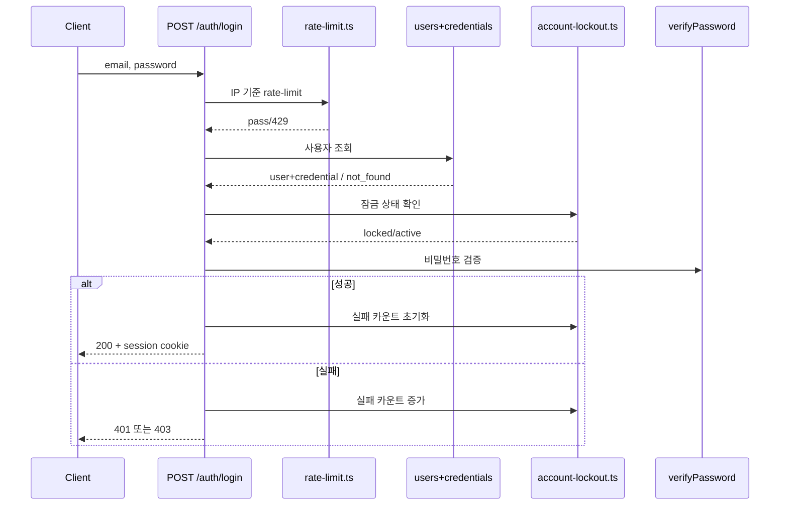
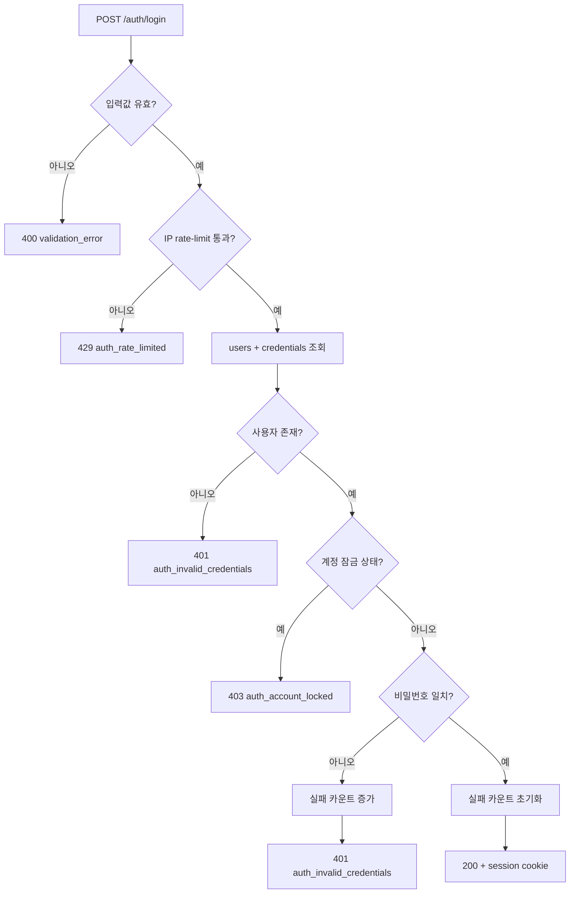

# 03. 이메일 로그인 검증 순서와 방어선

## 핵심 질문

> 이메일 로그인에서 rate-limit, lockout, 비밀번호 검증은 어떤 순서로 적용되는가?

## 한 줄 답

로그인은 `입력 검증 → IP rate-limit → 계정 조회 → lockout 확인 → 비밀번호 검증` 순서로 수행되어 brute-force를 다층으로 차단한다.

---

## 현재 흐름

상세 분기(Flowchart):

---

## 다층 방어선 — 네트워크/계정 기준 동시 적용

**Problem** — 단일 방어선(예: 비밀번호 실패만 체크)으로는 공격 패턴이 바뀌면 우회 가능성이 커진다.

**Action** — `rate-limit.ts`와 `account-lockout.ts`를 결합해 IP 단위와 계정 단위 제한을 동시에 적용한다.

**Result** — 공격 표면을 초기/중간 단계에서 동시에 축소한다. ✅ PRD 인증 보안 정책과 일치.

---

## 이 프로젝트에서의 적용

| 결정                      | 해결하는 문제                      |
| ------------------------- | ---------------------------------- |
| rate-limit + lockout 결합 | 무차별 대입 및 credential stuffing |

---

> **근거 문서**: [prd/01-auth/overview](../../01-prd/01-auth/01-overview.md)

---

## 다음 문서

[04. Refresh Rotation과 재사용 탐지](./04-refresh-rotation-reuse-detection.md) — 세션 연장 시 기존 refresh 토큰은 어떻게 처리되는가?
