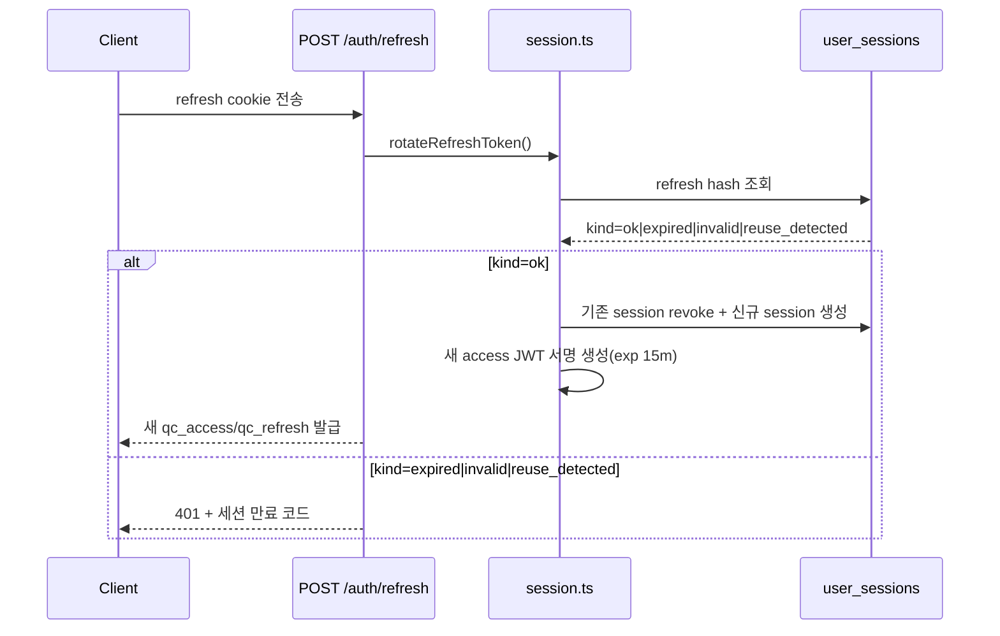
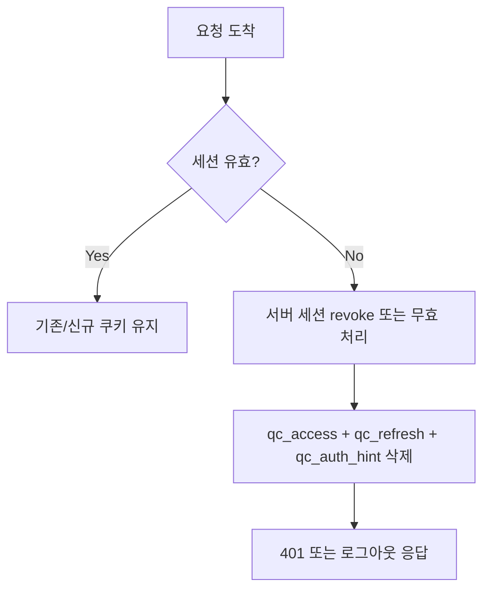

# 04. Refresh Rotation과 재사용 탐지

## 핵심 질문

> 세션 연장 시 기존 refresh 토큰은 어떻게 처리되고, 재사용 공격은 어떻게 탐지되는가?

## 한 줄 답

refresh 요청마다 기존 세션을 revoke하고 새 토큰 쌍을 발급하며, 이미 revoke된 refresh가 다시 오면 재사용 공격으로 간주해 세션을 폐기한다.

---

## 현재 흐름



---

## rotation + reuse detection — 장기 세션 공격면 축소

**Problem** — refresh 토큰을 고정으로 재사용하면 탈취 후 장기 악용이 가능해진다.

**Action** — refresh마다 회전(rotation)하고, revoke된 토큰 재사용 시 `reuse_detected`를 반환해 즉시 차단한다.

**Result** — 세션 연장 UX를 유지하면서도 refresh 탈취 리스크를 크게 줄인다. ✅ 2026년 기준 권장 보안 패턴.

---

## 쿠키 폐기(revoke)와 재사용(reuse) 처리 상세

쿠키를 브라우저에서 지우는 것만으로는 서버 세션이 폐기되었다고 보장할 수 없다. 반대로 서버만 revoke하고 클라이언트 쿠키를 남기면 다음 요청에서 혼란이 생긴다. 이 프로젝트는 이 문제를 피하기 위해 "서버 세션 revoke + 클라이언트 쿠키 삭제"를 항상 함께 수행한다.

| 상황                             | 서버 처리                                        | 쿠키 처리                                          | 응답                       |
| -------------------------------- | ------------------------------------------------ | -------------------------------------------------- | -------------------------- |
| `POST /auth/logout`              | access session revoke + refresh hash 기반 revoke | `clearAuthCookies`로 access/refresh/auth_hint 삭제 | `200 { ok: true }`         |
| `POST /auth/refresh` 성공        | 기존 refresh session revoke 후 신규 session 생성 | 새 `qc_access/qc_refresh/qc_auth_hint` 재발급      | `200 { ok: true }`         |
| `POST /auth/refresh` 재사용 탐지 | `reuse_detected` 반환 (세션 폐기 경로)           | 기존 쿠키 삭제                                     | `401 auth_session_expired` |
| `GET /auth/me` 세션 무효         | 세션 조회 실패 시 무효 판정                      | 기존 쿠키 삭제                                     | `401 auth_session_expired` |



세션 상태와 브라우저 쿠키 상태가 어긋나는 구간을 최소화한다. 즉, "서버는 만료인데 브라우저는 로그인처럼 보이는" 상황을 빠르게 정리할 수 있다.

---

## 인증/세션 감사 로그 상세

revoke/refresh/reuse는 사용자 체감은 비슷해 보여도 보안 관점 의미가 다르다. 로그가 단순하면 사고 구분이 어려워지므로, 인증 이벤트를 목적별로 나눠 `audit_logs`에 기록한다.

| 이벤트            | 발생 조건                            | 대표 resultCode                                        | 운영 관점 의미            |
| ----------------- | ------------------------------------ | ------------------------------------------------------ | ------------------------- |
| `login_success`   | 이메일 로그인 성공                   | `ok`                                                   | 정상 인증 성공률 측정     |
| `login_failed`    | 비밀번호 실패/잠금                   | `auth_invalid_credentials` / `auth_account_locked`     | 공격 시도/계정 잠금 추적  |
| `session_revoked` | refresh 만료/재사용 등으로 세션 폐기 | `auth_session_expired` / `auth_refresh_reuse_detected` | 세션 강제 만료 원인 분석  |
| `logout`          | 명시적 로그아웃 처리                 | `ok`                                                   | 사용자 로그아웃 행동 추적 |

로그 필드 기준:

```text
user_id, event, ip_address, user_agent, request_id, provider, result_code, created_at
```

단순 401 카운트가 아니라 "왜 401이 났는지"를 이벤트 코드로 구분해 분석할 수 있다. 보안 모니터링 품질이 올라가고 운영 대응 속도도 빨라진다.

---

## 이 프로젝트에서의 적용

| 결정                               | 해결하는 문제                   |
| ---------------------------------- | ------------------------------- |
| refresh rotation + reuse detection | 탈취 refresh의 장기 재사용 공격 |

---

> **근거 문서**: [prd/01-auth/overview](../../01-prd/01-auth/01-overview.md)

---

## 다음 문서

[05. OAuth 서버 Callback과 State 검증](./05-oauth-callback-state-validation.md) — OAuth는 왜 서버 callback + state 1회성 소비로 처리하는가?
