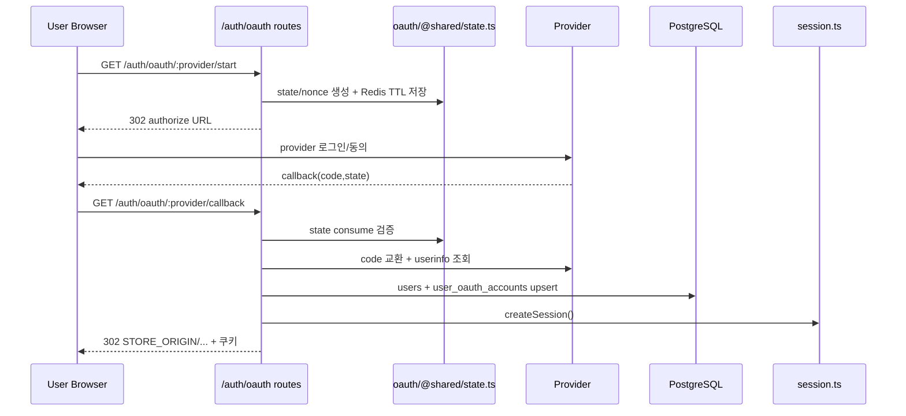
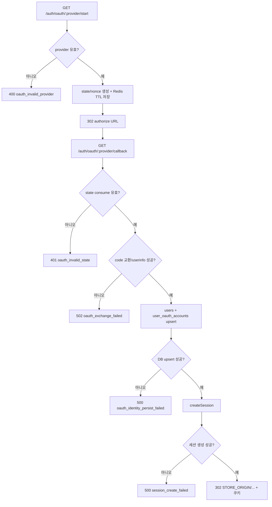
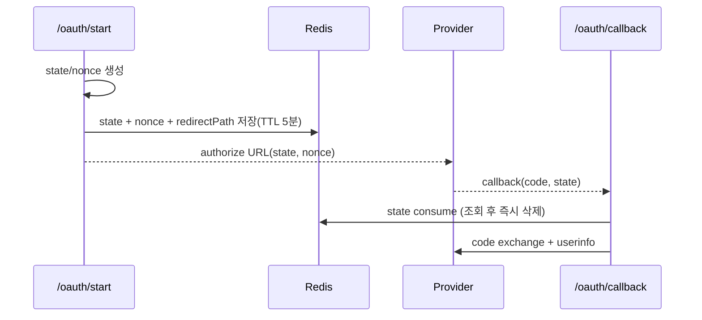
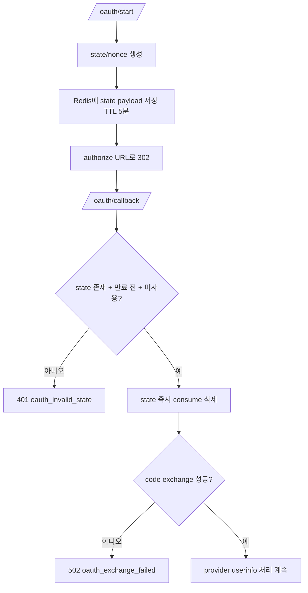

# 05. OAuth 서버 Callback과 State 검증

## 핵심 질문

> OAuth는 왜 프론트에서 토큰을 직접 처리하지 않고 서버 callback + state 1회성 소비로 처리하는가?

## 한 줄 답

code 교환과 state/nonce 검증을 서버에서 처리해야 CSRF·재사용 공격을 줄이고 provider별 예외를 일관되게 통제할 수 있다.

---

## 현재 흐름



상세 분기(Flowchart):



---

## 서버 callback + state consume — OAuth 공격면 통제

**Problem** — provider별 파라미터/에러가 다른데 프론트에서 직접 처리하면 state 검증 누락, redirect 오남용, 예외 분기 난립 위험이 커진다.

**Action** — 서버에서 `isOAuthProvider` 검증, `consumeOAuthState` 1회성 소비, provider adapter 교환, 계정 upsert, 세션 발급을 한 흐름으로 묶는다.

**Result** — OAuth 실패 코드를 레이어별로 표준화(`oauth_invalid_state`, `oauth_exchange_failed`)하고 운영 로그 추적이 쉬워진다. ✅ 서비스 운영성 개선.

---

## `state`와 `nonce` 상세 해설

`state`와 `nonce`를 같은 의미로 이해하면, 보안 사고가 났을 때 어떤 검증이 비어 있었는지 판단하기 어렵다. 이 문서에서는 두 값을 분리해 생성/저장/사용 단계를 명확히 구분한다.

| 항목    | 주된 목적                            | 생성 시점      | 저장 위치                             | 검증 시점                                 | 현재 구현 상태                                                   |
| ------- | ------------------------------------ | -------------- | ------------------------------------- | ----------------------------------------- | ---------------------------------------------------------------- |
| `state` | 요청-응답 연계, CSRF 방어            | `/oauth/start` | Redis (`auth:oauth:state:*`, TTL 5분) | `/oauth/callback`에서 `consumeOAuthState` | **완전 적용**(1회성 소비)                                        |
| `nonce` | OIDC 컨텍스트 식별, 재전송 위험 완화 | `/oauth/start` | state payload 내부                    | callback에서 adapter에 전달               | **부분 적용**(생성/전달 구현, provider 토큰 nonce 대조는 미구현) |



상세 분기(Flowchart):



`state` 기반 CSRF/replay 방어는 현재 구현에서 즉시 유효하며, `nonce`는 향후 OIDC 강화(예: id_token nonce 대조) 지점으로 명확히 분리되어 있다. 즉 운영 시 보안 점검 포인트가 선명해진다.

---

## OAuth 감사 로그 상세

OAuth 실패는 provider/네트워크/상태검증/DB 단계에서 모두 발생할 수 있어, 이벤트 로그가 없으면 원인 추적 시간이 길어진다. 그래서 start/callback 성공·실패마다 `audit_logs`에 표준 필드를 남긴다.

| 이벤트                   | 기록 시점                     | 대표 `resultCode`                               | 필수 분석 포인트                         |
| ------------------------ | ----------------------------- | ----------------------------------------------- | ---------------------------------------- |
| `oauth_start`            | `/oauth/:provider/start` 직후 | `ok`                                            | 유입량, rate-limit 직전 트래픽           |
| `oauth_callback_success` | code 교환 + 세션 발급 완료    | `ok`                                            | provider별 전환율                        |
| `oauth_callback_failed`  | callback 처리 실패            | `oauth_invalid_state` / `oauth_exchange_failed` | 상태검증 실패 vs provider 교환 실패 분리 |

로그 기본 필드(스키마):

```text
audit_logs
- user_id (nullable)
- event
- ip_address
- user_agent
- request_id
- provider (google|kakao)
- result_code
- created_at
```

운영 중 "어디서 실패했는지"를 코드 레벨이 아니라 이벤트 레벨로 바로 집계할 수 있다. 결과적으로 장애 대응과 보안 감사 대응성이 함께 올라간다.

---

## 이 프로젝트에서의 적용

| 결정                             | 해결하는 문제               |
| -------------------------------- | --------------------------- |
| 서버 callback + state 1회성 소비 | OAuth CSRF/재사용/분기 난립 |

---

> **근거 문서**: [ADR-0002: Backend Stack](../../02-architecture/backend/01-backend.adr.md), [prd/01-auth/overview](../../01-prd/01-auth/01-overview.md)

---

## 다음 문서

[06. 프론트 인증 상태 동기화(TanStack Query)](./06-frontend-auth-state-sync.md) — 로그인 이후 화면 상태를 왜 query invalidation으로 동기화하는가?
