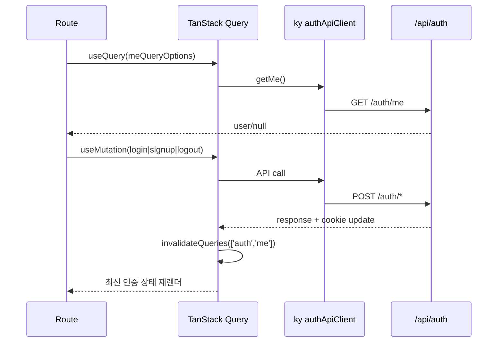
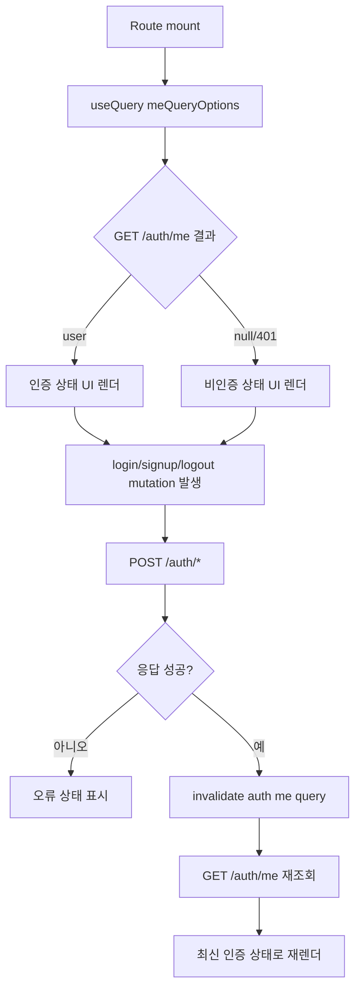

# 06. 프론트 인증 상태 동기화(TanStack Query)

## 핵심 질문

> 로그인/로그아웃 이후 화면 상태를 왜 로컬 state가 아니라 `queryOptions + mutationOptions`로 동기화하는가?

## 한 줄 답

인증은 공유 서버 상태이므로 `ky` 도메인 client + `['auth','me']` 캐시 규약으로 동기화해야 중복 호출과 상태 분기를 줄일 수 있다.

---

## 현재 흐름

상세 분기(Flowchart):

---

## query 규약 단일화 — 화면 간 인증 상태 일관성

**Problem** — 컴포넌트마다 fetch/로컬 state를 따로 들고 있으면 로그인 후 어떤 화면은 갱신되고 어떤 화면은 stale 상태로 남는다.

**Action** — `lib/api/domains/auth-client.ts`와 `lib/queries/auth.ts`를 기준으로 인증 호출/캐시 키를 중앙화한다.

추가로 `qc_auth_hint` 쿠키를 읽어 초기 `me` 조회 필요성을 빠르게 판정한다. 힌트가 없거나 만료면 즉시 비인증 UI 경로로 진입하고, 유효하면 `GET /auth/me`로 최종 상태를 확인한다.

**Result** — 로그인/회원가입/로그아웃 이후 상태 전파가 예측 가능해지고, 인증 UI 유지보수 비용이 감소한다. ✅ 프론트 구조 표준화.

---

## 이 프로젝트에서의 적용

| 결정                                 | 해결하는 문제                     |
| ------------------------------------ | --------------------------------- |
| auth 도메인 ky client + queryOptions | 라우트별 호출 중복/캐시 규약 분산 |

---

> **근거 문서**: [ADR-0001: Frontend Stack](../../02-architecture/frontend/01-frontend.adr.md), [architecture/integration/01-integration](../../02-architecture/integration/01-integration.md)

---

## 다음 문서

없음. (auth-login 심층 분석 종료)
