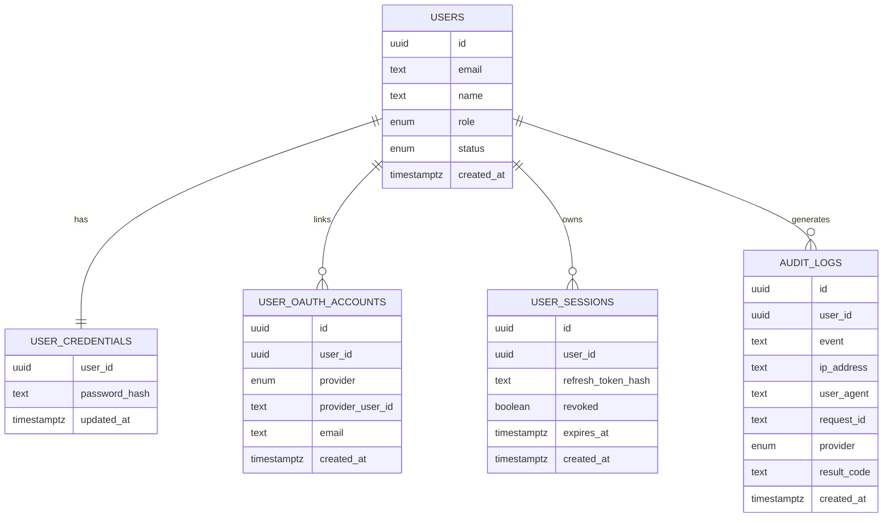
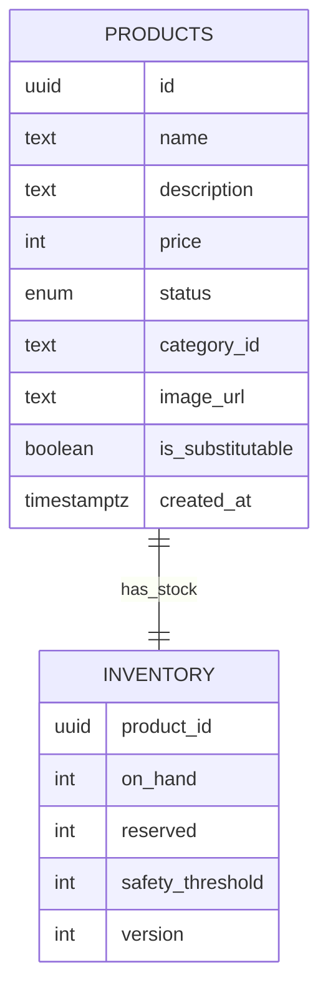
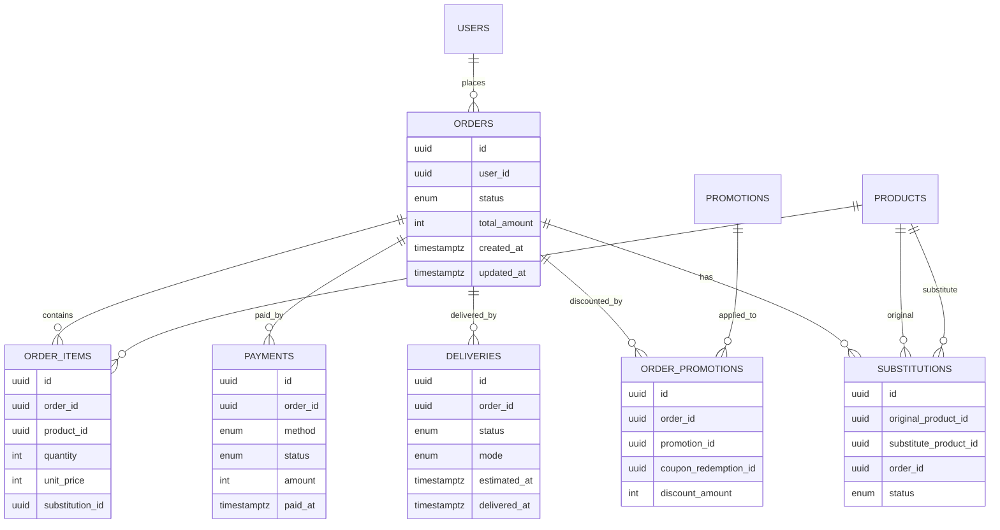
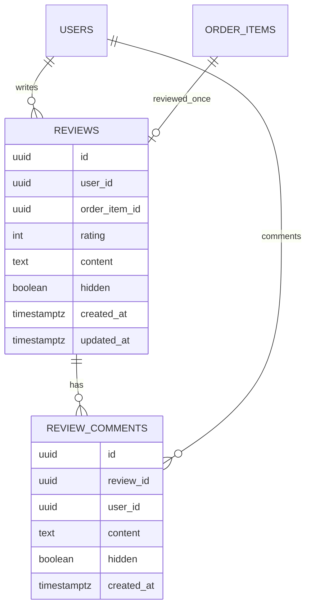
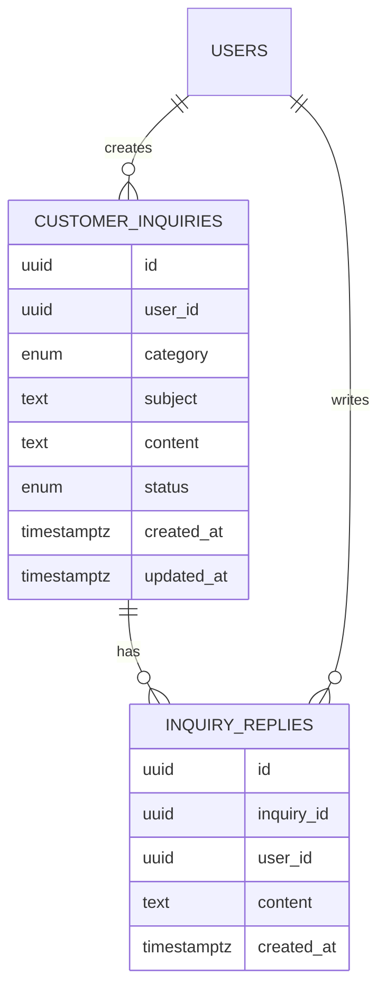
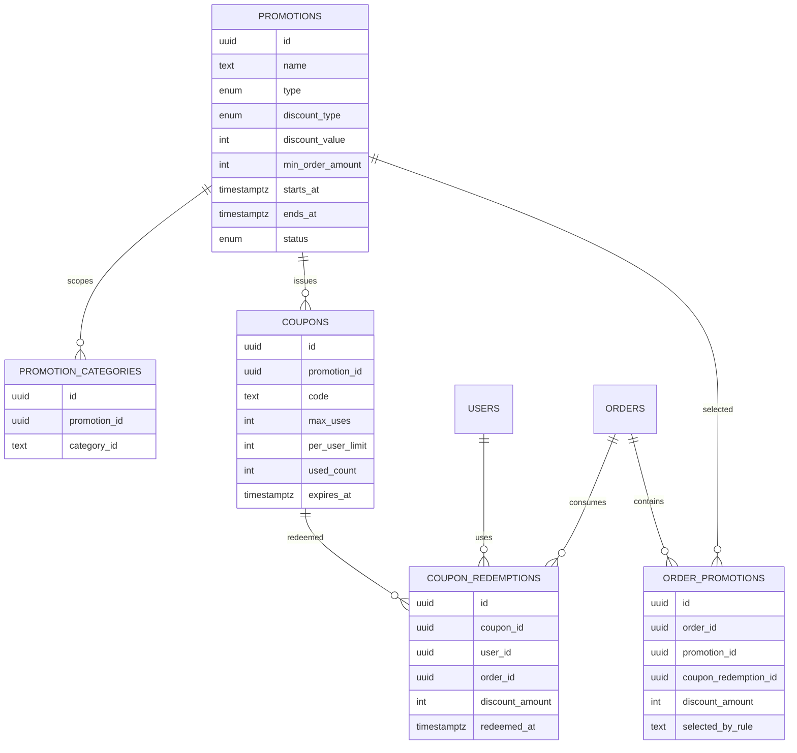
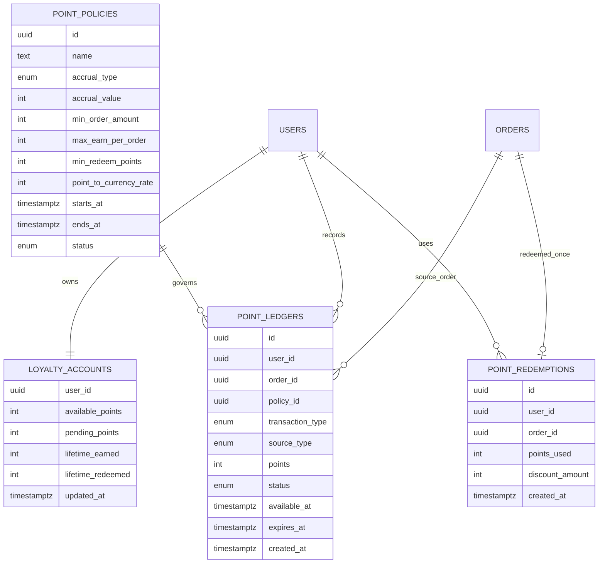

# 05. 도메인 분할 ERD

## 핵심 질문

> 현재 스키마를 도메인 단위로 보면 관계 구조가 어떻게 나뉘는가?

## 한 줄 답

Auth, Product, Order, Promotion, Points, Review, Inquiry 도메인으로 ERD를 분할하면 책임 경계와 FK 흐름을 한 번에 이해할 수 있다.

---

## 현재 접근 방식

```text
schema split
- auth.ts
- product.ts
- order.ts
- promotion.ts
- points.ts
- review.ts
- inquiry.ts
- relations.ts
```

---

## Auth / Account ERD



---

## Product / Inventory ERD



---

## Order / Payment / Delivery / Substitution ERD



---

## Review / Comment ERD



---

## Inquiry / Reply ERD



---

## Promotion / Coupon ERD



---

## Points / Loyalty ERD



---

## 이 프로젝트에서의 적용

| 결정                       | 해결하는 문제                                  |
| -------------------------- | ---------------------------------------------- |
| 도메인별 ERD 분할 제시     | 단일 ERD 과밀로 핵심 경계 파악이 어려운 문제   |
| FK 흐름 가시화             | 어떤 참조가 핵심 트랜잭션 경계인지 모호한 문제 |
| auth/commerce 분리 시각화  | 권한/보안 모델과 주문 도메인 모델 혼동         |
| promotion/coupon 경계 추가 | 할인 정책과 주문 정산 결과 추적 분리           |
| points/loyalty 경계 추가   | 적립/차감/만료 변동 이력과 잔액 관리 분리      |

---

> **근거 문서**: [ADR-0002: Backend Stack으로 Hono + Drizzle + PostgreSQL + Redis 선택](../../02-architecture/backend/01-backend.adr.md)

---

## 이전 문서

[04. 무결성·운영성·마이그레이션 설계 근거](./04-integrity-and-operations-rationale.md) — 왜 enum/FK/check/마이그레이션 분리 전략을 함께 쓰는가?
