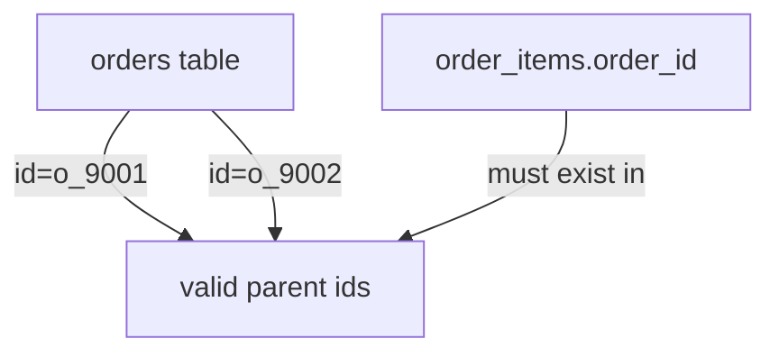
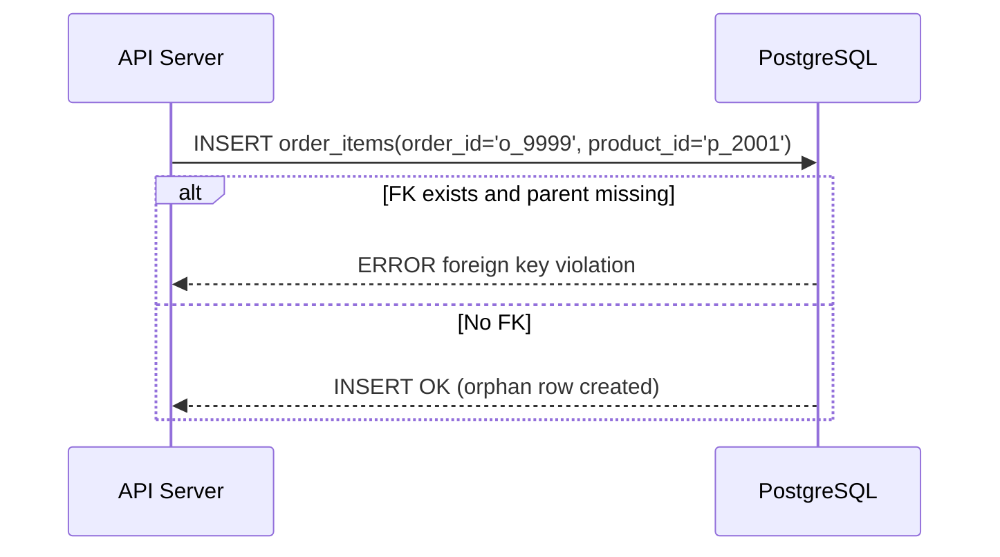

# 02. 외래 키(FK)는 왜 필요한가

## 핵심 질문

> FK를 걸면 무엇이 좋아지고, 무엇이 불편해지는가?

## 한 줄 답

FK는 "존재하지 않는 부모를 참조하는 잘못된 데이터"를 저장 단계에서 막아주지만, 대량 변경/아카이빙 시 작업 순서를 엄격하게 요구한다.

---

## 현재 접근 방식

`apps/api/src/db/schema.ts`에서는 핵심 도메인에 FK를 사용한다.

```ts
orderId: uuid('order_id')
  .notNull()
  .references(() => orders.id, { onDelete: 'cascade' })
```



---

## FK가 없으면 고아 데이터가 생긴다

**Problem** — FK가 없으면 존재하지 않는 주문 ID를 `order_items`에 넣어도 DB는 저장해버린다.

```text
orders table
  o_9001 exists

order_items insert
  id = oi_7777
  order_id = o_9999   # parent order does not exist

Without FK: insert succeeds -> orphan row created
```

**Action** — 자식 테이블에 FK를 선언한다.

```ts
orderId: uuid('order_id')
  .notNull()
  .references(() => orders.id, { onDelete: 'cascade' })
```



**Result** — 부모가 없는 참조는 저장 단계에서 실패한다. 앱 버그가 있어도 DB가 마지막 방어선이 된다.

---

## `onDelete` 정책은 삭제 의미를 결정한다

**Problem** — FK만 걸고 삭제 정책을 명시하지 않으면, 실제 비즈니스 기대와 다른 동작이 생길 수 있다.

**Action** — 도메인에 맞게 삭제 정책을 명시한다.

```text
cascade
  delete order o_9001 -> its order_items also deleted

restrict
  cannot delete user u_1001 if orders still exist

set null
  delete user u_1001 -> audit_logs.user_id becomes null
```

**Result** — 데이터 삭제 시나리오가 예측 가능해지고, 운영 중 사고 확률이 줄어든다.

---

## FK의 불편함은 "없애기"보다 "범위 조절"로 해결한다

**Problem** — FK를 모든 경계에 적용하면 대량 백필/마이그레이션/서비스 분리 시 운영 난이도가 높아진다.

**Action** — 같은 트랜잭션 경계는 FK를 유지하고, 외부/비동기 경계는 별도 전략으로 분리한다.

```text
FK 유지: orders -> order_items, users -> sessions
FK 완화: 외부 결제사 ID, 이벤트 소비 로그, cross-service 참조
```

**Result** — 정합성과 운영 유연성을 균형 있게 가져갈 수 있다.

---

## 이 프로젝트에서의 적용

| 결정                 | 해결하는 문제                        |
| -------------------- | ------------------------------------ |
| 핵심 도메인 FK 유지  | 고아 데이터/참조 무결성 붕괴 차단    |
| `onDelete` 정책 명시 | 삭제 동작 예측 가능성 확보           |
| 경계별 FK 정책 분리  | 운영 부담 증가 없이 핵심 정합성 유지 |

---

> **근거 문서**: [ADR-0002: Backend Stack으로 Hono + Drizzle + PostgreSQL + Redis 선택](../../02-architecture/backend/01-backend.adr.md)

---

## 다음 문서

[03. PK, Surrogate Key, Semantic Key](./03-key-types-basics.md) — 키 종류는 어떻게 다르고 언제 무엇을 써야 하는가?
