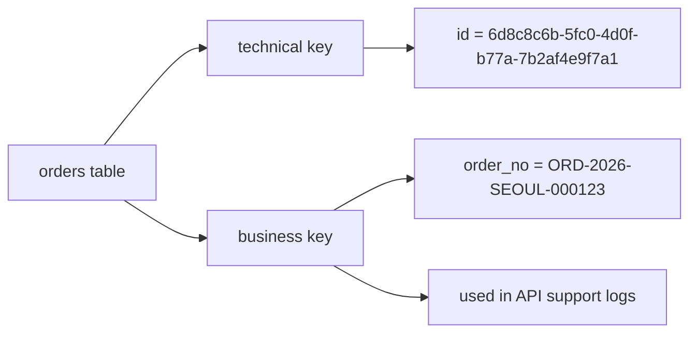

# 03. PK, Surrogate Key, Semantic Key

## 핵심 질문

> 키 종류는 어떻게 다르고 언제 무엇을 써야 하는가?

## 한 줄 답

내부 조인 안정성은 surrogate key(PK)로, 업무 의미/외부 노출은 semantic key(비즈니스 키)로 분리하는 것이 가장 실용적이다.

---

## 현재 접근 방식

이 저장소의 스키마(`apps/api/src/db/schema.ts`)는 기본적으로 UUID 기반 PK를 사용한다.

```ts
id: uuid('id').defaultRandom().primaryKey()
```

semantic key(예: `order_no`, `sku`)는 현재 핵심 스키마에 본격 도입 전이며, 다음 단계에서 점진 도입 가능한 구조다.



---

## PK(Primary Key) — 한 행을 유일하게 식별하는 기본 키

**Problem** — 테이블에 고유 식별자가 없으면 특정 행을 안정적으로 수정/삭제/참조하기 어렵다.

**Action** — 모든 핵심 테이블에 PK를 둔다.

```text
users.id
orders.id
products.id

example
users.id    = u_1001
orders.id   = o_9001
products.id = p_2001
```

**Result** — 각 행을 충돌 없이 식별할 수 있고, FK 참조의 기준점이 생긴다.

---

## Surrogate Key — 시스템이 만든 인공 식별자

**Problem** — 이메일/상품명 같은 자연값을 PK로 쓰면 값 변경 시 연쇄 수정이 발생한다.

```text
users.email as PK
  old: minji@oldmail.com
  new: minji@newmail.com

all child rows referencing email must be updated
  orders.user_email
  reviews.user_email
  inquiries.user_email
```

**Action** — 변경 가능성이 낮고 짧은 내부 키(UUID/시퀀스)를 PK로 사용한다.

```ts
id: uuid('id').defaultRandom().primaryKey()
```

**Result** — 내부 조인 안정성이 높아지고, 비즈니스 값 변경이 저장소 구조를 흔들지 않는다.

---

## Semantic Key — 사람이 읽고 업무 의미를 이해할 수 있는 키

**Problem** — 내부 UUID만 외부 계약에 노출하면 운영/CS/로그 추적 시 가독성이 떨어진다.

**Action** — 업무 식별용 키를 별도 컬럼으로 둔다.

```text
order_no: ORD-2026-SEOUL-000123
sku: SKU-FRUIT-APPLE-1KG
external_payment_id: pg_pay_3Ms9xT...

where each key is used
order_no: customer support + order tracking page
sku: catalog/warehouse mapping
external_payment_id: payment provider reconciliation
```

그리고 semantic key에는 보통 UNIQUE 인덱스를 건다.

**Result** — 사람/외부 시스템이 이해하기 쉬운 식별자를 제공하면서, 내부 조인은 여전히 안정적인 PK 기반으로 유지할 수 있다.

---

## 이 비유를 더 쉽게 풀어보면: "내부 사번"과 "고객에게 보이는 번호"

**Problem** — "키를 2개 쓰는 이유"가 직관적으로 와닿지 않으면, UUID만 쓰거나 semantic key만 쓰는 극단으로 흐르기 쉽다.

**Action** — 시스템 내부 식별자와 외부 노출 식별자를 역할로 분리해 이해한다.

```text
internal technical id (surrogate)
- machine-friendly, stable join key
- example: orders.id = 6d8c8c6b-5fc0-4d0f-b77a-7b2af4e9f7a1

external business id (semantic)
- human-friendly, support/tracking key
- example: orders.order_no = ORD-2026-SEOUL-000123
```

```text
real usage split
- DB join between orders and order_items: use orders.id
- customer support call: search by order_no
- payment reconciliation with PG: match by external_payment_id
```

**Result** — 내부 데이터 연결은 흔들리지 않고, 운영/CS/외부 연동은 사람이 이해 가능한 키로 빠르게 처리할 수 있다.

---

## "하나만 고르기"가 아니라 "역할 분담"이 핵심

**Problem** — surrogate key와 semantic key를 대체 관계로 보면 설계가 극단으로 흐른다.

**Action** — 용도별로 분리한다.

```text
내부 저장/조인: surrogate key (PK)
외부 노출/업무 추적: semantic key (UNIQUE)
```

**Result** — 개발/운영/고객지원 관점에서 모두 균형 잡힌 키 전략이 된다.

---

## 이 프로젝트에서의 적용

| 결정                        | 해결하는 문제                            |
| --------------------------- | ---------------------------------------- |
| UUID 기반 PK                | 내부 조인 안정성과 참조 일관성 확보      |
| semantic key 별도 도입 여지 | 외부 노출 가독성과 내부 저장 안정성 분리 |
| 키 역할 분담                | "하나의 키로 모든 문제 해결" 시도 방지   |

---

> **근거 문서**: [ADR-0002: Backend Stack으로 Hono + Drizzle + PostgreSQL + Redis 선택](../../02-architecture/backend/01-backend.adr.md)

---

## 다음 문서

[04. Relation, FK, Semantic Key를 함께 쓰는 방법](./04-how-to-combine-relation-fk-semantic-key.md) — 세 가지를 실제 서비스 설계에서 어떻게 조합하는가?
