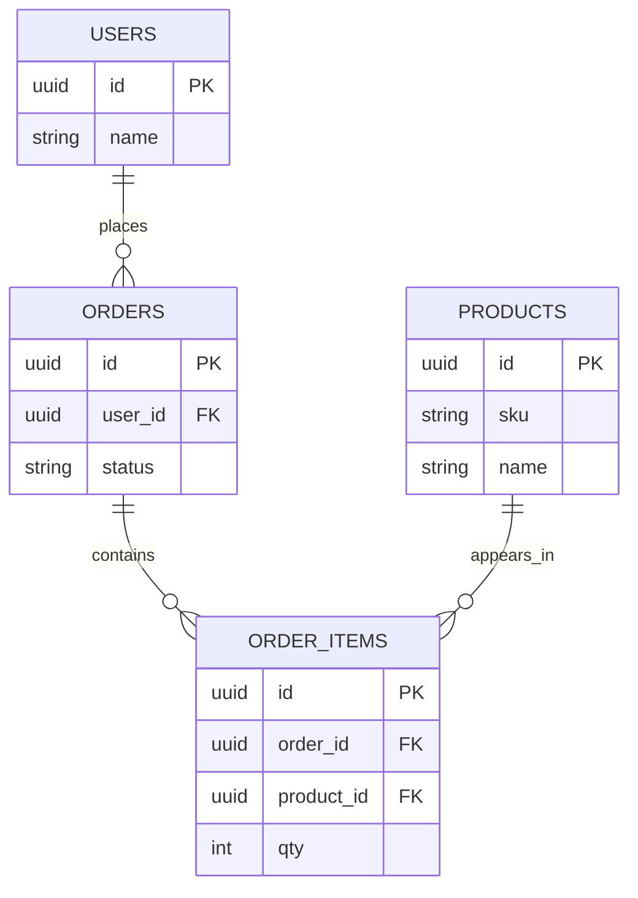

# 01. 관계형 데이터베이스의 관계란 무엇인가

## 핵심 질문

> 테이블 "관계"는 정확히 무엇을 의미하는가?

## 한 줄 답

관계는 "한 테이블의 행이 다른 테이블의 어떤 행과 연결되는가"를 정의한 규칙이다.

---

## 현재 흐름



```text
Example rows
users.id = u_1001 (Kim Minji)
orders.id = o_9001 (user_id = u_1001)
order_items.id = oi_3001 (order_id = o_9001, product_id = p_2001)
products.id = p_2001 (Apple)
```

---

## "관계"는 JOIN 문법이 아니라 데이터 의미다

**Problem** — 초보 단계에서는 relation을 "SQL JOIN 문법"으로만 이해해, 왜 테이블을 분리해야 하는지 감이 오지 않는다.

```text
single wide table: order_all_in_one

order_id | customer_name | customer_phone | product_name | unit_price | qty
9001     | Kim Minji     | 010-1111-2222  | Apple        | 3500       | 2
9001     | Kim Minji     | 010-1111-2222  | Banana       | 2200       | 1

If customer_phone changes, every duplicated row must be updated.
Miss one row -> inconsistent data.
```

**Action** — 엔터티(사용자/주문/상품)를 분리하고, "누가 누구를 소유하는가"를 관계로 표현한다.

```text
users(id, name, phone)
orders(id, user_id, order_status, total_amount)
order_items(id, order_id, product_id, qty, unit_price)
products(id, sku, name, price)

ownership
users.id -> orders.user_id
orders.id -> order_items.order_id
products.id -> order_items.product_id
```

**Result** — 중복/불일치가 줄고, 데이터 변경이 예측 가능한 방향으로 흘러간다.

---

## 1:1, 1:N, N:M은 설계의 기본 문법

**Problem** — 관계 카디널리티를 구분하지 않으면 제약을 잘못 걸어, 실제 요구사항을 저장소가 표현하지 못한다.

**Action** — 가장 자주 쓰는 세 가지 형태를 먼저 익힌다.

```text
1:1  [users] 1 --- 1 [user_credentials]
1:N  [users] 1 --- N [orders]
N:M  [orders] N --- M [products] via [order_items]

real example
u_1001 -> orders: o_9001, o_9002
o_9001 -> products: p_2001, p_2005
```

**Result** — 요구사항을 테이블 구조로 변환하는 기본 사고틀이 생긴다.

---

## 이 프로젝트에서의 적용

| 결정                          | 해결하는 문제                                |
| ----------------------------- | -------------------------------------------- |
| users/orders/order_items 분리 | 데이터 중복과 갱신 불일치 문제 완화          |
| N:M를 중간 테이블로 표현      | 주문-상품 다대다 관계를 명시적으로 관리 가능 |

---

> **근거 문서**: [ADR-0002: Backend Stack으로 Hono + Drizzle + PostgreSQL + Redis 선택](../../adr/ADR-0002-backend-stack-hono-drizzle-postgres-redis.md)

---

## 다음 문서

[02. 외래 키(FK)는 왜 필요한가](./02-why-foreign-key.md) — FK를 걸면 무엇이 좋아지고, 무엇이 불편해지는가?
