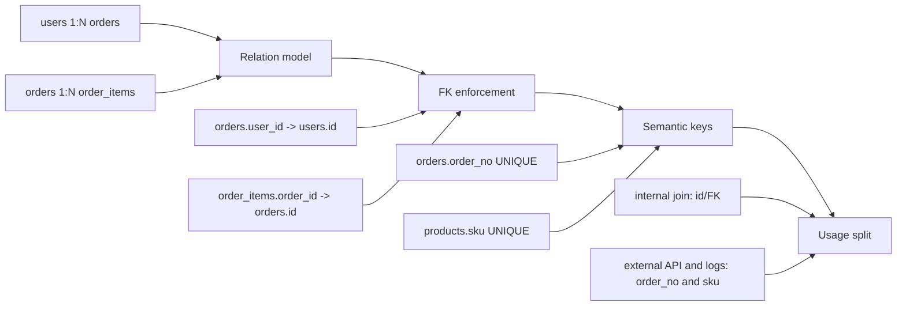

# 04. Relation, FK, Semantic Key를 함께 쓰는 방법

## 핵심 질문

> 세 가지를 실제 서비스 설계에서 어떻게 조합하는가?

## 한 줄 답

관계는 데이터 구조를 설명하고, FK는 저장 무결성을 강제하며, semantic key는 업무 가독성을 담당하도록 역할을 나누면 된다.

---

## 현재 흐름



---

## 역할을 섞으면 혼란이 생긴다

**Problem** — relation/FK/semantic key를 같은 개념으로 다루면 "무엇이 깨졌는지"를 추적하기 어렵다.

```text
incident example
- mobile app shows order ORD-2026-SEOUL-000123
- DB has order_items with order_id = o_9999 (missing parent)
- root cause: relation declared in code, but FK missing in table

another incident
- warehouse renames SKU from SKU-APPLE-OLD to SKU-APPLE-1KG
- internal joins use SKU directly
- multiple downstream tables must be rewritten
```

**Action** — 세 개념을 책임 단위로 분리한다.

```text
relation: 데이터 연결 구조(1:N, N:M) 설명
FK: 참조 무결성 강제 (잘못된 참조 저장 차단)
semantic key: 사람이 읽고 업무에서 쓰는 식별자
```

**Result** — 설계/개발/운영 단계에서 문제 원인을 빠르게 분리해 대응할 수 있다.

---

## 내부/외부 경계를 기준으로 키 전략을 나눈다

**Problem** — "모든 곳에 FK" 또는 "FK 전부 제거" 같은 극단 전략은 운영 리스크를 키운다.

**Action** — 경계별로 정책을 둔다.

```text
코어 트랜잭션 경계
- FK 유지 (orders-order_items, users-user_sessions)

외부/비동기 경계
- semantic key 중심 (order_no, external_payment_id)
- 필요 시 애플리케이션 레벨 검증
```

**Result** — 핵심 데이터 정합성을 지키면서도 외부 연동 유연성을 확보할 수 있다.

---

## 실무 기본 규칙: PK는 내부, semantic key는 외부

**Problem** — 고객지원/운영에서는 UUID보다 주문번호가 읽기 쉽지만, DB 내부 조인까지 주문번호로 통일하면 변경 비용이 커진다.

**Action** — 다음 규칙을 기본값으로 둔다.

```text
내부 저장/조인
- surrogate key (id UUID) + FK

외부 노출/API/로그
- semantic key (order_no, sku)
- UNIQUE 제약으로 중복 방지

concrete API/log usage
GET /orders/ORD-2026-SEOUL-000123
log: payment failed order_no=ORD-2026-SEOUL-000123 external_payment_id=pg_pay_3Ms9xT...
```

**Result** — 내부 기술 안정성과 외부 업무 가독성을 동시에 확보한다.

---

## 이 프로젝트에서의 적용

| 결정                       | 해결하는 문제                                           |
| -------------------------- | ------------------------------------------------------- |
| 관계/무결성/업무 식별 분리 | 개념 혼동으로 인한 설계 오류 및 디버깅 난이도 증가 방지 |
| 코어 FK 유지 + 외부 완화   | 정합성과 운영 유연성의 균형 확보                        |
| 내부 id, 외부 semantic key | 내부 조인 안정성과 운영 가독성 동시 확보                |

---

> **근거 문서**: [ADR-0002: Backend Stack으로 Hono + Drizzle + PostgreSQL + Redis 선택](../../adr/ADR-0002-backend-stack-hono-drizzle-postgres-redis.md)

---

## 참고 자료

- [PostgreSQL - Constraints](https://www.postgresql.org/docs/current/ddl-constraints.html)
- [PostgreSQL - Tutorial Concepts (relations)](https://www.postgresql.org/docs/current/tutorial-concepts.html)
- [Baeldung - Natural Key vs Surrogate Key](https://www.baeldung.com/sql/keys-natural-vs-surrogate)

---

## 이전 문서

[03. PK, Surrogate Key, Semantic Key](./03-key-types-basics.md) — 키 종류는 어떻게 다르고 언제 무엇을 써야 하는가?
