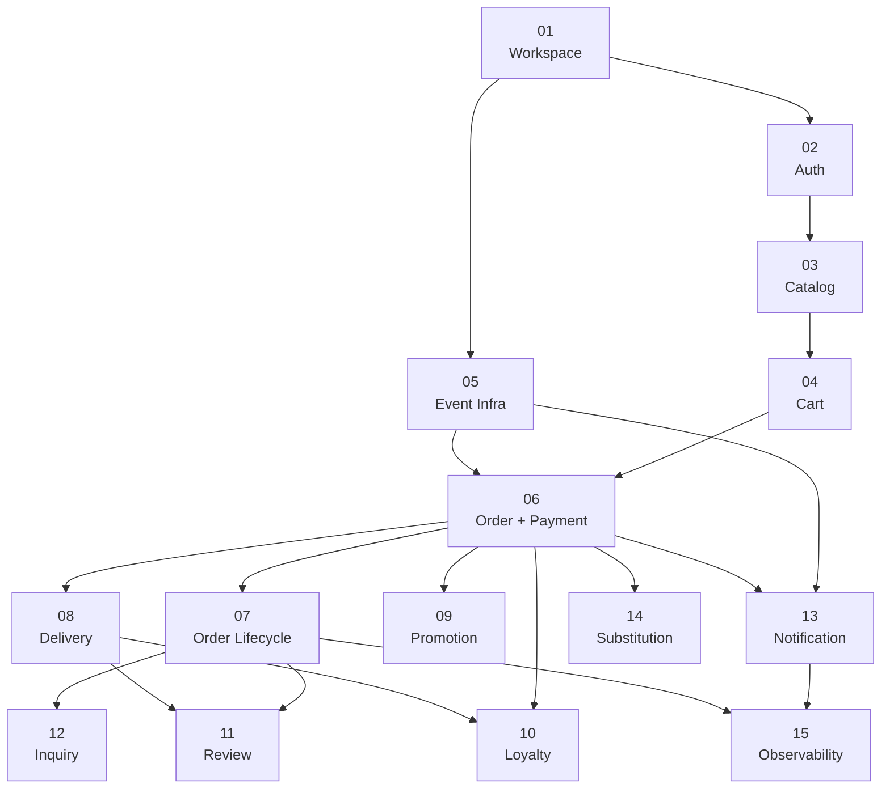

# Vertical Slice Map

전체 구현을 "유저/운영자가 완료하는 행위" 단위로 자른 vertical slice 목록.
각 슬라이스는 E2E로 동작하는 최소 기능 단위이며, 이벤트 기반 아키텍처를 처음부터 적용한다.

## 읽는 법

- **슬라이스**: 유저 행위 기준 기능 단위 (도메인 단위 아님)
- **세션**: 1 agent session = 1 branch = 1 plan 파일 (≤300줄)
- **의존**: 선행 슬라이스 완료 후 진행 가능
- **병렬**: 의존관계 없는 슬라이스는 동시 진행 가능
- **패턴 참조**: `00-meta/pattern-reference.md` (전 세션 공통)
- **세부 plan**: `{nn}-{name}/{nn}-{layer}.plan.md` (별도 생성)

## 의존 관계 그래프



## 병렬화 구간 (Phase)

| Phase   | 슬라이스     | 비고                                          |
| ------- | ------------ | --------------------------------------------- |
| Phase 0 | 01           | 단독 — 모노레포 실행 루프 안정화              |
| Phase 1 | 02           | 단독 — 전체 인증 기반                         |
| Phase 2 | 03 + 05      | 병렬 — Catalog와 Event Infra는 독립           |
| Phase 3 | 04           | 단독 — Cart (Catalog 완료 필요)               |
| Phase 4 | 06           | 단독 — 핵심 트랜잭션 (Cart + Event 완료 필요) |
| Phase 5 | 07 + 08      | 병렬 — Order Lifecycle + Delivery             |
| Phase 6 | 09 + 10 + 13 | 병렬 — Promotion + Loyalty + Notification     |
| Phase 7 | 11 + 12      | 병렬 — Review + Inquiry                       |
| Phase 8 | 14 + 15      | 병렬 — Substitution + Observability           |

## 슬라이스 인덱스

| #   | 슬라이스             | E2E 행위                                             | 커버 도메인               | 의존     | 세션   | PRD 근거                                                |
| --- | -------------------- | ---------------------------------------------------- | ------------------------- | -------- | ------ | ------------------------------------------------------- |
| 01  | Workspace Baseline   | 개발 환경, codegen/build/typecheck/test 루프         | infra                     | —        | 2      | `00-overview.md §Stage 0`                               |
| 02  | Auth                 | 회원가입, 로그인, OAuth, 로그아웃, 비밀번호 재설정   | auth                      | 01       | 5      | `01-auth/`                                              |
| 03  | Catalog              | 상품 탐색, 상세, 필터, admin CRUD, 이미지 업로드     | catalog                   | 02       | 6      | `02-catalog/`                                           |
| 04  | Cart                 | 장바구니 CRUD, 수량 제한, TTL 만료, 실시간 재고 표시 | cart                      | 03       | 4      | `04-cart/`                                              |
| 05  | Event Infrastructure | SNS→SQS fanout, idempotency, DLQ/redrive             | event                     | 01       | 2      | `13-event/`                                             |
| 06  | Order + Payment      | 장바구니→주문→재고예약→결제→확인 (핵심 트랜잭션)     | order, payment, inventory | 04, 05   | 5      | `05-order/`, `06-payment/`, `03-inventory/`, `04-cart/` |
| 07  | Order Lifecycle      | 상태 전이 전체, 전체/부분 취소, 환불, 재고 해제      | order, payment, inventory | 06       | 4      | `05-order/`, `06-payment/`, `03-inventory/`             |
| 08  | Delivery             | 결제→배송생성→배차→배송완료, SLA                     | delivery                  | 06       | 4      | `07-delivery/`                                          |
| 09  | Promotion            | 쿠폰/할인 적용, 최소주문금액, 취소 시 롤백           | promotion                 | 06       | 4      | `08-promotion/`                                         |
| 10  | Loyalty              | 포인트 적립/사용/롤백/만료                           | loyalty                   | 06, 08   | 4      | `09-loyalty/`                                           |
| 11  | Review               | 리뷰 작성, 이미지, 댓글, 모더레이션                  | review                    | 07, 08   | 4      | `10-review/`                                            |
| 12  | Inquiry              | 문의 CRUD, 답변, SLA, 재오픈                         | inquiry                   | 07       | 4      | `11-inquiry/`                                           |
| 13  | Notification         | 28개 이벤트→인앱 알림, 알림센터, 설정                | notification              | 05, 06   | 4      | `12-notification/`                                      |
| 14  | Substitution         | 대체 제안, 승인/거절, 가격 조정, 타임아웃            | order (대체)              | 06       | 3      | `05-order/ §대체상품`                                   |
| 15  | Observability        | 메트릭, 대시보드, 알림, 롤백 기준                    | observability             | 07, 13   | 3      | `14-observability/`                                     |
|     |                      |                                                      |                           | **합계** | **58** |                                                         |

## 크로스 도메인 의존 요약

핵심 트랜잭션 체인 (06이 허브):

```
Cart ──→ Order ──→ Inventory (reserve)
                ├─→ Payment (initiate)
                ├─→ Promotion (apply discount)
                └─→ Loyalty (deduct points)

PaymentCaptured ──→ Order (confirmed)
                 ├─→ Delivery (create)
                 └─→ Loyalty (earn pending)

OrderCancelled ──→ Inventory (release)
               ├─→ Payment (refund)
               ├─→ Loyalty (rollback)
               └─→ Promotion (rollback coupon)

DeliveryCompleted ──→ Order (delivered)
                   └─→ Loyalty (confirm points)
```

이벤트 소비 관계:

```
SNS Topic ──→ SQS order-queue ──→ Order worker (상태 전이)
           ├─→ SQS inventory-queue ──→ Inventory worker (예약/해제/차감)
           ├─→ SQS dispatch-queue ──→ Delivery worker (배차/배송)
           └─→ SQS notifications-queue ──→ Notification worker (28개 이벤트→알림)
```

## 사용 규칙

1. 슬라이스 내 세션은 번호 순서대로 실행 (api-spec → db → backend → store → admin)
2. 다음 슬라이스는 의존 슬라이스의 모든 세션 완료 후 진행
3. 병렬 가능 슬라이스는 동일 Phase 내에서 동시 진행 가능
4. 세부 plan 파일: `{nn}-{name}/{nn}-{layer}.plan.md`
5. 패턴 참조: `00-meta/pattern-reference.md`
